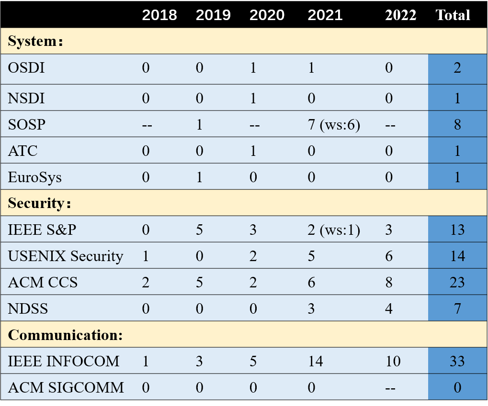
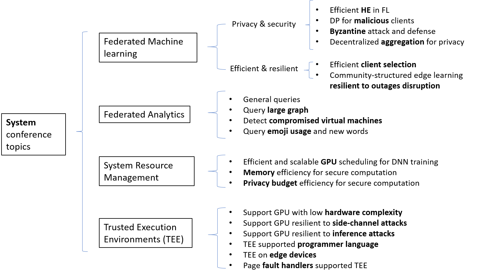
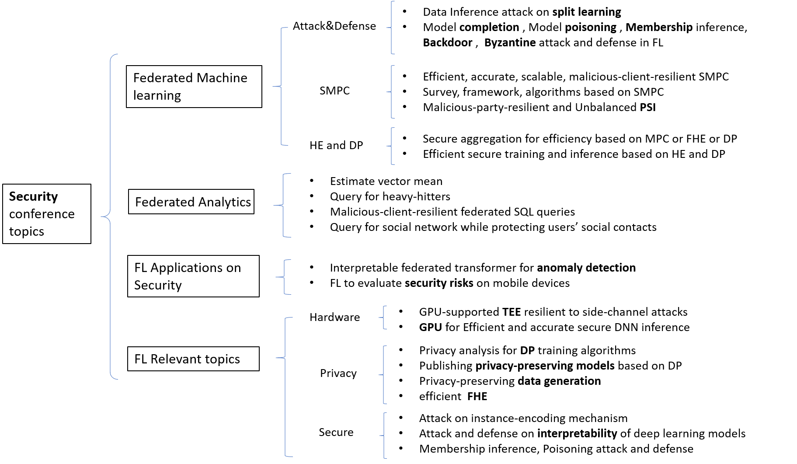
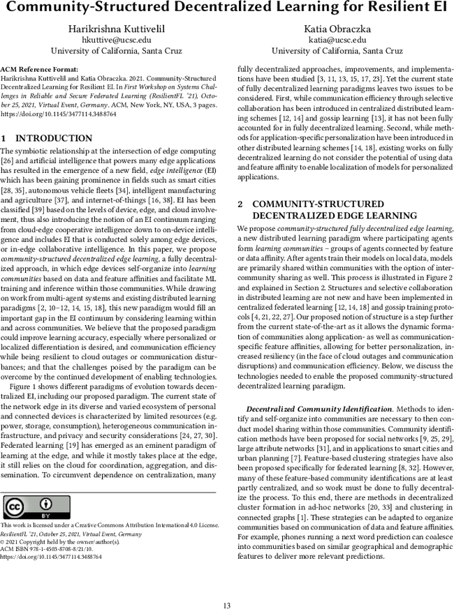

# Report on Federated Learning Papers Published in Top System, Security, and Communication Conferences

- [Report on Federated Learning Papers Published in Top System, Security, and Communication Conferences](#report-on-federated-learning-papers-published-in-top-system--security--and-communication-conferences)
  * [0. The System and Security conferences covered in this report.](#0-the-system-and-security-conferences-covered-in-this-report)
    + [System 会议:](#system----)
    + [Security 会议:](#security----)
    + [Communication 会议:](#communication----)
    + [涉及以下内容的文章都被纳入联邦学习相关论文:](#----------------------)
    + [2018-2022 系统和安全会议中联邦学习相关论文的统计](#2018-2022--------------------)
    + [System 会议中联邦学习及相关论文的研究主题](#system------------------)
    + [Security 会议中联邦学习及相关论文的研究主题](#security------------------)
  * [1. OSDI (USENIX Symposium on Operating Systems Design and Implementation)](#1-osdi--usenix-symposium-on-operating-systems-design-and-implementation-)
    + [OSDI 2022](#osdi-2022)
      - [None](#none)
    + [OSDI 2021](#osdi-2021)
      - [(FL) Oort: Efficient Federated Learning via Guided Participant Selection](#-fl--oort--efficient-federated-learning-via-guided-participant-selection)
      - [[MAGE: Nearly Zero-Cost Virtual Memory for Secure Computation](https://www.usenix.org/conference/osdi21/presentation/kumar)](#-mage--nearly-zero-cost-virtual-memory-for-secure-computation--https---wwwusenixorg-conference-osdi21-presentation-kumar-)
      - [Privacy Budget Scheduling](#privacy-budget-scheduling)
    + [OSDI 2020](#osdi-2020)
      - [(FL) Orchard: Differentially Private Analytics at Scale](#-fl--orchard--differentially-private-analytics-at-scale)
    + [OSDI 2019](#osdi-2019)
      - [None](#none-1)
    + [OSDI 2018](#osdi-2018)
      - [Graviton: Trusted Execution Environments on GPUs](#graviton--trusted-execution-environments-on-gpus)
  * [2. NSDI (USENIX Symposium on Networked Systems Design and Implementation)](#2-nsdi--usenix-symposium-on-networked-systems-design-and-implementation-)
    + [NSDI 2022](#nsdi-2022)
      - [[SwarmMap: Scaling Up Real-time Collaborative Visual SLAM at the Edge](https://www.usenix.org/conference/nsdi22/presentation/xu)](#-swarmmap--scaling-up-real-time-collaborative-visual-slam-at-the-edge--https---wwwusenixorg-conference-nsdi22-presentation-xu-)
    + [NSDI 2021](#nsdi-2021)
    + [NSDI 2020](#nsdi-2020)
      - [(FL) PrivateEye: Scalable and Privacy-Preserving Compromise Detection in the Cloud](#-fl--privateeye--scalable-and-privacy-preserving-compromise-detection-in-the-cloud)
      - [[Telekine: Secure Computing with Cloud GPUs](https://www.usenix.org/conference/nsdi20/presentation/hunt)](#-telekine--secure-computing-with-cloud-gpus--https---wwwusenixorg-conference-nsdi20-presentation-hunt-)
    + [NSDI 2019](#nsdi-2019)
    + [NSDI 2018](#nsdi-2018)
  * [3. SOSP (ACM Symposium on Operating Systems Principles) (once every two years)](#3-sosp--acm-symposium-on-operating-systems-principles---once-every-two-years-)
    + [SOSP 2021](#sosp-2021)
      - [(FL) Mycelium: Large-Scale Distributed Graph Queries with Differential Privacy](#-fl--mycelium--large-scale-distributed-graph-queries-with-differential-privacy)
    + [SOSP 2021 WORKSHOP: [ResilientFL 2021: First Workshop on Systems Challenges in Reliable and Secure Federated Learning](https://resilientfl.org/index.html)](#sosp-2021-workshop---resilientfl-2021--first-workshop-on-systems-challenges-in-reliable-and-secure-federated-learning--https---resilientflorg-indexhtml-)
      - [(FL) [FedScale: Benchmarking Model and System Performance of Federated Learning](https://dl.acm.org/doi/10.1145/3477114.3488760)](#-fl---fedscale--benchmarking-model-and-system-performance-of-federated-learning--https---dlacmorg-doi-101145-34771143488760-)
      - [(FL) [Redundancy in cost functions for Byzantine fault-tolerant federated learning](https://dl.acm.org/doi/10.1145/3477114.3488761)](#-fl---redundancy-in-cost-functions-for-byzantine-fault-tolerant-federated-learning--https---dlacmorg-doi-101145-34771143488761-)
      - [(FL) [Towards an Efficient System for Differentially-private, Cross-device Federated Learning](https://dl.acm.org/doi/10.1145/3477114.3488762)](#-fl---towards-an-efficient-system-for-differentially-private--cross-device-federated-learning--https---dlacmorg-doi-101145-34771143488762-)
      - [(FL) [GradSec: a TEE-based Scheme Against Federated Learning Inference Attacks](https://dl.acm.org/doi/10.1145/3477114.3488763)](#-fl---gradsec--a-tee-based-scheme-against-federated-learning-inference-attacks--https---dlacmorg-doi-101145-34771143488763-)
      - [(FL) [Community-Structured Decentralized Learning for Resilient EI](https://dl.acm.org/doi/10.1145/3477114.3488764)](#-fl---community-structured-decentralized-learning-for-resilient-ei--https---dlacmorg-doi-101145-34771143488764-)
      - [[(FL) Separation of Powers in Federated Learning (Poster Paper)](https://dl.acm.org/doi/10.1145/3477114.3488765)](#--fl--separation-of-powers-in-federated-learning--poster-paper---https---dlacmorg-doi-101145-34771143488765-)
    + [SOSP 2019](#sosp-2019)
      - [(FL) [Honeycrisp: Large-scale Differentially Private Aggregation Without a Trusted Core](https://dl.acm.org/authorize?N695027)](#-fl---honeycrisp--large-scale-differentially-private-aggregation-without-a-trusted-core--https---dlacmorg-authorize-n695027-)
  * [4. EuroSys](#4-eurosys)
    + [EuroSys 2022:](#eurosys-2022-)
      - [none](#none)
    + [EuroSys 2021:](#eurosys-2021-)
      - [none](#none-1)
    + [EuroSys 2020:](#eurosys-2020-)
      - [none](#none-2)
    + [EuroSys 2019:](#eurosys-2019-)
      - [(FL) Conclave: Secure Multi-Party Computation on Big Data](#-fl--conclave--secure-multi-party-computation-on-big-data)
    + [EuroSys 2018:](#eurosys-2018-)
      - [none](#none-3)
  * [5. ATC (USENIX Annual Technical Conference)](#5-atc--usenix-annual-technical-conference-)
    + [ATC 2022](#atc-2022)
      - [none](#none-4)
    + [ATC 2021](#atc-2021)
      - [none](#none-5)
    + [ATC 2020](#atc-2020)
      - [(FL) [BatchCrypt: Efficient Homomorphic Encryption for Cross-Silo Federated Learning](https://www.usenix.org/conference/atc20/presentation/zhang-chengliang)](#-fl---batchcrypt--efficient-homomorphic-encryption-for-cross-silo-federated-learning--https---wwwusenixorg-conference-atc20-presentation-zhang-chengliang-)
    + [ATC 2019](#atc-2019)
      - [[Secured Routines: Language-based Construction of Trusted Execution Environments](https://www.usenix.org/conference/atc19/presentation/ghosn)](#-secured-routines--language-based-construction-of-trusted-execution-environments--https---wwwusenixorg-conference-atc19-presentation-ghosn-)
      - [[CoSMIX: A Compiler-based System for Secure Memory Instrumentation and Execution in Enclaves](https://www.usenix.org/conference/atc19/presentation/orenbach)](#-cosmix--a-compiler-based-system-for-secure-memory-instrumentation-and-execution-in-enclaves--https---wwwusenixorg-conference-atc19-presentation-orenbach-)
      - [[StreamBox-TZ: Secure Stream Analytics at the Edge with TrustZone](https://www.usenix.org/conference/atc19/presentation/park-heejin)](#-streambox-tz--secure-stream-analytics-at-the-edge-with-trustzone--https---wwwusenixorg-conference-atc19-presentation-park-heejin-)
      - [[Analysis of Large-Scale Multi-Tenant GPU Clusters for DNN Training Workloads](https://www.usenix.org/conference/atc19/presentation/jeon)](#-analysis-of-large-scale-multi-tenant-gpu-clusters-for-dnn-training-workloads--https---wwwusenixorg-conference-atc19-presentation-jeon-)
    + [ATC 2018](#atc-2018)
      - [[Varys: Protecting SGX Enclaves from Practical Side-Channel Attacks](https://www.usenix.org/conference/atc18/presentation/oleksenko)](#-varys--protecting-sgx-enclaves-from-practical-side-channel-attacks--https---wwwusenixorg-conference-atc18-presentation-oleksenko-)
  * [6. IEEE S&P (IEEE Symposium on Security and Privacy)](#6-ieee-s-p--ieee-symposium-on-security-and-privacy-)
    + [IEEE S&P 2022](#ieee-s-p-2022)
      - [(FL) Back to the Drawing Board: A Critical Evaluation of Poisoning Attacks on Federated Learning](#-fl--back-to-the-drawing-board--a-critical-evaluation-of-poisoning-attacks-on-federated-learning)
      - [(FL) Locally Differentially Private Sparse Vector Aggregation](#-fl--locally-differentially-private-sparse-vector-aggregation)
      - [(MPC) SecFloat: Accurate Floating-Point meets Secure 2-Party Computation](#-mpc--secfloat--accurate-floating-point-meets-secure-2-party-computation)
      - [Sphinx: Enabling Privacy-Preserving Online Learning over the Cloud](#sphinx--enabling-privacy-preserving-online-learning-over-the-cloud)
    + [IEEE S&P 2021](#ieee-s-p-2021)
      - [(FL) Lightweight Techniques for Private Heavy Hitters](#-fl--lightweight-techniques-for-private-heavy-hitters)
      - [Adversary Instantiation: Lower bounds for differentially private machine learning](#adversary-instantiation--lower-bounds-for-differentially-private-machine-learning)
      - [Is Private Learning Possible with Instance Encoding?](#is-private-learning-possible-with-instance-encoding-)
      - [Learning Differentially Private Mechanisms](#learning-differentially-private-mechanisms)
      - [Pegasus: Bridging Polynomial and Non-polynomial Evaluations in Homomorphic Encryption](#pegasus--bridging-polynomial-and-non-polynomial-evaluations-in-homomorphic-encryption)
      - [SoK: Fully Homomorphic Encryption Compilers](#sok--fully-homomorphic-encryption-compilers)
    + [IEEE S&P 2021: 4th DEEP LEARNING AND SECURITY WORKSHOP](#ieee-s-p-2021--4th-deep-learning-and-security-workshop)
      - [(FL) SAFELearn: Secure Aggregation for private Federated Learning](#-fl--safelearn--secure-aggregation-for-private-federated-learning)
    + [IEEE S&P 2020](#ieee-s-p-2020)
      - [(FL) The Value of Collaboration in Convex Machine Learning with Differential Privacy](#-fl--the-value-of-collaboration-in-convex-machine-learning-with-differential-privacy)
      - [(MPC) Efficient and Secure Multiparty Computation from Fixed-Key Block Ciphers](#-mpc--efficient-and-secure-multiparty-computation-from-fixed-key-block-ciphers)
      - [(MPC) CrypTFlow : Secure TensorFlow Inference](#-mpc--cryptflow---secure-tensorflow-inference)
      - [ZEXE: Enabling Decentralized Private Computation](#zexe--enabling-decentralized-private-computation)
    + [IEEE S&P 2019](#ieee-s-p-2019)
      - [(FL) Exploiting Unintended Feature Leakage in Collaborative Learning](#-fl--exploiting-unintended-feature-leakage-in-collaborative-learning)
      - [(FL) Comprehensive Privacy Analysis of Deep Learning : Passive and Active White-box Inference Attacks against Centralized and Federated Learning](#-fl--comprehensive-privacy-analysis-of-deep-learning---passive-and-active-white-box-inference-attacks-against-centralized-and-federated-learning)
      - [(MPC) New Primitives for Actively-Secure MPC mod $2^k$ with Applications to Private Machine Learning](#-mpc--new-primitives-for-actively-secure-mpc-mod--2-k--with-applications-to-private-machine-learning)
      - [(MPC) Helen: Maliciously Secure Coopetitive Learning for Linear Models](#-mpc--helen--maliciously-secure-coopetitive-learning-for-linear-models)
      - [(MPC) SoK: General Purpose Compilers for Secure Multi-Party Computation](#-mpc--sok--general-purpose-compilers-for-secure-multi-party-computation)
      - [Differentially Private Model Publishing For Deep Learning](#differentially-private-model-publishing-for-deep-learning)
      - [Towards Practical Differentially Private Convex Optimization](#towards-practical-differentially-private-convex-optimization)
    + [IEEE S&P 2018](#ieee-s-p-2018)
  * [7. NDSS (The Network and Distributed System Security)](#7-ndss--the-network-and-distributed-system-security-)
    + [NDSS 2022](#ndss-2022)
      - [(FL) Local and Central Differential Privacy for Robustness and Privacy in Federated Learning](#-fl--local-and-central-differential-privacy-for-robustness-and-privacy-in-federated-learning)
      - [(FL) DeepSight: Mitigating Backdoor Attacks in Federated Learning Through Deep Model Inspection](#-fl--deepsight--mitigating-backdoor-attacks-in-federated-learning-through-deep-model-inspection)
      - [(FL) Interpretable Federated Transformer Log Learning for Cloud Threat Forensics](#-fl--interpretable-federated-transformer-log-learning-for-cloud-threat-forensics)
      - [(FL) FedCRI: Federated Mobile Cyber-Risk Intelligence](#-fl--fedcri--federated-mobile-cyber-risk-intelligence)
    + [NDSS 2021](#ndss-2021)
      - [(FL) FLTrust: Byzantine-robust Federated Learning via Trust Bootstrapping](#-fl--fltrust--byzantine-robust-federated-learning-via-trust-bootstrapping)
      - [(FL) Manipulating the Byzantine: Optimizing Model Poisoning Attacks and Defenses for Federated Learning](#-fl--manipulating-the-byzantine--optimizing-model-poisoning-attacks-and-defenses-for-federated-learning)
      - [(FL) POSEIDON: Privacy-Preserving Federated Neural Network Learning](#-fl--poseidon--privacy-preserving-federated-neural-network-learning)
    + [NDSS 2020, 2019, 2018](#ndss-2020--2019--2018)
      - [none](#none-6)
  * [8. USENIX Security](#8-usenix-security)
    + [USENIX Security 2022](#usenix-security-2022)
      - [(FL) [Estimating Incidental Collection in Foreign Intelligence Surveillance: Large-Scale Multiparty Private Set Intersection with Union and Sum](https://www.usenix.org/conference/usenixsecurity22/presentation/kulshrestha)](#-fl---estimating-incidental-collection-in-foreign-intelligence-surveillance--large-scale-multiparty-private-set-intersection-with-union-and-sum--https---wwwusenixorg-conference-usenixsecurity22-presentation-kulshrestha-)
      - [(FL) [Efficient Differentially Private Secure Aggregation for Federated Learning via Hardness of Learning with Errors](https://www.usenix.org/conference/usenixsecurity22/presentation/stevens)](#-fl---efficient-differentially-private-secure-aggregation-for-federated-learning-via-hardness-of-learning-with-errors--https---wwwusenixorg-conference-usenixsecurity22-presentation-stevens-)
      - [(FL) [FLAME: Taming Backdoors in Federated Learning](https://www.usenix.org/conference/usenixsecurity22/presentation/nguyen)](#-fl---flame--taming-backdoors-in-federated-learning--https---wwwusenixorg-conference-usenixsecurity22-presentation-nguyen-)
      - [(MPC) [Cheetah: Lean and Fast Secure Two-Party Deep Neural Network Inference](https://www.usenix.org/conference/usenixsecurity22/presentation/huang-zhicong)](#-mpc---cheetah--lean-and-fast-secure-two-party-deep-neural-network-inference--https---wwwusenixorg-conference-usenixsecurity22-presentation-huang-zhicong-)
      - [(FL) [Label Inference Attacks Against Vertical Federated Learning](https://www.usenix.org/conference/usenixsecurity22/presentation/fu)](#-fl---label-inference-attacks-against-vertical-federated-learning--https---wwwusenixorg-conference-usenixsecurity22-presentation-fu-)
      - [(MPC) [Secure Poisson Regression](https://www.usenix.org/conference/usenixsecurity22/presentation/kelkar)](#-mpc---secure-poisson-regression--https---wwwusenixorg-conference-usenixsecurity22-presentation-kelkar-)
      - [[SIMC: ML Inference Secure Against Malicious Clients at Semi-Honest Cost](https://www.usenix.org/conference/usenixsecurity22/presentation/chandran)](#-simc--ml-inference-secure-against-malicious-clients-at-semi-honest-cost--https---wwwusenixorg-conference-usenixsecurity22-presentation-chandran-)
    + [USENIX Security 2021](#usenix-security-2021)
      - [(MPC) [Cerebro: A Platform for Multi-Party Cryptographic Collaborative Learning](https://www.usenix.org/conference/usenixsecurity21/presentation/zheng)](#-mpc---cerebro--a-platform-for-multi-party-cryptographic-collaborative-learning--https---wwwusenixorg-conference-usenixsecurity21-presentation-zheng-)
    + [USENIX Security 2021 Secure Multiparty Computation Track](#usenix-security-2021-secure-multiparty-computation-track)
      - [(MPC) [Senate: A Maliciously-Secure MPC Platform for Collaborative Analytics](https://www.usenix.org/conference/usenixsecurity21/presentation/poddar)](#-mpc---senate--a-maliciously-secure-mpc-platform-for-collaborative-analytics--https---wwwusenixorg-conference-usenixsecurity21-presentation-poddar-)
      - [(MPC) [ABY2.0: Improved Mixed-Protocol Secure Two-Party Computation](https://www.usenix.org/conference/usenixsecurity21/presentation/patra)](#-mpc---aby20--improved-mixed-protocol-secure-two-party-computation--https---wwwusenixorg-conference-usenixsecurity21-presentation-patra-)
      - [(MPC) [Fantastic Four: Honest-Majority Four-Party Secure Computation With Malicious Security](https://www.usenix.org/conference/usenixsecurity21/presentation/dalskov)](#-mpc---fantastic-four--honest-majority-four-party-secure-computation-with-malicious-security--https---wwwusenixorg-conference-usenixsecurity21-presentation-dalskov-)
      - [(MPC) [Muse: Secure Inference Resilient to Malicious Clients](https://www.usenix.org/conference/usenixsecurity21/presentation/lehmkuhl)](#-mpc---muse--secure-inference-resilient-to-malicious-clients--https---wwwusenixorg-conference-usenixsecurity21-presentation-lehmkuhl-)
      - [[GForce: GPU-Friendly Oblivious and Rapid Neural Network Inference](https://www.usenix.org/conference/usenixsecurity21/presentation/ng)](#-gforce--gpu-friendly-oblivious-and-rapid-neural-network-inference--https---wwwusenixorg-conference-usenixsecurity21-presentation-ng-)
    + [USENIX Security 2020](#usenix-security-2020)
      - [(FL) [Local Model Poisoning Attacks to Byzantine-Robust Federated Learning](https://www.usenix.org/conference/usenixsecurity20/presentation/fang)](#-fl---local-model-poisoning-attacks-to-byzantine-robust-federated-learning--https---wwwusenixorg-conference-usenixsecurity20-presentation-fang-)
      - [(FL) [Justinian's GAAvernor: Robust Distributed Learning with Gradient Aggregation Agent](https://www.usenix.org/conference/usenixsecurity20/presentation/pan)](#-fl---justinian-s-gaavernor--robust-distributed-learning-with-gradient-aggregation-agent--https---wwwusenixorg-conference-usenixsecurity20-presentation-pan-)
      - [[Fawkes: Protecting Privacy against Unauthorized Deep Learning Models](https://www.usenix.org/conference/usenixsecurity20/presentation/shan)](#-fawkes--protecting-privacy-against-unauthorized-deep-learning-models--https---wwwusenixorg-conference-usenixsecurity20-presentation-shan-)
      - [[Stolen Memories: Leveraging Model Memorization for Calibrated White-Box Membership Inference](https://www.usenix.org/conference/usenixsecurity20/presentation/leino)](#-stolen-memories--leveraging-model-memorization-for-calibrated-white-box-membership-inference--https---wwwusenixorg-conference-usenixsecurity20-presentation-leino-)
      - [[Interpretable Deep Learning under Fire](https://www.usenix.org/conference/usenixsecurity20/presentation/zhang-xinyang)](#-interpretable-deep-learning-under-fire--https---wwwusenixorg-conference-usenixsecurity20-presentation-zhang-xinyang-)
    + [USENIX Security 2019](#usenix-security-2019)
      - [[From Privacy by Design to Data Protection by Design: The Challenges of Turning Good Practice into a Legal Obligation](https://www.usenix.org/conference/usenixsecurity19/presentation/klabunde)](#-from-privacy-by-design-to-data-protection-by-design--the-challenges-of-turning-good-practice-into-a-legal-obligation--https---wwwusenixorg-conference-usenixsecurity19-presentation-klabunde-)
    + [USENIX Security 2018](#usenix-security-2018)
      - [(FL) [GAZELLE: A Low Latency Framework for Secure Neural Network Inference](https://www.usenix.org/conference/usenixsecurity18/presentation/juvekar)](#-fl---gazelle--a-low-latency-framework-for-secure-neural-network-inference--https---wwwusenixorg-conference-usenixsecurity18-presentation-juvekar-)
  * [9. ACM CCS](#9-acm-ccs)
    + [ACM CCS 2022](#acm-ccs-2022)
      - [(FL) CERBERUS: Exploring Federated Prediction of Security Events](#-fl--cerberus--exploring-federated-prediction-of-security-events)
      - [(FL) EIFFeL: Ensuring Integrity for Federated Learning](#-fl--eiffel--ensuring-integrity-for-federated-learning)
      - [(FL) Eluding Secure Aggregation in Federated Learning via Model Inconsistency](#-fl--eluding-secure-aggregation-in-federated-learning-via-model-inconsistency)
      - [(FL) Federated Boosted Decision Trees with Differential Privacy](#-fl--federated-boosted-decision-trees-with-differential-privacy)
      - [(MPC) Fast Fully Secure Multi-Party Computation over Any Ring with Two-Thirds Honest Majority](#-mpc--fast-fully-secure-multi-party-computation-over-any-ring-with-two-thirds-honest-majority)
      - [(MPC) pMPL: A Robust Multi-Party Learning Framework with a Privileged Party](#-mpc--pmpl--a-robust-multi-party-learning-framework-with-a-privileged-party)
      - [(MPC) STAR: Secret Sharing for Private Threshold Aggregation Reporting](#-mpc--star--secret-sharing-for-private-threshold-aggregation-reporting)
      - [(PSI) Laconic Private Set-Intersection From Pairings](#-psi--laconic-private-set-intersection-from-pairings)
    + [ACM CCS 2021](#acm-ccs-2021)
      - [(FL) Private Hierarchical Clustering in Federated Networks](#-fl--private-hierarchical-clustering-in-federated-networks)
      - [(MPC) Secure Multi-party Computation of Differentially Private Heavy Hitters](#-mpc--secure-multi-party-computation-of-differentially-private-heavy-hitters)
      - [(FL) Unleashing the Tiger: Inference Attacks on Split Learning](#-fl--unleashing-the-tiger--inference-attacks-on-split-learning)
      - [(PSI) Simple, Fast Malicious Multiparty Private Set Intersection](#-psi--simple--fast-malicious-multiparty-private-set-intersection)
      - [(PSI) Compact and Malicious Private Set Intersection for Small Sets](#-psi--compact-and-malicious-private-set-intersection-for-small-sets)
      - [(PSI) Labeled PSI from Homomorphic Encryption with Reduced Computation and Communication](#-psi--labeled-psi-from-homomorphic-encryption-with-reduced-computation-and-communication)
      - [Reverse Attack: Black-box Attacks on Collaborative Recommendation](#reverse-attack--black-box-attacks-on-collaborative-recommendation)
      - [DataLens: Scalable Privacy Preserving Training via Gradient Compression and Aggregation](#datalens--scalable-privacy-preserving-training-via-gradient-compression-and-aggregation)
      - [Membership Inference Attacks Against Recommender Systems](#membership-inference-attacks-against-recommender-systems)
      - [Honest-but-Curious Nets: Sensitive Attributes of Private Inputs Can Be Secretly Coded into the Classifiers' Outputs](#honest-but-curious-nets--sensitive-attributes-of-private-inputs-can-be-secretly-coded-into-the-classifiers--outputs)
    + [ACM CCS 2020](#acm-ccs-2020)
      - [(MPC) MP-SPDZ: A Versatile Framework for Multi-Party Computation](#-mpc--mp-spdz--a-versatile-framework-for-multi-party-computation)
      - [(MPC) CrypTFlow2: Practical 2-Party Secure Inference](#-mpc--cryptflow2--practical-2-party-secure-inference)
      - [GAN-Leaks: A Taxonomy of Membership Inference Attacks against Generative Models](#gan-leaks--a-taxonomy-of-membership-inference-attacks-against-generative-models)
    + [ACM CCS 2019](#acm-ccs-2019)
      - [(MPC) QUOTIENT: Two-Party Secure Neural Network Training and Prediction](#-mpc--quotient--two-party-secure-neural-network-training-and-prediction)
      - [(MPC) Make Some ROOM for the Zeros: Data Sparsity in Secure Distributed Machine Learning](#-mpc--make-some-room-for-the-zeros--data-sparsity-in-secure-distributed-machine-learning)
      - [(PSI) Two-party Private Set Intersection with an Untrusted Third Party.](#-psi--two-party-private-set-intersection-with-an-untrusted-third-party)
      - [(MPC) Practical Fully Secure Three-Party Computation via Sublinear Distributed ZK Proofs](#-mpc--practical-fully-secure-three-party-computation-via-sublinear-distributed-zk-proofs)
      - [(MPC) Two-Thirds Honest-Majority MPC for Malicious Adversaries at Almost the Cost of Semi-Honest](#-mpc--two-thirds-honest-majority-mpc-for-malicious-adversaries-at-almost-the-cost-of-semi-honest)
    + [ACM CCS 2018](#acm-ccs-2018)
      - [(FL) nanoPI: Extreme-Scale Actively-Secure Multi-Party Computation](#-fl--nanopi--extreme-scale-actively-secure-multi-party-computation)
      - [(FL) Labeled PSI from Fully Homomorphic Encryption with Malicious Security](#-fl--labeled-psi-from-fully-homomorphic-encryption-with-malicious-security)
      - [Machine Learning with Membership Privacy using Adversarial Regularization](#machine-learning-with-membership-privacy-using-adversarial-regularization)
  * [10. IEEE INFOCOM](#10-ieee-infocom)
    + [IEEE INFOCOM 2022](#ieee-infocom-2022)
      - [(FL) A Profit-Maximizing Model Marketplace with Differentially Private Federated Learning](#-fl--a-profit-maximizing-model-marketplace-with-differentially-private-federated-learning)
      - [(FL) Communication-Efficient Device Scheduling for Federated Learning Using Stochastic Optimization](#-fl--communication-efficient-device-scheduling-for-federated-learning-using-stochastic-optimization)
      - [(FL) FedFPM: A Unified Federated Analytics Framework for Collaborative Frequent Pattern Mining](#-fl--fedfpm--a-unified-federated-analytics-framework-for-collaborative-frequent-pattern-mining)
      - [(FL) FLASH: Federated Learning for Automated Selection of High-band mmWave Sectors](#-fl--flash--federated-learning-for-automated-selection-of-high-band-mmwave-sectors)
      - [(FL) Joint Superposition Coding and Training for Federated Learning over Multi-Width Neural Networks](#-fl--joint-superposition-coding-and-training-for-federated-learning-over-multi-width-neural-networks)
      - [(FL) Optimal Rate Adaption in Federated Learning with Compressed Communications](#-fl--optimal-rate-adaption-in-federated-learning-with-compressed-communications)
      - [(FL) Protect Privacy from Gradient Leakage Attack in Federated Learning](#-fl--protect-privacy-from-gradient-leakage-attack-in-federated-learning)
      - [(FL) Tackling System and Statistical Heterogeneity for Federated Learning with Adaptive Client Sampling](#-fl--tackling-system-and-statistical-heterogeneity-for-federated-learning-with-adaptive-client-sampling)
      - [(FL) The Right to be Forgotten in Federated Learning: An Efficient Realization with Rapid Retraining](#-fl--the-right-to-be-forgotten-in-federated-learning--an-efficient-realization-with-rapid-retraining)
      - [(FL) Towards Optimal Multi-modal Federated Learning on Non-IID Data with Hierarchical Gradient Blending](#-fl--towards-optimal-multi-modal-federated-learning-on-non-iid-data-with-hierarchical-gradient-blending)
    + [IEEE INFOCOM 2021](#ieee-infocom-2021)
      - [(FL) An Incentive Mechanism for Cross-Silo Federated Learning: A Public Goods Perspective](#-fl--an-incentive-mechanism-for-cross-silo-federated-learning--a-public-goods-perspective)
      - [(FL) Cost-Effective Federated Learning Design](#-fl--cost-effective-federated-learning-design)
      - [(FL) Device Sampling for Heterogeneous Federated Learning: Theory, Algorithms, and Implementation](#-fl--device-sampling-for-heterogeneous-federated-learning--theory--algorithms--and-implementation)
      - [(FL) Dual Attention-Based Federated Learning for Wireless Traffic Prediction](#-fl--dual-attention-based-federated-learning-for-wireless-traffic-prediction)
      - [(FL) FAIR: Quality-Aware Federated Learning with Precise User Incentive and Model Aggregation](#-fl--fair--quality-aware-federated-learning-with-precise-user-incentive-and-model-aggregation)
      - [(FL) Federated Learning over Wireless Networks: A Band-limited Coordinated Descent Approach](#-fl--federated-learning-over-wireless-networks--a-band-limited-coordinated-descent-approach)
      - [(FL) FedSens: A Federated Learning Approach for Smart Health Sensing with Class Imbalance in Resource Constrained Edge Computing](#-fl--fedsens--a-federated-learning-approach-for-smart-health-sensing-with-class-imbalance-in-resource-constrained-edge-computing)
      - [(FL) FedServing: A Federated Prediction Serving Framework Based on Incentive Mechanism](#-fl--fedserving--a-federated-prediction-serving-framework-based-on-incentive-mechanism)
      - [(FL) Learning for Learning: Predictive Online Control of Federated Learning with Edge Provisioning](#-fl--learning-for-learning--predictive-online-control-of-federated-learning-with-edge-provisioning)
      - [(FL) P-FedAvg: Parallelizing Federated Learning with Theoretical Guarantees](#-fl--p-fedavg--parallelizing-federated-learning-with-theoretical-guarantees)
      - [(FL) Resource-Efficient Federated Learning with Hierarchical Aggregation in Edge Computing](#-fl--resource-efficient-federated-learning-with-hierarchical-aggregation-in-edge-computing)
      - [(FL) Sample-level Data Selection for Federated Learning](#-fl--sample-level-data-selection-for-federated-learning)
      - [(FL) To Talk or to Work: Flexible Communication Compression for Energy Efficient Federated Learning over Heterogeneous Mobile Edge Devices](#-fl--to-talk-or-to-work--flexible-communication-compression-for-energy-efficient-federated-learning-over-heterogeneous-mobile-edge-devices)
      - [(FL) TiBroco: A Fast and Secure Distributed Learning Framework for Tiered Wireless Edge Networks](#-fl--tibroco--a-fast-and-secure-distributed-learning-framework-for-tiered-wireless-edge-networks)
    + [IEEE INFOCOM 2020](#ieee-infocom-2020)
      - [(FL) Enabling Execution Assurance of Federated Learning at Untrusted Participants](#-fl--enabling-execution-assurance-of-federated-learning-at-untrusted-participants)
      - [(FL) Optimizing Federated Learning on Non-IID Data with Reinforcement Learning](#-fl--optimizing-federated-learning-on-non-iid-data-with-reinforcement-learning)
      - [(FL) Physical-Layer Arithmetic for Federated Learning in Uplink MU-MIMO Enabled Wireless Networks](#-fl--physical-layer-arithmetic-for-federated-learning-in-uplink-mu-mimo-enabled-wireless-networks)
      - [(FL) DeepAdapter: A Collaborative Deep Learning Framework for the Mobile Web Using Context-Aware Network Pruning](#-fl--deepadapter--a-collaborative-deep-learning-framework-for-the-mobile-web-using-context-aware-network-pruning)
      - [(FL) SurveilEdge: Real-time Video Query based on Collaborative Cloud-Edge Deep Learning](#-fl--surveiledge--real-time-video-query-based-on-collaborative-cloud-edge-deep-learning)
    + [IEEE INFOCOM 2019](#ieee-infocom-2019)
      - [(FL) Beyond Inferring Class Representatives: User-Level Privacy Leakage From Federated Learning](#-fl--beyond-inferring-class-representatives--user-level-privacy-leakage-from-federated-learning)
      - [(FL) Federated Learning over Wireless Networks: Optimization Model Design and Analysis](#-fl--federated-learning-over-wireless-networks--optimization-model-design-and-analysis)
      - [(FL) A Collaborative Learning Based Approach for Parameter Configuration of Cellular Networks](#-fl--a-collaborative-learning-based-approach-for-parameter-configuration-of-cellular-networks)
      - [Differentially-Private Two-Party Egocentric Betweenness Centrality](#differentially-private-two-party-egocentric-betweenness-centrality)
    + [IEEE INFOCOM 2018](#ieee-infocom-2018)
      - [(FL) InPrivate Digging: Enabling Tree-based Distributed Data Mining with Differential Privacy](#-fl--inprivate-digging--enabling-tree-based-distributed-data-mining-with-differential-privacy)
      - [Communication-Efficient and Privacy-Preserving Data Aggregation without Trusted Authority](#communication-efficient-and-privacy-preserving-data-aggregation-without-trusted-authority)
  * [11. ACM SIGCOMM](#11-acm-sigcomm)
    + [ACM SIGCOMM 2021](#acm-sigcomm-2021)
    + [ACM SIGCOMM 2020](#acm-sigcomm-2020)
    + [ACM SIGCOMM 2019](#acm-sigcomm-2019)
    + [ACM SIGCOMM 2018](#acm-sigcomm-2018)

<small><i><a href='http://ecotrust-canada.github.io/markdown-toc/'>Table of contents generated with markdown-toc</a></i></small>

## 0. The System and Security conferences covered in this report.

### System 会议:

- OSDI (USENIX Symposium on Operating Systems Design and Implementation)

- NSDI (USENIX Symposium on Networked Systems Design and Implementation)

- SOSP (ACM Symposium on Operating Systems Principles)

- EuroSys (ACM SIGOPS in EUROPE)

- ATC (USENIX Annual Technical Conference)

### Security 会议:

- IEEE S&P (IEEE Symposium on Security and Privacy)
- USNIX Security Symposium
- ACM CCS  (ACM Conference on Computer and Communications Security)
- NDSS  (The Network and Distributed System Security)

### Communication 会议:

- IEEE INFOCOM (IEEE International Conference on Computer Communications)
- ACM SIGCOMM (Special Interest Group on Data Communications)

### 涉及以下内容的文章都被纳入联邦学习相关论文:

- federated learning / MPC / PSI

### 2018-2022 系统和安全会议中联邦学习相关论文的统计

**系统和安全会议中联邦学习相关论文统计的总结**:

- 联邦学习开始逐渐出现的系统顶会，
  - 数量还不多
- 安全顶会联邦学习相对较多
  - SMPC
  - 联邦机器学习中的攻防
  - 广泛的隐私与安全相关的论文
- EuroSys 只有在2019年收录了一篇关于MPC的论文。
- ACM SIGCOMM 没有出现联邦学习相关论文

### System 会议中联邦学习及相关论文的研究主题

### Security 会议中联邦学习及相关论文的研究主题

## 1. OSDI (USENIX Symposium on Operating Systems Design and Implementation)

---

Notes: Optimizations and Scheduling for Machine Learning; efficiency and scalability for Machine Learning.

---

### OSDI 2022
https://www.usenix.org/conference/osdi22/technical-sessions

#### None

### OSDI 2021

https://www.usenix.org/conference/osdi21/technical-sessions

#### (FL) Oort: Efficient Federated Learning via Guided Participant Selection 

Authors: 

Fan Lai, Xiangfeng Zhu, Harsha V. Madhyastha, and Mosharaf Chowdhury, *University of Michigan*

**Distinguished Artifact Award Winner**

>  Algorithm-wise system efficiency

**Abstract:** 

Federated Learning (FL) is an emerging direction in distributed machine learning (ML) that enables in-situ model training and testing on edge data. Despite having the same end goals as traditional ML, FL executions differ significantly in scale, spanning thousands to millions of participating devices. As a result, **data characteristics and device capabilities vary widely across clients.** Yet, existing efforts randomly select FL participants, which leads to poor model and **system efficiency**.

In this paper, we propose Oort to improve the performance of federated training and testing with guided participant selection. With an aim to improve time-to-accuracy performance in model training, **Oort prioritizes the use of those clients who have both data that offers the greatest utility in improving model accuracy and the capability to run training quickly**. To enable FL developers to interpret their results in model testing, Oort enforces their requirements on the distribution of participant data while improving the duration of federated testing by cherry-picking clients. Our evaluation shows that, compared to existing participant selection mechanisms, Oort improves time-to-accuracy performance by 1.2X-14.1X and final model accuracy by 1.3%-9.8%, while efficiently enforcing developer-specified model testing criteria at the scale of millions of clients.

#### [MAGE: Nearly Zero-Cost Virtual Memory for Secure Computation](https://www.usenix.org/conference/osdi21/presentation/kumar)

Sam Kumar, David E. Culler, and Raluca Ada Popa, *University of California, Berkeley*

> Resource management for memory efficiency

**Abstract:**

Secure Computation (SC) is a family of cryptographic primitives for computing on encrypted data in single-party and multi-party settings. SC is being increasingly adopted by industry for a variety of applications. A significant obstacle to using SC for practical applications is the memory overhead of the underlying cryptography. We develop MAGE, an execution engine for SC that efficiently runs SC computations that do not fit in memory. We observe that, due to their intended security guarantees, SC schemes are inherently *oblivious*—their memory access patterns are independent of the input data. Using this property, MAGE calculates the memory access pattern ahead of time and uses it to produce a memory management plan. This formulation of memory management, which we call *memory programming*, is a generalization of paging that allows MAGE to provide a highly efficient virtual memory abstraction for SC. MAGE outperforms the OS virtual memory system by up to an order of magnitude, and in many cases, runs SC computations that do not fit in memory at nearly the same speed as if the underlying machines had *unbounded physical memory* to fit the entire computation.

#### Privacy Budget Scheduling

Authors: 

Tao Luo, Mingen Pan, Pierre Tholoniat, Asaf Cidon, and Roxana Geambasu, *Columbia University;* Mathias Lécuyer, *Microsoft Research*

>  Resource management for privacy budget efficiency

**Abstract:** 

Machine learning (ML) models trained on personal data have been shown to leak information about users. Differential privacy (DP) enables model training with a guaranteed bound on this leakage. Each new model trained with DP increases the bound on data leakage and can be seen **as consuming part of a global privacy** budget that should not be exceeded. This budget is a scarce resource that must be carefully managed to maximize the number of successfully trained models.

We describe PrivateKube, an extension to the popular Kubernetes datacenter orchestrator that adds privacy as a new type of resource to be managed alongside other traditional compute resources, such as CPU, GPU, and memory. The abstractions we design for the privacy resource mirror those defined by Kubernetes for traditional resources, but there are also major differences. For example, traditional compute resources are replenishable while privacy is not: a CPU can be regained after a model finishes execution while privacy budget cannot. This distinction forces a re-design of the scheduler. We present DPF (Dominant Private Block Fairness) –a variant of the popular Dominant Resource Fairness (DRF) algorithm–that is geared toward the non-replenishable privacy resource but enjoys similar theoretical properties as DRF.

We evaluate PrivateKube and DPF on microbenchmarks and an ML workload on Amazon Reviews data. Compared to existing baselines, DPF allows training more models under the same global privacy guarantee. This is especially true for DPF over Rényi DP, a highly composable form of DP.

---

### OSDI 2020
https://www.usenix.org/conference/osdi20/technical-sessions

#### (FL) Orchard: Differentially Private Analytics at Scale

Authors: 

Edo Roth, Hengchu Zhang, Andreas Haeberlen, and Benjamin C. Pierce, *University of Pennsylvania*

> Privacy-preserving federated analytics (for general queries)

**Abstract:** 

This paper presents Orchard, a system that can answer queries about sensitive data that is held by millions of user devices, with strong differential privacy guarantees. **Orchard combines high accuracy with good scalability, and it uses only a single untrusted party to facilitate the query**. Moreover, whereas previous solutions that shared these properties were custom-built for specific queries, Orchard is general and can accept a wide range of queries. Orchard accomplishes this by rewriting queries into a distributed protocol that can be executed efficiently at scale, using cryptographic primitives.

Our prototype of Orchard can execute 14 out of 17 queries chosen from the literature; to our knowledge, no other system can handle more than one of them in this setting. And the costs are moderate: each user device typically needs only a few megabytes of traffic and a few minutes of computation time. Orchard also includes a novel defense against malicious users who attempt to distort the results of a query.

---

### OSDI 2019

https://www.usenix.org/conference/osdi19/technical-sessions

#### None

---

### OSDI 2018

https://www.usenix.org/conference/osdi18/technical-sessions

#### Graviton: Trusted Execution Environments on GPUs

Authors: 

Stavros Volos and Kapil Vaswani, *Microsoft Research;* Rodrigo Bruno, *INESC-ID / IST, University of Lisbon*

> GPU supported TEE

**Abstract:** 

We propose Graviton, an architecture for supporting **trusted execution environments on GPU**s. Graviton enables applications to offload security- and performance-sensitive kernels and data to a GPU, and execute kernels in isolation from other code running on the GPU and all software on the host, including the device driver, the operating system, and the hypervisor. Graviton can be integrated into existing GPUs with relatively low hardware complexity; all changes are restricted to peripheral components, such as the GPU’s command processor, with no changes to existing CPUs, GPU cores, or the GPU’s MMU and memory controller. We also propose extensions to the CUDA runtime for securely copying data and executing kernels on the GPU. We have implemented Graviton on off-the-shelf NVIDIA GPUs, using emulation for new hardware features. Our evaluation shows that overheads are low(17-33%)with encryption and decryption of traffic to and from the GPU being the main source of overheads.

## 2. NSDI (USENIX Symposium on Networked Systems Design and Implementation)

notes: distributed, efficient, scalable machine learning

----

### NSDI 2022
https://www.usenix.org/conference/nsdi22/technical-sessions

#### [SwarmMap: Scaling Up Real-time Collaborative Visual SLAM at the Edge](https://www.usenix.org/conference/nsdi22/presentation/xu)

Jingao Xu, Hao Cao, and Zheng Yang, *Tsinghua University;* Longfei Shangguan, *University of Pittsburgh & Microsoft;* Jialin Zhang, Xiaowu He, and Yunhao Liu, *Tsinghua University*

>System scalability (with more agents)

**Abstract:**

The Edge-based Multi-agent visual SLAM plays a key role in emerging mobile applications such as search-and-rescue, inventory automation, and drone grouping. This algorithm relies on a central node to maintain the global map and schedule agents to execute their individual tasks. However, as the number of agents continues growing, the operational overhead of the visual SLAM system such as data redundancy, bandwidth consumption, and localization errors also scale, which challenges the **system** **scalability**.

In this paper, we present the design and implementation of SwarmMap, **a framework design that scales up collaborative visual SLAM service in edge offloading settings**. At the core of SwarmMap are three simple yet effective system modules — a change log-based server-client synchronization mechanism, a priority-aware task scheduler, and a lean representation of the global map that work hand-in-hand to address the data explosion caused by the growing number of agents. We make SwarmMap compatible with the robotic operating system (ROS) and open-source it. Existing visual SLAM applications could incorporate SwarmMap to enhance their performance and capacity in multi-agent scenarios. Comprehensive evaluations and a three-month case study at one of the world's largest oil fields demonstrate that SwarmMap can serve 2× more agents (>20 agents) than the state of the arts with the same resource overhead, meanwhile maintaining an average trajectory error of 38*cm*, outperforming existing works by > 55%.

----

### NSDI 2021

https://www.usenix.org/conference/nsdi21/technical-sessions

None

---

### NSDI 2020

https://www.usenix.org/conference/nsdi20/technical-sessions

#### (FL) PrivateEye: Scalable and Privacy-Preserving Compromise Detection in the Cloud

Authors: 

Behnaz Arzani, *Microsoft Research;* Selim Ciraci, *Microsoft;* Stefan Saroiu, Alec Wolman, and Jack Stokes, *Microsoft Research;* Geoff Outhred and Lechao Diwu, *Microsoft*

>  Privacy-preserving federated analytics (for detect compromised VMs)

**Abstract:** 

Today, it is difficult for operators to detect compromised VMs in their data centers (DCs). Despite their benefits, the compromise detection systems operators offer are mostly unused. Operators are faced with a dilemma: allow VMs to remain unprotected, or mandate all customers use the compromise detection systems they provide. Neither is appealing: unprotected VMs can be used to attack other VMs. Many customers would view a mandate to use these detection systems as unacceptable due to privacy and performance concerns. Data from a production cloud show their compromise detection systems protect less than 5% of VMs.

PrivateEye is a scalable and privacy-preserving solution. It uses sanitized summaries of network traffic patterns obtained from the vSwitch, rather than installing binaries in customer VMs, introspection at the hypervisor, or packet captures. The challenge it addresses is protecting all VMs at DC-scale while preserving customer privacy using low-signal data. We developed PrivateEye to meet the needs of production DCs, and our data collection agent is deployed across all DCs of a large cloud. Evaluation on VMs of both internal and customer VM's shows it has an area under the ROC curve -- the curve showing the model's true positive rate vs its false-positive rate -- of 0.96.

#### [Telekine: Secure Computing with Cloud GPUs](https://www.usenix.org/conference/nsdi20/presentation/hunt)

Tyler Hunt, Zhipeng Jia, Vance Miller, Ariel Szekely, and Yige Hu, *The University of Texas at Austin;* Christopher J. Rossbach, *The University of Texas at Austin and VMware Research;* Emmett Witchel, *The University of Texas at Austin*

> GPU supported TEE

**Abstract:**

GPUs have become ubiquitous in the cloud due to the dramatic performance gains they enable in domains such as machine learning and computer vision. However, offloading GPU computation to the cloud requires placing enormous trust in providers and administrators. **Recent proposals for GPU trusted execution environments (TEEs) are promising but fail to address very real side-channel concerns**. To illustrate the severity of the problem, we demonstrate a novel attack that enables an attacker to correctly classify images from ImageNet by observing only the timing of GPU kernel execution, rather than the images themselves.

Telekine enables applications to use GPU acceleration in the cloud securely, based on a novel GPU stream abstraction that ensures execution and interaction through untrusted components are independent of any secret data. Given a GPU with support for a TEE, Telekine employs a novel variant of API remoting to partition application-level software into components to ensure secret-dependent behaviors occur only on trusted components. Telekine can securely train modern image recognition models on MXNet with 10%–22% performance penalty relative to an insecure baseline with a locally attached GPU. It runs graph algorithms using Galois on one and two GPUs with 18%–41% overhead.

---

### NSDI 2019

https://www.usenix.org/conference/nsdi19/technical-sessions

None

---

### NSDI 2018

https://www.usenix.org/conference/nsdi18/technical-sessions

None

## 3. SOSP (ACM Symposium on Operating Systems Principles) (once every two years)

### SOSP 2021

https://sosp2021.mpi-sws.org/program.html

#### (FL) Mycelium: Large-Scale Distributed Graph Queries with Differential Privacy

> Privacy-preserving federated analytics (for large graph)

**ABSTRACT**:

This paper introduces Mycelium, the first system to process **differentially private queries over large graphs that are distributed across millions of user devices**. Such graphs occur, for instance, when tracking the spread of diseases or malware. Today, the only practical way to query such graphs is to upload them to a central aggregator, which requires a great deal of trust from users and rules out certain types of studies entirely. With Mycelium, users' private data never leaves their personal devices unencrypted, and each user receives strong privacy guarantees. Mycelium does require the help of a central aggregator with access to a data center, but the aggregator merely facilitates the computation by providing bandwidth and computation power; **it never learns the topology of the graph or the underlying data**. Mycelium accomplishes this with a combination of **homomorphic encryption**, a verifiable secret redistribution scheme, and **a mix network based on telescoping circuits**. Our evaluation shows that Mycelium can answer a range of different questions from the medical literature with millions of devices.

---

### SOSP 2021 WORKSHOP: [ResilientFL 2021: First Workshop on Systems Challenges in Reliable and Secure Federated Learning](https://resilientfl.org/index.html)

#### (FL) [FedScale: Benchmarking Model and System Performance of Federated Learning](https://dl.acm.org/doi/10.1145/3477114.3488760)
Fan Lai, Yinwei Dai, Xiangfeng Zhu, Harsha V. Madhyastha, Mosharaf Chowdhury
> large-scale benchmark datasets

**Abstarct:**
We present FedScale, a diverse set of challenging and realistic benchmark datasets to facilitate scalable, comprehensive, and reproducible federated learning (FL) research. FedScale datasets are large-scale, encompassing a diverse range of important FL tasks, such as image classification, object detection, word prediction, and speech recognition. For each dataset, we provide a unified evaluation protocol using realistic data splits and evaluation metrics. To meet the pressing need for reproducing realistic FL at scale, we have also built an efficient evaluation platform to simplify and standardize the process of FL experimental setup and model evaluation. Our evaluation platform provides flexible APIs to implement new FL algorithms and includes new execution backends with minimal developer efforts. Finally, we perform in-depth benchmark experiments on these datasets. Our experiments suggest fruitful opportunities in heterogeneity-aware co-optimizations of the system and statistical efficiency under realistic FL characteristics. FedScale is open-source with permissive licenses and actively maintained, and we welcome feedback and contributions from the community.

#### (FL) [Redundancy in cost functions for Byzantine fault-tolerant federated learning](https://dl.acm.org/doi/10.1145/3477114.3488761)

Shuo Liu, Nirupam Gupta, Nitin H. Vaidya

> Byzantine attack and defense

**Abstract:**

Federated learning has gained significant attention in recent years owing to the development of hardware and rapid growth in data collection. However, its ability to incorporate a large number of participating agents with various data sources makes federated learning susceptible to adversarial agents. This paper summarizes our recent results on server-based Byzantine fault-tolerant distributed optimization with applicability to resilience in federated learning. Specifically, we characterize redundancies in agents' cost functions that are necessary and sufficient for provable Byzantine resilience in distributed optimization. We discuss the implications of these results in the context of federated learning.

#### (FL) [Towards an Efficient System for Differentially-private, Cross-device Federated Learning](https://dl.acm.org/doi/10.1145/3477114.3488762)
> DP for malicious clients

**Abstract:**
This paper describes fresh ideas for a new system for federated averaging that aims to efficiently provide differential privacy even when a fraction of devices is malicious and there is no trusted core.

#### (FL) [GradSec: a TEE-based Scheme Against Federated Learning Inference Attacks](https://dl.acm.org/doi/10.1145/3477114.3488763)

> TEE resilient to inference attacks

Has no abstracts:

#### (FL) [Community-Structured Decentralized Learning for Resilient EI](https://dl.acm.org/doi/10.1145/3477114.3488764)

> community-structured edge learning resilient to outages and disruptions

Has no abstracts:

#### [(FL) Separation of Powers in Federated Learning (Poster Paper)](https://dl.acm.org/doi/10.1145/3477114.3488765)

> decentralized aggregation for privacy

In federated learning (FL), model updates from mutually distrusting parties are aggregated in a centralized fusion server. The concentration of model updates simplifies FL's model building process, but might lead to unforeseeable information leakage. This problem has become acute due to recent FL attacks that can reconstruct large fractions of training data from ostensibly "sanitized" model updates.

In this paper, we re-examine the current design of FL systems under the new security model of reconstruction attacks. To break down information concentration, we build TRUDA, a new cross-silo FL system, employing a trustworthy and decentralized aggregation architecture. Based on the unique computational properties of model-fusion algorithms, we disassemble all exchanged model updates at the parameter-granularity and re-stitch them to form random partitions designated for multiple hardware-protected aggregators. Thus, each aggregator only has a fragmentary and shuffled view of model updates and is oblivious to the model architecture. The deployed security mechanisms in TRUDA can effectively mitigate training data reconstruction attacks, while still preserving the accuracy of trained models and keeping performance overheads low.

---

### SOSP 2019

https://sosp19.rcs.uwaterloo.ca/program.html

#### (FL) [Honeycrisp: Large-scale Differentially Private Aggregation Without a Trusted Core](https://dl.acm.org/authorize?N695027)

Edo Roth (University of Pennsylvania), Daniel Noble (University of Pennsylvania), Brett Hemenway Falk (University of Pennsylvania), Andreas Haeberlen (University of Pennsylvania) 

> Privacy-preserving federated analytics (for emoji usage and new words)

**Abstract:**

Recently, a number of systems have been deployed that gather sensitive statistics from user devices while giving differential privacy guarantees. One prominent example is the component in Apple’s macOS and iOS devices that collects information about emoji usage and new words. However, these systems have been criticized for making unrealistic assumptions, e.g., by creating a very high “privacy budget” for answering queries, and by replenishing this budget every day, which results in a high worst-case privacy loss. However, it is not obvious whether such assumptions can be avoided if one requires a strong threat model and wishes to collect data periodically, instead of just once. In this paper, we show that, essentially, it is possible to have one’s cake and eat it too. We describe a system called Honeycrisp whose privacy cost depends on how often the data changes, and not on how often a query is asked. Thus, if the data is relatively stable (as is likely the case, e.g., with emoji and word usage), Honeycrisp can answer periodic queries for many years, as long as the underlying data does not change too often. Honeycrisp accomplishes this by using a) the sparsevector technique, and b) a combination of cryptographic techniques to enable global differential privacy without a trusted party. Using a prototype implementation, we show that Honeycrisp is efficient and can scale to large deployments.

---

## 4. EuroSys

---

### EuroSys 2022:

https://dl.acm.org/doi/proceedings/10.1145/3492321

#### none

---

### EuroSys 2021:

https://dl.acm.org/doi/proceedings/10.1145/3447786

#### none

---

### EuroSys 2020:

https://www.eurosys2020.org/program-2/accepted-papers/

#### none

---

### EuroSys 2019:

https://eurosys2019.org/program/accepted-papers/

#### (FL) Conclave: Secure Multi-Party Computation on Big Data
Nikolaj Volgushev (Alexandra Institute); Malte Schwarzkopf (MIT CSAIL); Ben Getchell, Mayank Varia, Andrei Lapets, and Azer Bestavros (Boston University)

> Privacy-perserving federated analytics

**Abstract:**

Secure Multi-Party Computation (MPC) allows mutually distrusting parties to run joint computations without revealing private data. Current MPC algorithms scale poorly with data size, which makes MPC on "big data" prohibitively slow and inhibits its practical use.

Many relational analytics queries can maintain MPC's end-to-end security guarantee without using cryptographic MPC techniques for all operations. **Conclave is a query compiler that accelerates such queries by transforming them into a combination of data-parallel, local cleartext processing and small MPC steps.** When parties trust others with specific subsets of the data, Conclave applies new hybrid MPC-cleartext protocols to run additional steps outside of MPC and improve scalability further.

Our Conclave prototype generates code for cleartext processing in Python and Spark, and for secure MPC using the Sharemind and Obliv-C frameworks. Conclave scales to data sets between three and six orders of magnitude larger than state-of-the-art MPC frameworks support on their own. Thanks to its hybrid protocols and additional optimizations, Conclave also substantially outperforms SMCQL, the most similar existing system.

---

### EuroSys 2018:

https://dl.acm.org/doi/proceedings/10.1145/3190508

#### none

---

## 5. ATC (USENIX Annual Technical Conference)

Notes: efficient (low-cost) train large-scale DNN (in a distributed system)

---

### ATC 2022

https://www.usenix.org/conference/atc22/technical-sessions

#### none

---

### ATC 2021

https://www.usenix.org/conference/atc21/technical-sessions

#### none

---

### ATC 2020

https://www.usenix.org/conference/atc20/technical-sessions

#### (FL) [BatchCrypt: Efficient Homomorphic Encryption for Cross-Silo Federated Learning](https://www.usenix.org/conference/atc20/presentation/zhang-chengliang)

Chengliang Zhang, Suyi Li, Junzhe Xia, and Wei Wang, *Hong Kong University of Science and Technology;* Feng Yan, *University of Nevada, Reno;* Yang Liu, *WeBank*

> Efficient homomorphic encryption for FL

**Abstract:** 

Cross-silo federated learning (FL) enables organizations (e.g., financial, or medical) to collaboratively train a machine learning model by aggregating local gradient updates from each client without sharing privacy-sensitive data. To ensure no update is revealed during aggregation, industrial FL frameworks allow clients to mask local gradient updates using additively homomorphic encryption (HE). However, this results in significant cost in computation and communication. In our characterization, HE operations dominate the training time, while inflating the data transfer amount by two orders of magnitude. **In this paper, we present BatchCrypt, a system solution for cross-silo FL that substantially reduces the encryption and communication overhead caused by HE**. Instead of encrypting individual gradients with full precision, we encode a batch of quantized gradients into a long integer and encrypt it in one go. To allow gradient-wise aggregation to be performed on ciphertexts of the encoded batches, we develop new quantization and encoding schemes along with a novel gradient clipping technique. We implemented BatchCrypt as a plug-in module in FATE, an industrial cross-silo FL framework. Evaluations with EC2 clients in geo-distributed datacenters show that BatchCrypt achieves 23X-93X training speedup while reducing the communication overhead by 66X-101X. The accuracy loss due to quantization errors is less than 1%.

---

### ATC 2019

https://www.usenix.org/conference/atc19/technical-sessions

#### [Secured Routines: Language-based Construction of Trusted Execution Environments](https://www.usenix.org/conference/atc19/presentation/ghosn)

Adrien Ghosn, James R. Larus, and Edouard Bugnion, *EPFL*

> Improvement on TEE: TEE supported programming-language.

**Abstract:**

Trusted Execution Environments (TEEs), such as Intel SGX’s enclave, use hardware to ensure the confidentiality and integrity of operations on sensitive data. While the technology is widely available, the complexity of its programming model and its performance overhead have limited adoption. TEEs provide a new and valuable hardware functionality that has no obvious analogue in programming languages, which means that developers must manually partition their application into trusted and untrusted components.

**This paper describes an approach that fully integrates trusted execution in a language-appropriate manner**. **We extend the Go language to allow a programmer to execute a goroutine within an enclave, to use low-overhead channels to communicate between the trusted and untrusted environments, and to rely on a compiler to automatically extract the secure code and data**. Our prototype compiler and runtime, GOTEE , is a backward-compatible fork of the Go compiler.

The evaluation shows that our compiler-driven code and data partitioning efficiently executes both microbenchmarks and applications. On the former, GOTEE achieves a 5.2x throughput, and a 2.3x latency improvement over the Intel SGX SDK. Our case studies, the Go tls package and a secured keystore inspired by the go-ethereum project, show that minor source-code modifications suffice to provide confidentiality and integrity guarantees with only moderate performance overheads.

#### [CoSMIX: A Compiler-based System for Secure Memory Instrumentation and Execution in Enclaves](https://www.usenix.org/conference/atc19/presentation/orenbach)

Meni Orenbach, *Technion;* Yan Michalevsky, *Anjuna Security;* Christof Fetzer, *TU Dresden;* Mark Silberstein, *Technion*

>  Improvement on TEE: support page fault handlers

**Abstract:**
Hardware secure enclaves are increasingly used to run complex applications. **Unfortunately, existing and emerging enclave architectures do not allow secure and efficient implementation of custom page fault handlers**. This limitation impedes in-enclave use of secure memory-mapped files and prevents extensions of the application memory layer commonly used in untrusted systems, such as transparent memory compression or access to remote memory.

CoSMIX is a Compiler-based system for Secure Memory Instrumentation and eXecution of applications in secure enclaves. A novel memory store abstraction allows implementation of application-level secure page fault handlers that are invoked by a lightweight enclave runtime. The CoSMIX compiler instruments the application memory accesses to use one or more memory stores, guided by a global instrumentation policy or code annotations without changing application code.

The CoSMIX prototype runs on Intel SGX and is compatible with popular SGX execution environments, including SCONE and Graphene. Our evaluation of several production applications shows how CoSMIX improves their security and performance by recompiling them with appropriate memory stores. For example, unmodified Redis and Memcached key-value stores achieve about 2× speedup by using a self-paging memory store while working on datasets up to 6× larger than the enclave’s secure memory. Similarly, annotating a single line of code in a biometric verification server changes it to store its sensitive data in Oblivious RAM and makes it resilient against SGX side-channel attacks.

#### [StreamBox-TZ: Secure Stream Analytics at the Edge with TrustZone](https://www.usenix.org/conference/atc19/presentation/park-heejin)

Heejin Park and Shuang Zhai, *Purdue ECE;* Long Lu, *Northeastern University;* Felix Xiaozhu Lin, *Purdue ECE*

>  Improvement on TEE: TEE on edge devices

**Abstract:**
While it is compelling to process large streams of IoT data on the cloud edge, doing so exposes the data to a sophisticated, vulnerable software stack on the edge and hence security threats. To this end, we advocate isolating the data and its computations in a trusted execution environment (TEE) on the edge, shielding them from the remaining edge software stack which we deem untrusted.

This approach faces two major challenges: (1) executing high-throughput, low-delay stream analytics in a single TEE, which is constrained by a low trusted computing base (TCB) and limited physical memory; (2) verifying execution of stream analytics as the execution involves untrusted software components on the edge. In response, we present StreamBox-TZ (SBT), a stream analytics engine for an edge platform that offers strong data security, verifiable results, and good performance. SBT contributes a data plane designed and optimized for a TEE based on ARM TrustZone. It supports continuous remote attestation for analytics correctness and result freshness while incurring low overhead. SBT only adds 42.5 KB executable to the TCB (16% of the entire TCB). On an octa core ARMv8 platform, it delivers the state-of-the-art performance by processing input events up to 140 MB/sec (12M events/sec) with sub-second delay. The overhead incurred by SBT’s security mechanism is less than 25%.

#### [Analysis of Large-Scale Multi-Tenant GPU Clusters for DNN Training Workloads](https://www.usenix.org/conference/atc19/presentation/jeon)

Myeongjae Jeon, *UNIST and Microsoft Research;* Shivaram Venkataraman, *University of Wisconsin and Microsoft Research;* Amar Phanishayee and Junjie Qian, *Microsoft Research;* Wencong Xiao, *Beihang University and Microsoft Research;* Fan Yang, *Microsoft Research*

> Efficient, scalable robust GPU resource management.

**Abstract:**

With widespread advances in machine learning, a number of large enterprises are beginning to incorporate machine learning models **across a number of products.** These models are typically trained on shared, multi-tenant GPU clusters. Similar to existing cluster computing workloads, **scheduling frameworks** aim to provide features like **high efficiency, resource isolation, fair sharing across users,** etc. However Deep Neural Network (DNN) based workloads, predominantly trained on GPUs, differ in two significant ways from traditional big data analytics workloads. First, from a cluster utilization perspective, GPUs represent a monolithic resource that cannot be shared at a fine granularity across users. Second, from a workload perspective, deep learning frameworks require gang scheduling reducing the flexibility of scheduling and making the jobs themselves inelastic to failures at runtime. In this paper we present a detailed workload characterization of a two-month long trace from a multi-tenant GPU cluster in Microsoft. By correlating scheduler logs with logs from individual jobs, we study three distinct issues that affect cluster utilization for DNN training workloads on multi-tenant clusters: (1) the effect of gang scheduling and locality constraints on queuing, (2) the effect of locality on GPU utilization, and (3) failures during training. Based on our experience running a large-scale operation, we provide design guidelines pertaining to next-generation cluster schedulers for DNN training workloads.

----

### ATC 2018

https://www.usenix.org/conference/atc18/technical-sessions

#### [Varys: Protecting SGX Enclaves from Practical Side-Channel Attacks](https://www.usenix.org/conference/atc18/presentation/oleksenko)

Oleksii Oleksenko, Bohdan Trach, Robert Krahn, and André Martin, *TU Dresden;* Mark Silberstein, *Technion;* Christof Fetzer, *TU Dresden*

> TEE resilient to side-channel attacks

**Abstract:**

Numerous recent works have experimentally shown that Intel Software Guard Extensions (SGX) are vulnerable to cache timing and page table side-channel attacks which could be used to circumvent the data confidentiality guarantees provided by SGX. Existing mechanisms that protect against these attacks either incur high execution costs, are ineffective against certain attack variants, or require significant code modifications.

We present Varys, a system that protects unmodified programs running in SGX enclaves from cache timing and page table side-channel attacks. Varys takes a pragmatic approach of strict reservation of physical cores to security-sensitive threads, thereby preventing the attacker from accessing shared CPU resources during enclave execution. The key challenge that we are addressing is that of maintaining the core reservation in the presence of an untrusted OS.

Varys fully protects against all L1/L2 cache timing attacks and significantly raises the bar for page table side-channel attacks - all with only 15% overhead on average for Phoenix and PARSEC benchmarks. Additionally, we propose a set of minor hardware extensions that hold the potential to extend Varys' security guarantees to L3 cache and further improve its performance.

---

## 6. IEEE S&P (IEEE Symposium on Security and Privacy)

### IEEE S&P 2022

https://www.ieee-security.org/TC/SP2022/program-papers.html

#### (FL) Back to the Drawing Board: A Critical Evaluation of Poisoning Attacks on Federated Learning
Virat Shejwalkar (UMass Amherst), Amir Houmansadr (UMass Amherst), Peter Kairouz (Google), Daniel Ramage (Google)

> Comprehensive evaluation on poisoning attack

**Abstract:**

While recent works have indicated that federated learning (FL) may be vulnerable to poisoning attacks by compromised clients, their real impact on production FL systems is not fully understood. In this work, we aim to develop a comprehensive systemization for poisoning attacks on FL by enumerating all possible threat models, variations of poisoning, and adversary capabilities. We specifically put our focus on untargeted poisoning attacks, as we argue that they are significantly relevant to production FL deployments.
We present a critical analysis of untargeted poisoning attacks under practical, production FL environments by carefully characterizing the set of realistic threat models and adversarial capabilities. Our findings are rather surprising: contrary to the established belief, we show that FL is highly robust in practice even when using simple, low-cost defenses. We go even further and propose novel, state-of-the-art data and model poisoning attacks, and show via an extensive set of experiments across three benchmark datasets how (in)effective poisoning attacks are in the presence of simple defense mechanisms. We aim to correct previous misconceptions and offer concrete guidelines to conduct more accurate (and more realistic) research on this topic.

#### (FL) Locally Differentially Private Sparse Vector Aggregation
Mingxun Zhou (Carnegie Mellon University), Tianhao Wang (Carnegie Mellon University and University of Virginia), T-H. Hubert Chan (The University of Hong Kong), Giulia Fanti (Carnegie Mellon University), Elaine Shi (Carnegie Mellon University)

> Privacy-preserving federated analytics (for vector mean estimation)

**Abstract:**

**Vector mean estimation** is a central primitive in **federated analytics**. In vector mean estimation, each user i∈[n] holds a real-valued vector vi∈[−1,1]d, and a server wants to estimate the mean of all n vectors. Not only so, we would like to protect each individual user's privacy. In this paper, we consider the k-sparse version of the vector mean estimation problem, that is, suppose that each user's vector has at most k non-zero coordinates in its d-dimensional vector, and moreover, k≪d. In practice, since the universe size d can be very large (e.g., the space of all possible URLs), we would like the per-user communication to be succinct, i.e., independent of or (poly-)logarithmic in the universe size.
In this paper, we are the first to show matching upper- and lower-bounds for the k-sparse vector mean estimation problem under local differential privacy. Specifically, we construct new mechanisms that achieve asymptotically optimal error as well as succinct communication, either under user-level-LDP or event-level-LDP. We implement our algorithms and evaluate them on synthetic as well as real-world datasets. Our experiments show that we can often achieve one or two orders of magnitude reduction in error in comparison with prior works under typical choices of parameters, while incurring insignificant communication cost.

#### (MPC) SecFloat: Accurate Floating-Point meets Secure 2-Party Computation

Deevashwer Rathee (UC Berkeley), Anwesh Bhattacharya (Microsoft Research India), Rahul Sharma (Microsoft Research India), Divya Gupta (Microsoft Research India), Nishanth Chandran (Microsoft Research India), Aseem Rastogi (Microsoft Research India)

> Secure inference for efficiency and accuracy

**Abstract:**

We build a library SECFLOAT for secure 2-party computation (2PC) of 32-bit single-precision floating-point operations and math functions. The existing functionalities used in cryptographic works are imprecise and the precise functionalities used in standard libraries are not crypto-friendly, i.e., they use operations that are cheap on CPUs but have exorbitant cost in 2PC. SecFloat bridges this gap with its novel crypto-friendly precise functionalities. Compared to the prior cryptographic libraries, SECFLOAT is up to six orders of magnitude more precise and up to two orders of magnitude more efficient. Furthermore, against a precise 2PC baseline, SECFLOAT is three orders of magnitude more efficient. The high precision of SECFLOAT leads to the first accurate implementation of secure inference. All prior works on secure inference of deep neural networks rely on ad hoc float-to-fixed converters. We evaluate a model where the fixed-point approximations used in privacy-preserving machine learning completely fail and floating-point is necessa

#### Sphinx: Enabling Privacy-Preserving Online Learning over the Cloud

Han Tian (Hong Kong University of Science and Technology), Chaoliang Zeng (Hong Kong University of Science and Technology), Zhenghang Ren (Hong Kong University of Science and Technology), Di Chai (Hong Kong University of Science and Technology), Junxue ZHANG (Hong Kong University of Science and Technology), Kai Chen (Hong Kong University of Science and Technology), Qiang Yang (Hong Kong University of Science and Technology)

> Secure training and inference (encrypted data sent out)

**Abstract:**

With the growing complexity of deep learning applications, users have started to delegate their data and models to the cloud. Among these applications, online learning services, which involve both training and inference procedures, are widely deployed. To ensure privacy guarantee on the public cloud, researchers have proposed a plethora of privacy-preserving deep learning algorithms with different techniques, ranging from obfuscation mechanisms to cryptographic tools. However, none of them is applicable to online learning services. They either focus only on inference or training procedure while ignoring the other one, or require non-colluding or trusted third parties. In this paper, we present Sphinx, an efficient and privacypreserving online deep learning system without any trusted third parties. Sphinx strikes a balance between model performance, computational efficiency, and privacy preservation with systematical optimizations on both private inference and training protocols. At its core, Sphinx synthesizes homomorphic encryption and differential privacy reciprocally to maintain the model by keeping most of its parameters as plaintexts, enabling fast training and inference protocol designs. Meanwhile, by refining the homomorphic operation behaviors, Sphinx avoids most of the heavyweight homomorphic operations and minimizes the communication cost. As a result, Sphinx is able to reduce the training time significantly while achieving real-time inference without exposing user privacy. In our experiments, we find that compared to the pure homomorphic encryption solution, Sphinx is 35× faster for training and 4 orders of magnitude faster for inference, providing real-time inference response (0.05 seconds for MNIST and 0.08 seconds for CIFAR-10). Our experiments also demonstrate that Sphinx achieves promising model accuracy under a tight privacy budget (96% accuracy under  = 2, δ = 10−5 for MNIST) without a trusted data aggregator, and is more robust against practical reconstruction attacks.

---

### IEEE S&P 2021

https://www.ieee-security.org/TC/SP2021/program-papers.html

#### (FL) Lightweight Techniques for Private Heavy Hitters
Dan Boneh (Stanford), Elette Boyle (IDC Herzliya), Henry Corrigan-Gibbs (MIT CSAIL), Niv Gilboa (Ben-Gurion University), Yuval Ishai (Technion)

> Privacy-preserving federated analytics (for heavy hitters)

**Abstract:**

This paper presents Poplar, a new system for solving the private heavy-hitters problem. In this problem, there are many clients and a small set of data-collection servers. Each client holds a private bitstring. The servers want to recover the set of all popular strings, without learning anything else about any client's string. A web-browser vendor, for instance, can use Poplar to figure out which homepages are popular, without learning any user's homepage. We also consider the simpler private subset-histogram problem, in which the servers want to count how many clients hold strings in a particular set without revealing this set to the clients.
Poplar uses two data-collection servers and, in a protocol run, each client send sends only a single message to the servers. Poplar protects client privacy against arbitrary misbehavior by one of the servers and our approach requires no public-key cryptography (except for secure channels), nor general-purpose multiparty computation. Instead, we rely on incremental distributed point functions, a new cryptographic tool that allows a client to succinctly secret-share the labels on the nodes of an exponentially large binary tree, provided that the tree has a single non-zero path. Along the way, we develop new general tools for providing malicious security in applications of distributed point functions.

#### Adversary Instantiation: Lower bounds for differentially private machine learning
Milad Nasr (University of Massachusetts Amherst), Shuang Song (Google), Abhradeep Guha Thakurta (Google), Nicolas Papernot (Google), Nicholas Carlini (Google)

> Privacy-preserving computation

**Abstract:**

Differentially private (DP) machine learning allows us to train models on private data while limiting data leakage. DP formalizes this data leakage through a cryptographic game, where an adversary must predict if a model was trained on a dataset D, or a dataset D' that differs in just one example.If observing the training algorithm does not meaningfully increase the adversary's odds of successfully guessing which dataset the model was trained on, then the algorithm is said to be differentially private. Hence, the purpose of privacy analysis is to upper bound the probability that any adversary could successfully guess which dataset the model was trained [this http URL](http://on.in/) our paper, we instantiate this hypothetical adversary in order to establish lower bounds on the probability that this distinguishing game can be won. We use this adversary to evaluate the importance of the adversary capabilities allowed in the privacy analysis of DP training algorithms.For DP-SGD, the most common method for training neural networks with differential privacy, our lower bounds are tight and match the theoretical upper bound. This implies that in order to prove better upper bounds, it will be necessary to make use of additional assumptions. Fortunately, we find that our attacks are significantly weaker when additional (realistic)restrictions are put in place on the adversary's capabilities.Thus, in the practical setting common to many real-world deployments, there is a gap between our lower bounds and the upper bounds provided by the analysis: differential privacy is conservative and adversaries may not be able to leak as much information as suggested by the theoretical bound.

#### Is Private Learning Possible with Instance Encoding?
Nicholas Carlini (Google), Samuel Deng (Columbia), Sanjam Garg (UC Berkeley), Somesh Jha (UW-Madison), Saeed Mahloujifar (Princeton), Mohammad Mahmoody (University of Virginia), Abhradeep Thakurta (Google), Florian Tramer (Stanford University)

> Attack on instance-encoding mechanism

**Abstract:**

A private machine learning algorithm hides as much as possible about its training data while still preserving accuracy. In this work, we study whether a non-private learning algorithm can be made private by relying on an instance-encoding mechanism that modifies the training inputs before feeding them to a normal learner. We formalize both the notion of instance encoding and its privacy by providing two attack models. We first prove impossibility results for achieving a (stronger) model. Next, we demonstrate practical attacks in the second (weaker) attack model on InstaHide, a recent proposal by Huang, Song, Li and Arora [ICML'20] that aims to use instance encoding for privacy.

#### Learning Differentially Private Mechanisms
Subhajit Roy (IIT Kanpur), Justin Hsu (University of Wisconsin--Madison), Aws Albarghouthi (University of Wisconsin--Madison)

> Privacy-preserving computation

**Abstract:** 

Differential privacy is a formal, mathematical definition of data privacy that has gained traction in academia, industry, and government. The task of correctly constructing differentially private algorithms is non-trivial, and mistakes have been made in foundational algorithms. Currently, there is no automated support for converting an existing, non-private program into a differentially private version. **In this paper, we propose a technique for automatically learning an accurate and differentially private version of a given non-private program**. We show how to solve this difficult program synthesis problem via a combination of techniques: carefully picking representative example inputs, reducing the problem to continuous optimization, and mapping the results back to symbolic expressions. We demonstrate that our approach is able to learn foundational algorithms from the differential privacy literature and significantly outperforms natural program synthesis baselines.

#### Pegasus: Bridging Polynomial and Non-polynomial Evaluations in Homomorphic Encryption
Wen-jie Lu (Alibaba Group), Zhicong Huang (Alibaba Group), Cheng Hong (Alibaba Group), Yiping Ma (University of Pennsylvania), Fuping Qu (Alibaba Group)

> Improve efficiency of HE

**Abstract:** 

Homomorphic encryption (HE) is considered as one of the most important primitives for privacy-preserving applications. However, an efficient approach to evaluate both polynomial and non-polynomial functions on encrypted data is still absent, which hinders the deployment of HE to real-life applications. To address this issue, we propose a practical framework PEGASUS. **PEGASUS can efficiently switch back and forth between a packed CKKS ciphertext and FHEW ciphertexts without decryption, allowing us to evaluate arithmetic functions efficiently on the CKKS side, and to evaluate look-up tables on FHEW ciphertexts.** Our FHEW ! CKKS conversion algorithm is more practical than the existing methods. We improve the computational complexity from linear to sublinear. Moreover, the size of our conversion key is significantly smaller, e.g., reduced from 80 gigabytes to 12 megabytes. We present extensive benchmarks of PEGASUS, including sigmoid/ReLU/min/max/division, sorting and max-pooling. To further demonstrate the capability of PEGASUS, we developed two more applications. The first one is a private decision tree evaluation whose communication cost is about two orders of magnitude smaller than the previous HE-based approaches. The second one is a secure K-means clustering that is able to run on thousands of encrypted samples in minutes that outperforms the best existing system by 14 – 20. To the best of our knowledge, this is the first work that supports practical K-means clustering using HE in a single server setting.

#### SoK: Fully Homomorphic Encryption Compilers
Alexander Viand (ETH Zurich), Patrick Jattke (ETH Zurich), Anwar Hithnawi (ETH Zurich)

> Survey on FHE

**Abstract:**

Fully Homomorphic Encryption (FHE) allows a third party to perform arbitrary computations on encrypted data, learning neither the inputs nor the computation results. Hence, it provides resilience in situations where computations are carried out by an untrusted or potentially compromised party. This powerful concept was first conceived by Rivest et al. in the 1970s. However, it remained unrealized until Craig Gentry presented the first feasible FHE scheme in 2009.
The advent of the massive collection of sensitive data in cloud services, coupled with a plague of data breaches, moved highly regulated businesses to increasingly demand confidential and secure computing solutions. This demand, in turn, has led to a recent surge in the development of FHE tools. To understand the landscape of recent FHE tool developments, we conduct an extensive survey and experimental evaluation to explore the current state of the art and identify areas for future development.

**In this paper, we survey, evaluate, and systematize FHE tools and compilers.** We perform experiments to evaluate these tools' performance and usability aspects on a variety of applications. We conclude with recommendations for developers intending to develop FHE-based applications and a discussion on future directions for FHE tools development.

### IEEE S&P 2021: 4th DEEP LEARNING AND SECURITY WORKSHOP

#### (FL) SAFELearn: Secure Aggregation for private Federated Learning
*Hossein Fereidooni (TU Darmstadt), Samuel Marchal (Aalto University & F-Secure Corporation), Markus Miettinen (TU Darmstadt), Azalia Mirhoseini (Google Brain), Helen Moellering (TU Darmstadt), Thien Duc Nguyen (TU Darmstadt), Phillip Rieger (TU Darmstadt), Ahmad-Reza Sadeghi (TU Darmstadt), Thomas Schneider (TU Darmstadt), Hossein Yalame (TU Darmstadt), Shaza Zeitouni (TU Darmstadt)*

> FL Secure aggregation for efficiency

**Abstact:**

Federated learning (FL) is an emerging distributed machine learning paradigm which addresses critical data privacy issues in machine learning by enabling clients, using an aggregation server (aggregator), to jointly train a global model without revealing their training data. Thereby, it improves not only privacy but is also efficient as it uses the computation power and data of potentially millions of clients for training in parallel. **However, FL is vulnerable to so-called inference attacks by malicious aggregators which can infer information about clients’ data from their model updates**. Secure aggregation restricts the central aggregator to only learn the summation or average of the updates of clients. Unfortunately, existing protocols for secure aggregation for FL suffer from high communication, computation, and many communication rounds.In this work, we present SAFELearn, a generic design for efficient private FL systems that protects against inference attacks that have to analyze individual clients’ model updates using secure aggregation. It is flexibly adaptable to the efficiency and security requirements of various FL applications and can be instantiated with MPC or FHE. In contrast to previous works, we only need 2 rounds of communication in each training iteration, do not use any expensive cryptographic primitives on clients, tolerate dropouts, and do not rely on a trusted third party. We implement and benchmark an instantiation of our generic design with secure two-party computation. Our implementation aggregates 500 models with more than 300K parameters in less than 0.5 seconds.

---

### IEEE S&P 2020

https://www.ieee-security.org/TC/SP2021/program-papers.html

#### (FL) The Value of Collaboration in Convex Machine Learning with Differential Privacy
Nan Wu (Macquarie University), Farhad Farokhi (CSIRO's Data61 / The University of Melbourne), David Smith (CSIRO's Data61 / Austrailian National University), Mohamed Ali Kaafar (CSIRO's Data61 / Macquarie University)

**Abstract:**

In this paper, we apply machine learning to distributed private data owned by multiple data owners, entities with access to non-overlapping training datasets. We use noisy, differentially-private gradients to minimize the fitness cost of the machine learning model using stochastic gradient descent. We quantify the quality of the trained model, using the fitness cost, as a function of privacy budget and size of the distributed datasets to capture the trade-off between privacy and utility in machine learning. This way, we can predict the outcome of collaboration among privacy-aware data owners prior to executing potentially computationally-expensive machine learning algorithms. Particularly, we show that the difference between the fitness of the trained machine learning model using differentially-private gradient queries and the fitness of the trained machine model in the absence of any privacy concerns is inversely proportional to the size of the training datasets squared and the privacy budget squared. We successfully validate the performance prediction with the actual performance of the proposed privacy-aware learning algorithms, applied to: financial datasets for determining interest rates of loans using regression; and detecting credit card frauds using support vector machines.

#### (MPC) Efficient and Secure Multiparty Computation from Fixed-Key Block Ciphers
Chun Guo (Université catholique de Louvain), Jonathan Katz (University of Maryland), Xiao Wang (Northwestern University), Yu Yu (Shanghai Jiao Tong University)

> Efficient and secure computation based OT

**Abstract:**

Many implementations of secure computation use fixed-key AES (modeled as a random permutation); this results in substantial performance benefits due to existing hardware support for AES and the ability to avoid recomputing the AES key schedule. Surveying these implementations, however, we find that most utilize AES in a heuristic fashion; in the best case this leaves a gap in the security proof, but in many cases we show it allows for explicit attacks. Motivated by this unsatisfactory state of affairs, **we initiate a comprehensive study of how to use fixed-key block ciphers for secure computation—in particular for OT extension and circuit garbling—efficiently and securely**. Specifically: (1) We consider several notions of pseudorandomness for hash functions (e.g., correlation robustness), and show provably secure schemes for OT extension, garbling, and other applications based on hash functions satisfying these notions. (2) We provide provably secure constructions, in the random-permutation model, of hash functions satisfying the different notions of pseudorandomness we consider. Taken together, our results provide end-to-end security proofs for implementations of securecomputation protocols based on fixed-key block ciphers (modeled as random permutations). Perhaps surprisingly, at the same

#### (MPC) CrypTFlow : Secure TensorFlow Inference

Nishant Kumar (Microsoft Research, India), Mayank Rathee (Microsoft Research, India), Nishanth Chandran (Microsoft Research, India), Divya Gupta (Microsoft Research, India), Aseem Rastogi (Microsoft Research, India), Rahul Sharma (Microsoft Research, India)

>  Secure inference in Tensorflow using SMPC

**Abstract:**

We present CrypTFlow, a first of its kind system that converts TensorFlow inference code into **Secure Multi-party Computation (MPC) protocols** at the push of a button. To do this, we build three components. Our first component, Athos, is an end-to-end compiler from TensorFlow to a variety of semi-honest MPC protocols. The second component, Porthos, is an improved semi-honest 3-party protocol that provides significant speedups for TensorFlow like applications. Finally, to provide malicious secure MPC protocols, our third component, Aramis, is a novel technique that uses hardware with integrity guarantees to convert any semi-honest MPC protocol into an MPC protocol that provides malicious security. The malicious security of the protocols output by Aramis relies on integrity of the hardware and semi-honest security of MPC. Moreover, our system matches the inference accuracy of plaintext TensorFlow.
We experimentally demonstrate the power of our system by showing the secure inference of real-world neural networks such as ResNet50 and DenseNet121 over the ImageNet dataset with running times of about 30 seconds for semi-honest security and under two minutes for malicious security. Prior work in the area of secure inference has been limited to semi-honest security of small networks over tiny datasets such as MNIST or CIFAR. Even on MNIST/CIFAR, CrypTFlow outperforms prior work.

#### ZEXE: Enabling Decentralized Private Computation
Sean Bowe (Zcash), Alessandro Chiesa (University of California, Berkeley), Matthew Green (Johns Hopkins University), Ian Miers (Cornell Tech), Pratyush Mishra (University of California, Berkeley), Howard Wu (University of California, Berkeley)

**Abstract:**

Ledger-based systems that support rich applications often suffer from two limitations. First, validating a transaction requires re-executing the state transition that it attests to. Second, transactions not only reveal which application had a state transition but also reveal the application’s internal state. **We design, implement, and evaluate Zexe, a ledger-based system where users can execute offline computations and subsequently produce transactions, attesting to the correctness of these computations, that satisfy two main properties. First, transactions hide all information about the offline computations. Second, transactions can be validated in constant time by anyone, regardless of the offline computation**. The core of Zexe is a construction for a new cryptographic primitive that we introduce, decentralized private computation (DPC) schemes. In order to achieve an efficient implementation of our construction, we leverage tools in the area of cryptographic proofs, including succinct zero knowledge proofs and recursive proof composition. Overall, transactions in Zexe are 968 bytes regardless of the offline computation, and generating them takes less than a minute plus a time that grows with the offline computation. We demonstrate how to use Zexe to realize privacy-preserving analogues of popular applications: private decentralized exchanges for user-defined fungible assets and regulation-friendly private stablecoins.

---

### IEEE S&P 2019

https://www.ieee-security.org/TC/SP2019/program-papers.html

#### (FL) Exploiting Unintended Feature Leakage in Collaborative Learning
Luca Melis (University College London), Congzheng Song (Cornell University), Emiliano De Cristofaro (University College London), Vitaly Shmatikov (Cornell Tech)

> membership inference attack in FL

**Abstract:**

Collaborative machine learning and related techniques such as federated learning allow multiple participants, each with his own training dataset, to build a joint model by training locally and periodically exchanging model updates. **We demonstrate that these updates leak unintended information about participants' training data and develop passive and active inference attacks to exploit this leakage**. First, we show that an adversarial participant can infer the presence of exact data points -- for example, specific locations -- in others' training data (i.e., membership inference). Then, we show how this adversary can infer properties that hold only for a subset of the training data and are independent of the properties that the joint model aims to capture. For example, he can infer when a specific person first appears in the photos used to train a binary gender classifier. We evaluate our attacks on a variety of tasks, datasets, and learning configurations, analyze their limitations, and discuss possible defenses.

#### (FL) Comprehensive Privacy Analysis of Deep Learning : Passive and Active White-box Inference Attacks against Centralized and Federated Learning 

Milad Nasr (University of Massachusetts Amherst), Reza Shokri (National University of Singapore (NUS)), Amir Houmansadr (University of Massachusetts Amherst)

> Membership inference attack

**Abstract:**

Deep neural networks are susceptible to various inference attacks as they remember information about their training data. **We design white-box inference attacks to perform a comprehensive privacy analysis of deep learning models**. We measure the privacy leakage through parameters of fully trained models as well as the parameter updates of models during training. **We design inference algorithms for both centralized and federated learning, with respect to passive and active inference attackers, and assuming different adversary prior knowledge**.
We evaluate our novel white-box membership inference attacks against deep learning algorithms to trace their training data records. We show that a straightforward extension of the known black-box attacks to the white-box setting (through analyzing the outputs of activation functions) is ineffective. **We therefore design new algorithms tailored to the white-box setting by exploiting the privacy vulnerabilities of the stochastic gradient descent algorithm, which is the algorithm used to train deep neural networks**. We investigate the reasons why deep learning models may leak information about their training data. We then show that even well-generalized models are significantly susceptible to white-box membership inference attacks, by analyzing state-of-the-art pre-trained and publicly available models for the CIFAR dataset. We also show how adversarial participants, in the federated learning setting, can successfully run active membership inference attacks against other participants, even when the global model achieves high prediction accuracies.

#### (MPC) New Primitives for Actively-Secure MPC mod $2^k$ with Applications to Private Machine Learning

Ivan Damgård (Aarhus University), Daniel Escudero (Aarhus University), Tore Frederiksen (Alexandra Institute), Marcel Keller (Data61), Peter Scholl (Aarhus University), Nikolaj Volgushev (Alexandra Institute)

> SMPC for efficiency

**Abstract:**

Abstract—At CRYPTO 2018 Cramer et al. presented SPDZ2k , a new secret-sharing based protocol for actively secure multi-party computation against a dishonest majority, that works over rings instead of fields. Their protocol uses slightly more communication than competitive schemes working over fields. However, their approach allows for arithmetic to be carried out using native 32 or 64-bit CPU operations rather than modulo a large prime. The authors thus conjectured that the increased communication would be more than made up for by the increased efficiency of implementations. In this work we answer their conjecture in the affirmative. We do so by implementing their scheme, and designing and implementing new efficient protocols for equality test, comparison, and truncation over rings. We further show that these operations find application in the machine learning domain, and indeed significantly outperform their field-based competitors. In particular, we implement and benchmark oblivious algorithms for d

#### (MPC) Helen: Maliciously Secure Coopetitive Learning for Linear Models

Wenting Zheng (UC Berkeley), Raluca Ada Popa (UC Berkeley), Joseph E. Gonzalez (UC Berkeley), Ion Stoica (UC Berkeley)

> SMPC resilient malicious clients

**Abstract:**

Many organizations wish to collaboratively train machine learning models on their combined datasets for a common benefit (e.g., better medical research, or fraud detection). However, they often cannot share their plaintext datasets due to privacy concerns and/or business competition. In this paper, we design and build Helen, a system that allows multiple parties to train a linear model without revealing their data, a setting we call coopetitive learning. Compared to prior secure training systems, Helen protects against a much stronger adversary who is malicious and can compromise m − 1 out of m parties. Our evaluation shows that Helen can achieve up to five orders of magnitude of performance improvement when compared to training using an existing state-of-the-art secure multi-party computation framework.

#### (MPC) SoK: General Purpose Compilers for Secure Multi-Party Computation

Marcella Hastings (University of Pennsylvania), Brett Hemenway (University of Pennsylvania), Daniel Noble (University of Pennsylvania), Steve Zdancewic (University of Pennsylvania)

> Survey for SMPC

**Abstract:**

Abstract—Secure multi-party computation (MPC) allows a group of mutually distrustful parties to compute a joint function on their inputs without revealing any information beyond the result of the computation. This type of computation is extremely powerful and has wide-ranging applications in academia, industry, and government. Protocols for secure computation have existed for decades, but only recently have general-purpose compilers for executing MPC on arbitrary functions been developed. These projects rapidly improved the state of the art, and began to make MPC accessible to non-expert users. However, the field is changing so rapidly that it is difficult even for experts to keep track of the varied capabilities of modern frameworks. In this work, we survey general-purpose compilers for secure multi-party computation. These tools provide high-level abstractions to describe arbitrary functions and execute secure computation protocols. We consider eleven systems: EMP-toolkit, Obliv-C, ObliVM, TinyGarble, SCALE-MAMBA (formerly SPDZ), Wysteria, Sharemind, PICCO, ABY, Frigate and CBMC-GC. **We evaluate these systems on a range of criteria, including language expressibility, capabilities of the cryptographic back-end, and accessibility to developers. We advocate for improved documentation of MPC frameworks, standardization within the community, and make recommendations for future directions in compiler development**. Installing and running these systems can be challenging, and for each system, we also provide a complete virtual environment (Docker container) with all the necessary dependencies to run the compiler and our example programs.

#### Differentially Private Model Publishing For Deep Learning

Lei Yu (Georgia Institute of Technology), Ling Liu (Georgia Institute of Technology), Calton Pu (Georgia Institute of Technology), Mehmet Emre Gursoy (Georgia Institute of Technology), Stacey Truex (Georgia Institute of Technology)

> publishing privacy-preserving models based on DP

**Abstract:**

Deep learning techniques based on neural networks have shown significant success in a wide range of AI tasks. Large-scale training datasets are one of the critical factors for their success. However, when the training datasets are crowdsourced from individuals and contain sensitive information, **the model parameters may encode private information and bear the risks of privacy leakag**e. The recent growing trend of the sharing and publishing of pre-trained models further aggravates such privacy risks. **To tackle this problem, we propose a differentially private approach for training neural networks. Our approach includes several new techniques for optimizing both privacy loss and model accuracy.** We employ a generalization of differential privacy called concentrated differential privacy(CDP), with both a formal and refined privacy loss analysis on two different data batching methods. We implement a dynamic privacy budget allocator over the course of training to improve model accuracy. Extensive experiments demonstrate that our approach effectively improves privacy loss accounting, training efficiency and model quality under a given privacy budget.

#### Towards Practical Differentially Private Convex Optimization

Roger Iyengar (Carnegie Mellon University), Joseph P. Near (University of California, Berkeley), Dawn Song (University of California, Berkeley), Om Thakkar (Boston University), Abhradeep Thakurta (University of California, Santa Cruz), Lun Wang (Peking University)

>  Practical Differentially Private algorithms for convex optimization

**Abstract:**

Abstract—Building useful predictive models often involves learning from sensitive data. Training models with differential privacy can guarantee the privacy of such sensitive data. **For convex optimization tasks, several differentially private algorithms are known, but none has yet been deployed in practice**. In this work, we make two major contributions towards practical differentially private convex optimization. First, we present Approximate Minima Perturbation, a novel algorithm that can leverage any off-the-shelf optimizer. We show that it can be employed without any hyperparameter tuning, thus making it an attractive technique for practical deployment. Second, we perform an extensive empirical evaluation of the state-of-the-art algorithms for differentially private convex optimization, on a range of publicly available benchmark datasets, and real-world datasets obtained through an industrial collaboration. We release open-source implementations of all the differentially private convex optimization algorithms considered, and benchmarks on as many as nine public datasets, four of which are high-dimensional.

---

### IEEE S&P 2018

https://www.ieee-security.org/TC/SP2018/program-papers.html

none

## 7. NDSS (The Network and Distributed System Security)

### NDSS 2022

https://www.ndss-symposium.org/ndss2022/accepted-papers/

#### (FL) Local and Central Differential Privacy for Robustness and Privacy in Federated Learning
Mohammad Naseri (University College London); Jamie Hayes (DeepMind); Emiliano De Cristofaro (University College London & Alan Turing Institute)

> DP against Attacks

**Abstract:**

Federated Learning (FL) allows multiple participants to train machine learning models collaboratively by keeping their datasets local while only exchanging model updates. Alas, this is not necessarily free from privacy and robustness vulnerabilities, e.g., via membership, property, and backdoor attacks**. This paper investigates whether and to what extent one can use differential Privacy (DP) to protect both privacy and robustness in FL**. To this end, we present a first-of-its-kind evaluation of Local and Central Differential Privacy (LDP/CDP) techniques in FL, assessing their feasibility and effectiveness. Our experiments show that both DP variants do defend against backdoor attacks, albeit with varying levels of protection-utility trade-offs, but anyway more effectively than other robustness defenses. DP also mitigates white-box membership inference attacks in FL, and our work is the first to show it empirically. Neither LDP nor CDP, however, defend against property inference. Overall, our work provides a comprehensive, re-usable measurement methodology to quantify the trade-offs between robustness/privacy and utility in differentially private FL.

#### (FL) DeepSight: Mitigating Backdoor Attacks in Federated Learning Through Deep Model Inspection
Phillip Rieger, Thien Duc Nguyen, Markus Miettinen, and Ahmad-Reza Sadeghi (Technical University of Darmstadt)

> Backdoor attack and defense 

**Abstract:**

Federated Learning (FL) allows multiple clients to collaboratively train a Neural Network (NN) model on their private data without revealing the data. Recently, several targeted poisoning attacks against FL have been introduced. These attacks inject a backdoor into the resulting model that allows adversary-controlled inputs to be misclassified. Existing countermeasures against backdoor attacks are inefficient and often merely aim to exclude deviating models from the aggregation. However, this approach also removes benign models of clients with deviating data distributions, causing the aggregated model to perform poorly for such clients.
To address this problem, we propose DeepSight, a novel model filtering approach for mitigating backdoor attacks. It is based on three novel techniques that allow to characterize the distribution of data used to train model updates and seek to measure fine-grained differences in the internal structure and outputs of NNs. Using these techniques, DeepSight can identify suspicious model updates. We also develop a scheme that can accurately cluster model updates. Combining the results of both components, DeepSight is able to identify and eliminate model clusters containing poisoned models with high attack impact. We also show that the backdoor contributions of possibly undetected poisoned models can be effectively mitigated with existing weight clipping-based defenses. We evaluate the performance and effectiveness of DeepSight and show that it can mitigate state-of-the-art backdoor attacks with a negligible impact on the model's performance on benign data.

#### (FL) Interpretable Federated Transformer Log Learning for Cloud Threat Forensics

Gonzalo De La Torre Parra (University of the Incarnate Word, TX, USA); Luis Selvera (Secure AI and Autonomy Lab, The University of Texas at San Antonio, TX, USA); Joseph Khoury (The Cyber Center For Security and Analytics, University of Texas at San Antonio, TX, USA); Hector Irizarry (Raytheon, USA); Elias Bou-Harb (The Cyber Center For Security and Analytics, University of Texas at San Antonio, TX, USA); Paul Rad (Secure AI and Autonomy Lab, The University of Texas at San Antonio, TX, USA)

> Application for FL 

**Abstract:**

Threat detection and forensics have become an imperative objective for any digital forensic triage. Supervised approaches have been proposed for inferring system and network anomalies; including anomaly detection contributions using syslogs. Nevertheless, most works downplay the importance of the interpretability of a model's decision-making process. In this research, we are among the first to propose an interpretable federated transformer log learning model for threat detection supporting explainable cyber forensics. The proposed model is generated by training a local transformer-based threat detection model at each client in an organizational unit. Local models learn the system's normal behavior from the syslogs which keep records of execution flows. Subsequently, **a federated learning server aggregates the learned model parameters from local models to generate a global federated learning model. Log time-series capturing normal behavior are expected to differ from those possessing cyber threat activity.** We demonstrate this difference through a goodness of fit test based on Karl-Pearson's Chi-square statistic. To provide insights on actions triggering this difference, we integrate an attention-based interpretability module.

We implement and evaluate our proposed model using HDFS, a publicly available log dataset, and an in-house collected and publicly-released dataset named CTDD, which consists of more than 8 million syslogs representing cloud collaboration services and systems compromised by different classes of cyber threats. Moreover, through different experiments, we demonstrate the log agnostic capability and applicability of our approach on real-world operational settings such as edge computing systems. Our interpretability module manifests significant attention difference between normal and abnormal logs which provide insightful interpretability of the model's decision-making process. Finally, we deem the obtained results as a validation for the appropriate adoption of our approach in achieving threat forensics in the real world.

#### (FL) FedCRI: Federated Mobile Cyber-Risk Intelligence
Hossein Fereidooni (Technical University of Darmstadt); Alexandra Dmitrienko (University of Wuerzburg); Phillip Rieger, Markus Miettinen, and Ahmad-Reza Sadeghi (Technical University of Darmstadt); Felix Madlener (KOBIL)

> Application for FL 

**Abstract:**

In the present era of ubiquitous digitization more and more services are becoming available online which is amplified by the Corona pandemic. The fast-growing mobile service market opens up new attack surfaces to the mobile service ecosystem. Hence, mobile service providers are faced with various challenges to protect their services and in particular the associated mobile apps. Defenses for apps are, however, often limited to (lightweight) application-level protection such as app hardening and monitoring and intrusion detection. Therefore, effective risk management is crucial to limit the exposure of mobile services to threats and potential damages caused by attacks.

In this paper, we present FedCRI, a solution for sharing **Cyber-Risk Intelligence** (CRI). At its core, **FedCRI transforms mobile cyber-risks into machine learning (ML) models and leverages ML-based risk management to evaluate security risks on mobile devices**. FedCRI enables fast and autonomous sharing of actionable ML-based CRI knowledge by utilizing Federated Learning (FL). FL allows collaborative training of effective risk detection models based on information contributed by different mobile service providers while preserving the privacy of the training data of the individual organizations. We extensively evaluate our approach on several real-world user databases representing 23.8 million users of security-critical mobile apps (since Android 4 and iOS 6) provided by nine different service providers in different European countries. The datasets were collected over the course of six years in the domains of financial services, payments, or insurances. Our approach can successfully extract accurate CRI models, allowing the effective identification of cybersecurity risks on mobile devices. Our evaluation shows that the federated risk detection model can achieve better than 99% accuracy in terms of F1-score in most risk classification tasks with a very low number of false positives.

---

### NDSS 2021

https://www.ndss-symposium.org/ndss2021/accepted-papers/

#### (FL) FLTrust: Byzantine-robust Federated Learning via Trust Bootstrapping

Xiaoyu Cao (Duke University); Minghong Fang and Jia Liu (The Ohio State University); Neil Zhenqiang Gong (Duke University)

> Byzantine attack and defenses

**Abstract:**

Abstract—Byzantine-robust federated learning aims to enable a service provider to learn an accurate global model when a bounded number of clients are malicious. The key idea of existing Byzantine-robust federated learning methods is that the service provider performs statistical analysis among the clients’ local model updates and removes suspicious ones, before aggregating them to update the global model. However, malicious clients can still corrupt the global models in these methods via sending carefully crafted local model updates to the service provider. The fundamental reason is that there is no root of trust in existing federated learning methods, i.e., from the service provider’s perspective, every client could be malicious. In this work, we bridge the gap via proposing FLTrust, a new federated learning method in which the service provider itself bootstraps trust. In particular, the service provider itself collects a clean small training dataset (called root dataset) for the learning task and the service provider maintains a model (called server model) based on it to bootstrap trust. In each iteration, the service provider first assigns a trust score to each local model update from the clients, where a local model update has a lower trust score if its direction deviates more from the direction of the server model update. Then, the service provider normalizes the magnitudes of the local model updates such that they lie in the same hyper-sphere as the server model update in the vector space. Our normalization limits the impact of malicious local model updates with large magnitudes. Finally, the service provider computes the average of the normalized local model updates weighted by their trust scores as a global model update, which is used to update the global model. Our extensive evaluations on six datasets from different domains show that our FLTrust is secure against both existing attacks and strong adaptive attacks. For instance, using a root dataset with less than 100 examples, FLTrust under adaptive attacks with 40%-60% of malicious clients can still train global models that are as accurate as the global models trained by FedAvg under no attacks, where FedAvg is a popular method in non-adversarial settings.

#### (FL) Manipulating the Byzantine: Optimizing Model Poisoning Attacks and Defenses for Federated Learning
Virat Shejwalkar and Amir Houmansadr (UMass Amherst)

> Model poisoning attack and defenses

**Abstract:**

Federated learning (FL) enables many data owners (e.g., mobile devices) to train a joint ML model (e.g., a next-word prediction classifier) without the need of sharing their private training data.

However, FL is known to be susceptible to poisoning attacks by malicious participants (e.g., adversary-owned mobile devices) who aim at hampering the accuracy of the jointly trained model through sending malicious inputs during the federated training process.

In this paper, we present a generic framework for model poisoning attacks on FL. We show that our framework leads to poisoning attacks that substantially outperform state-of-the-art model poisoning attacks by large margins. For instance, our attacks result in 1.5 $times$ to 60 $times$ higher reductions in the accuracy of FL models compared to previously discovered poisoning attacks.

Our work demonstrates that existing Byzantine-robust FL algorithms are significantly more susceptible to model poisoning than previously thought. Motivated by this, we design a defense against FL poisoning, called emph{divide-and-conquer} (DnC). We demonstrate that DnC outperforms all existing Byzantine-robust FL algorithms in defeating model poisoning attacks,
specifically, it is 2.5 $\times$ to 12 $\times$ more resilient in our experiments with different datasets and models.

#### (FL) POSEIDON: Privacy-Preserving Federated Neural Network Learning
Sinem Sav, Apostolos Pyrgelis, Juan Ramón Troncoso-Pastoriza, David Froelicher, Jean-Philippe Bossuat, Joao André Gomes de Sá E Sousa, and Jean-Pierre Hubaux (EPFL)

> SMPC for malicious clients

**Abstract:**

In this paper, we address the problem of privacy-preserving training and evaluation of neural networks in an N-party, federated learning setting. We propose a novel system, POSEIDON, the first of its kind in the regime of privacy-preserving neural network training. It employs multiparty lattice-based cryptography to preserve the confidentiality of the training data, the model, and the evaluation data, under a passive-adversary model and collusions between up to N−1 parties. To efficiently execute the secure backpropagation algorithm for training neural networks, we provide a generic packing approach that enables Single Instruction, Multiple Data (SIMD) operations on encrypted data. We also introduce arbitrary linear transformations within the cryptographic bootstrapping operation, optimizing the costly cryptographic computations over the parties, and we define a constrained optimization problem for choosing the cryptographic parameters. Our experimental results show that POSEIDON achieves accuracy similar to centralized or decentralized non-private approaches and that its computation and communication overhead scales linearly with the number of parties. POSEIDON trains a 3-layer neural network on the MNIST dataset with 784 features and 60K samples distributed among 10 parties in less than 2 hours.

---

### NDSS 2020, 2019, 2018

#### none

----

## 8. USENIX Security

### USENIX Security 2022

https://www.usenix.org/conference/usenixsecurity22/winter-accepted-papers

https://www.usenix.org/conference/usenixsecurity22/fall-accepted-papers

https://www.usenix.org/conference/usenixsecurity22/summer-accepted-papers

#### (FL) [Estimating Incidental Collection in Foreign Intelligence Surveillance: Large-Scale Multiparty Private Set Intersection with Union and Sum](https://www.usenix.org/conference/usenixsecurity22/presentation/kulshrestha)

Authors: 

Anunay Kulshrestha and Jonathan Mayer, *Princeton University*

**Abstract:** 

Section 702 of the Foreign Intelligence Surveillance Act authorizes U.S. intelligence agencies to intercept communications content without obtaining a warrant. While Section 702 requires targeting foreigners abroad for intelligence purposes, agencies "incidentally" collect communications to or from Americans and can search that data for purposes beyond intelligence gathering. For over a decade, members of Congress and civil society organizations have called on the U.S. Intelligence Community (IC) to estimate the scale of incidental collection. Senior intelligence officials have acknowledged the value of quantitative transparency for incidental collection, but the IC has not identified a satisfactory estimation method that respects individual privacy, protects intelligence sources and methods, and imposes minimal burden on IC resources.

In this work, we propose a novel approach to estimating incidental collection using secure multiparty computation (MPC). The IC possesses records about the parties to intercepted communications, and communications services possess country-level location for users. By combining these datasets with MPC, it is possible to generate an automated aggregate estimate of incidental collection that maintains confidentiality for intercepted communications and user locations.

We formalize our proposal as a new variant of private set intersection, which we term multiparty private set intersection with union and sum (MPSIU-Sum). We then design and evaluate an efficient MPSIU-Sum protocol, based on elliptic curve cryptography and partially homomorphic encryption. Our protocol performs well at the large scale necessary for estimating incidental collection in Section 702 surveillance.

#### (FL) [Efficient Differentially Private Secure Aggregation for Federated Learning via Hardness of Learning with Errors](https://www.usenix.org/conference/usenixsecurity22/presentation/stevens)

Authors: 
Timothy Stevens, Christian Skalka, and Christelle Vincent, University of Vermont; John Ring, MassMutual; Samuel Clark, Raytheon; Joseph Near, University of Vermont

**Abstract: **
Federated machine learning leverages edge computing to develop models from network user data, but privacy in federated learning remains a major challenge. Techniques using differential privacy have been proposed to address this, but bring their own challenges. Many techniques require a trusted third party or else add too much noise to produce useful models. Recent advances in secure aggregation using multiparty computation eliminate the need for a third party, but are computationally expensive especially at scale. We present a new federated learning protocol that leverages a novel differentially private, malicious secure aggregation protocol based on techniques from Learning With Errors. Our protocol outperforms current state-of-the art techniques, and empirical results show that it scales to a large number of parties, with optimal accuracy for any differentially private federated learning scheme.

#### (FL) [FLAME: Taming Backdoors in Federated Learning](https://www.usenix.org/conference/usenixsecurity22/presentation/nguyen)

Authors: 
Thien Duc Nguyen and Phillip Rieger, Technical University of Darmstadt; Huili Chen, University of California San Diego; Hossein Yalame, Helen Möllering, and Hossein Fereidooni, Technical University of Darmstadt; Samuel Marchal, Aalto University and F-Secure; Markus Miettinen, Technical University of Darmstadt; Azalia Mirhoseini, Google; Shaza Zeitouni, Technical University of Darmstadt; Farinaz Koushanfar, University of California San Diego; Ahmad-Reza Sadeghi and Thomas Schneider, Technical University of Darmstadt

**Abstract: **
Federated Learning (FL) is a collaborative machine learning approach allowing participants to jointly train a model without having to share their private, potentially sensitive local datasets with others. Despite its benefits, FL is vulnerable to so-called backdoor attacks, in which an adversary injects manipulated model updates into the federated model aggregation process so that the resulting model will provide targeted false predictions for specific adversary-chosen inputs. Proposed defenses against backdoor attacks based on detecting and filtering out malicious model updates consider only very specific and limited attacker models, whereas defenses based on differential privacy-inspired noise injection significantly deteriorate the benign performance of the aggregated model. To address these deficiencies, we introduce FLAME, a defense framework that estimates the sufficient amount of noise to be injected to ensure the elimination of backdoors. To minimize the required amount of noise, FLAME uses a model clustering and weight clipping approach. This ensures that FLAME can maintain the benign performance of the aggregated model while effectively eliminating adversarial backdoors. Our evaluation of FLAME on several datasets stemming from application areas including image classification, word prediction, and IoT intrusion detection demonstrates that FLAME removes backdoors effectively with a negligible impact on the benign performance of the models.

#### (MPC) [Cheetah: Lean and Fast Secure Two-Party Deep Neural Network Inference](https://www.usenix.org/conference/usenixsecurity22/presentation/huang-zhicong)

Authors: 
Zhicong Huang, Wen-jie Lu, Cheng Hong, and Jiansheng Ding, Alibaba Group

**Abstract: **
Secure two-party neural network inference (2PC-NN) can offer privacy protection for both the client and the server and is a promising technique in the machine-learning-as-a-service setting. However, the large overhead of the current 2PC-NN inference systems is still being a headache, especially when applied to deep neural networks such as ResNet50. In this work, we present Cheetah, a new 2PC-NN inference system that is faster and more communication-efficient than state-of-the-arts. The main contributions of Cheetah are two-fold: the first part includes carefully designed homomorphic encryption-based protocols that can evaluate the linear layers (namely convolution, batch normalization, and fully-connection) without any expensive rotation operation. The second part includes several lean and communication-efficient primitives for the non-linear functions (e.g., ReLU and truncation). Using Cheetah, we present intensive benchmarks over several large-scale deep neural networks. Take ResNet50 for an example, an end-to-end execution of Cheetah under a WAN setting costs less than 2.5 minutes and 2.3 gigabytes of communication, which outperforms CrypTFlow2 (ACM CCS 2020) by about 5.6× and 12.9×, respectively.

####  (FL) [Label Inference Attacks Against Vertical Federated Learning](https://www.usenix.org/conference/usenixsecurity22/presentation/fu)

Chong Fu, *Zhejiang University;* Xuhong Zhang and Shouling Ji, *Binjiang Institute of Zhejiang University;* Jinyin Chen, *Zhejiang University of Technology;* Jingzheng Wu, *Institute of Software, Chinese Academy of Sciences;* Shanqing Guo, *Shandong University;* Jun Zhou and Alex X. Liu, *Ant Group;* Ting Wang, *Pennsylvania State University*

> Model completion attack and defense

**Abstract:** 

As the initial variant of federated learning (FL), horizontal federated learning (HFL) applies to the situations where datasets share the same feature space but differ in the sample space, e.g., the collaboration between two regional banks, while trending vertical federated learning (VFL) deals with the cases where datasets share the same sample space but differ in the feature space, e.g., the collaboration between a bank and an e-commerce platform.

Although various attacks have been proposed to evaluate the privacy risks of HFL, yet, few studies, if not none, have explored that for VFL. Considering that the typical application scenario of VFL is that a few participants (usually two) collaboratively train a machine learning (ML) model with features distributed among them but labels owned by only one of them, protecting the privacy of the labels owned by one participant should be a fundamental guarantee provided by VFL, as the labels might be highly sensitive, e.g., whether a person has a certain kind of disease. However, we discover that the bottom model structure and the gradient update mechanism of VFL can be exploited by a malicious participant to gain the power to infer the privately owned labels. Worse still, by abusing the bottom model, he/she can even infer labels beyond the training dataset. Based on our findings, we propose a set of novel label inference attacks against VFL. Our experiments show that the proposed attacks achieve an outstanding performance. We further share our insights and discuss possible defenses. Our research can shed light on the hidden privacy risks of VFL and pave the way for new research directions towards more secure VFL.

#### (MPC) [Secure Poisson Regression](https://www.usenix.org/conference/usenixsecurity22/presentation/kelkar)

Mahimna Kelkar, *Cornell Tech;* Phi Hung Le, Mariana Raykova, and Karn Seth, *Google*

> SMPC for poisson Regression

**Abstract:**

We introduce the first construction for secure two-party computation of Poisson regression, which enables two parties who hold shares of the input samples to learn only the resulting Poisson model while protecting the privacy of the inputs.

Our construction relies on new protocols for secure fixed-point exponentiation and correlated matrix multiplications. Our secure exponentiation construction avoids expensive bit decomposition and achieves orders of magnitude improvement in both online and offline costs over state of the art works. As a result, the dominant cost for our secure Poisson regression are matrix multiplications with one fixed matrix. We introduce a new technique, called correlated Beaver triples, which enables many such multiplications at the cost of roughly one matrix multiplication. This further brings down the cost of secure Poisson regression.

We implement our constructions and show their extreme efficiency. In a LAN setting, our secure exponentiation for 20-bit fractional precision takes less than 0.07ms with a batch-size of 100,000. One iteration of secure Poisson regression on a dataset with 10,000 samples with 1000 binary features needs about 65.82s in the offline phase, 55.14s in the online phase and 17MB total communication. For several real datasets this translates into training that takes seconds and only a couple of MB communication.

#### [SIMC: ML Inference Secure Against Malicious Clients at Semi-Honest Cost](https://www.usenix.org/conference/usenixsecurity22/presentation/chandran)

Nishanth Chandran, Divya Gupta, and Sai Lakshmi Bhavana Obbattu, *Microsoft Research;* Akash Shah, *UCLA*

> Privacy-prserving computation

**Abstract:**

**Secure inference allows a model owner (or, the server) and the input owner (or, the client) to perform inference on machine learning model without revealing their private information to each other.** A large body of work has shown efficient cryptographic solutions to this problem through secure 2- party computation. However, they assume that both parties are semi-honest, i.e., follow the protocol specification. Recently, Lehmkuhl et al. showed that malicious clients can extract the whole model of the server using novel model-extraction attacks. To remedy the situation, they introduced the client-malicious threat model and built a secure inference system, MUSE, that provides security guarantees, even when the client is malicious.

In this work, we design and build SIMC, a new cryptographic system for secure inference in the client malicious threat model. On secure inference benchmarks considered by MUSE, SIMC has 23 − 29× lesser communication and is up to 11.4× faster than MUSE. SIMC obtains these improvements using a novel protocol for non-linear activation functions (such as ReLU) that has > 28× lesser communication and is up to 43× more performant than MUSE. In fact, SIMC's performance beats the state-of-the-art semi-honest secure inference system!

Finally, similar to MUSE, we show how to push the majority of the cryptographic cost of SIMC to an input independent preprocessing phase. While the cost of the online phase of this protocol, SIMC++, is same as that of MUSE, the overall improvements of SIMC translate to similar improvements to the preprocessing phase of MUSE.

---

### USENIX Security 2021

https://www.usenix.org/conference/usenixsecurity21/technical-sessions

#### (MPC) [Cerebro: A Platform for Multi-Party Cryptographic Collaborative Learning](https://www.usenix.org/conference/usenixsecurity21/presentation/zheng)

Wenting Zheng, *UC Berkeley/CMU;* Ryan Deng, Weikeng Chen, and Raluca Ada Popa, *UC Berkeley;* Aurojit Panda, *New York University;* Ion Stoica, *UC Berkeley*

> SMPC

**Abstract:**

Many organizations need large amounts of high quality data for their applications, and one way to acquire such data is to combine datasets from multiple parties. Since these organizations often own sensitive data that cannot be shared in the clear with others due to policy regulation and business competition, there is increased interest in utilizing secure multi-party computation (MPC). MPC allows multiple parties to jointly compute a function without revealing their inputs to each other. We present Cerebro, an end-to-end collaborative learning platform that enables parties to compute learning tasks without sharing plaintext data. By taking an end-to-end approach to the system design, Cerebro allows multiple parties with complex economic relationships to safely collaborate on machine learning computation through the use of release policies and auditing, while also enabling users to achieve good performance without manually navigating the complex performance tradeoffs between MPC protocols.

### USENIX Security 2021 Secure Multiparty Computation Track

#### (MPC) [Senate: A Maliciously-Secure MPC Platform for Collaborative Analytics](https://www.usenix.org/conference/usenixsecurity21/presentation/poddar)

Rishabh Poddar and Sukrit Kalra, *UC Berkeley;* Avishay Yanai, *VMware Research;* Ryan Deng, Raluca Ada Popa, and Joseph M. Hellerstein, *UC Berkeley*

> Privacy-preserving federated analytics robust to malicious adversaries.

**Abstract:**

Many organizations stand to benefit from pooling their data together in order to draw mutually beneficial insights—e.g., for fraud detection across banks, better medical studies across hospitals, etc. However, such organizations are often prevented from sharing their data with each other by privacy concerns, regulatory hurdles, or business competition.

We present **Senate, a system that allows multiple parties to collaboratively run analytical SQL queries without revealing their individual data to each other**. Unlike prior works on secure multi-party computation (MPC) that assume that all parties are semi-honest, **Senate protects the data even in the presence of malicious adversaries**. At the heart of Senate lies a new *MPC decomposition protocol* that decomposes the cryptographic MPC computation into smaller units, some of which can be executed by *subsets* of parties and in *parallel*, while preserving its security guarantees. Senate then provides a *new query planning algorithm* that decomposes and plans the cryptographic computation effectively, achieving a performance of up to 145 × faster than the state-of-the-art.

#### (MPC) [ABY2.0: Improved Mixed-Protocol Secure Two-Party Computation](https://www.usenix.org/conference/usenixsecurity21/presentation/patra)

Arpita Patra, *Indian Institute of Science;* Thomas Schneider, *TU Darmstadt;* Ajith Suresh, *Indian Institute of Science;* Hossein Yalame, *TU Darmstadt*

> SMPC for efficiency

**Abstract:**

Secure Multi-party Computation (MPC) allows a set of mutually distrusting parties to jointly evaluate a function on their private inputs while maintaining input privacy. **In this work, we improve semi-honest secure two-party computation (2PC) over rings, with a focus on the efficiency of the online phase**.

We propose an efficient mixed-protocol framework, outperforming the state-of-the-art 2PC framework of ABY. Moreover, we extend our techniques to multi-input multiplication gates without inflating the online communication, i.e., it remains independent of the fan-in. Along the way, we construct efficient protocols for several primitives such as scalar product, matrix multiplication, comparison, maxpool, and equality testing. The online communication of our scalar product is two ring elements *irrespective* of the vector dimension, which is a feature achieved for the first time in the 2PC literature.

The practicality of our new set of protocols is showcased with four applications: i) AES S-box, ii) Circuit-based Private Set Intersection, iii) Biometric Matching, and iv) Privacy-preserving Machine Learning (PPML). Most notably, for PPML, we implement and benchmark training and inference of Logistic Regression and Neural Networks over LAN and WAN networks. For training, we improve online runtime (both for LAN and WAN) over SecureML (Mohassel et al., IEEE S&P '17) in the range 1.5x–6.1x, while for inference, the improvements are in the range of 2.5x–754.3x.

#### (MPC) [Fantastic Four: Honest-Majority Four-Party Secure Computation With Malicious Security](https://www.usenix.org/conference/usenixsecurity21/presentation/dalskov)

Anders Dalskov, *Aarhus University & Partisia;* Daniel Escudero, *Aarhus University;* Marcel Keller, *CSIRO's Data61*

> SMPC for malicious clients

**Abstact:**

**This work introduces a novel four-party honest-majority MPC protocol with active security that achieves comparable efficiency to equivalent protocols in the same setting, while having a much simpler design and not relying on function-dependent preprocessing**. Our initial protocol satisfies security with abort, but we present some extensions to achieve guaranteed output delivery. Unlike previous works, we do not achieve this by delegating the computation to one single party that is identified to be honest, which is likely to hinder the adoption of these technologies as it centralizes sensitive data. Instead, our novel approach guarantees termination of the protocol while ensuring that no single party (honest or corrupt) learns anything beyond the output.

We implement our four-party protocol with abort in the MP-SPDZ framework for multi-party computation and benchmark multiple applications like MNIST classification training and ImageNet inference. Our results show that our four-party protocol performs similarly to an efficient honest-majority three-party protocol that only provides semi-honest/passive security, which suggests that adding a fourth party can be an effective method to achieve active security without harming performance.

#### (MPC) [Muse: Secure Inference Resilient to Malicious Clients](https://www.usenix.org/conference/usenixsecurity21/presentation/lehmkuhl)

Ryan Lehmkuhl and Pratyush Mishra, *UC Berkeley;* Akshayaram Srinivasan, *Tata Institute of Fundamental Research;* Raluca Ada Popa, *UC Berkeley*

> Secure machine learning inference resilient to malicious clients

**Abstract:**

The increasing adoption of machine learning inference in applications has led to a corresponding increase in concerns about the privacy guarantees offered by existing mechanisms for inference. Such concerns have motivated the construction of efficient *secure inference* protocols that allow parties to perform inference without revealing their sensitive information. Recently, there has been a proliferation of such proposals, rapidly improving efficiency. However, most of these protocols assume that the client is semi-honest, that is, the client does not deviate from the protocol; yet in practice, clients are many, have varying incentives, and can behave arbitrarily.

To demonstrate that a malicious client can completely break the security of semi-honest protocols, we first develop a new *model-extraction attack* against many state-of-the-art secure inference protocols. Our attack enables a malicious client to learn model weights with 22x--312x fewer queries than the best black-box model-extraction attack and scales to much deeper networks.

Motivated by the severity of our attack, we design and implement **MUSE, an efficient two-party secure inference protocol resilient to *malicious clients***. MUSE introduces a novel cryptographic protocol for *conditional disclosure of secrets* to switch between authenticated additive secret shares and garbled circuit labels, and an improved *Beaver's triple generation* procedure which is 8x--12.5x faster than existing techniques.

These protocols allow MUSE to push a majority of its cryptographic overhead into a preprocessing phase: compared to the equivalent *semi-honest* protocol (which is close to state-of-the-art), MUSE's online phase is only 1.7x--2.2x slower and uses 1.4x more communication. Overall, MUSE is 13.4x--21x faster and uses 2x--3.6x less communication than existing secure inference protocols which defend against malicious clients.

#### [GForce: GPU-Friendly Oblivious and Rapid Neural Network Inference](https://www.usenix.org/conference/usenixsecurity21/presentation/ng)

Lucien K. L. Ng and Sherman S. M. Chow, *The Chinese University of Hong Kong, Hong Kong*

> Secure machine learning
>
> inference for efficiency and accuracy

**Abstract:**

Neural-network classification is getting more pervasive. It captures data of the subjects to be classified, e.g., appearance for facial recognition, which is personal and often sensitive. Oblivious inference protects the data privacy of both the query and the model. However, it is not as fast and as accurate as its plaintext counterpart. A recent cryptographic solution Delphi (Usenix Security 2020) strives for low latency by using GPU on linear layers and replacing some non-linear units in the model at **a price of accuracy**. It can handle a query on CIFAR-100 with ~68% accuracy in 14s or ~66% accuracy in 2.6s.

We propose GForce, tackling the latency issue from the root causes instead of approximating non-linear computations. With the SWALP training approach (ICML 2019), we propose stochastic rounding and truncation (SRT) layers, which fuse quantization with dequantization between non-linear and linear layers and free us from floating-point operations for efficiency. They also ensure high accuracy while working over the severely-finite cryptographic field. We further propose a suite of GPU-friendly secure online/offline protocols for common operations, including comparison and wrap-around handling, which benefit non-linear layers, including our SRT.

With our two innovations, GForce supports VGG16, attaining ~73% accuracy over CIFAR-100 for the first time, in 0.4s. Compared with the prior best non-approximated solution (Usenix Security 2018), GForce speeds up non-linear layers in VGG by >34×. Our techniques shed light on a new direction that utilizes GPU throughout the model to minimize latency.

---

### USENIX Security 2020

https://www.usenix.org/conference/usenixsecurity20/technical-sessions

#### (FL) [Local Model Poisoning Attacks to Byzantine-Robust Federated Learning](https://www.usenix.org/conference/usenixsecurity20/presentation/fang)

Minghong Fang, *Iowa State University;* Xiaoyu Cao, Jinyuan Jia, and Neil Gong, *Duke University*

> Byzantine attack and defenses

**Abstract:**

In federated learning, multiple client devices jointly learn a machine learning model: each client device maintains a local model for its local training dataset, while a master device maintains a global model via aggregating the local models from the client devices. The machine learning community recently proposed several federated learning methods that were claimed to be robust against Byzantine failures (e.g., system failures, adversarial manipulations) of certain client devices. In this work, we perform the first systematic study on local model poisoning attacks to federated learning. We assume an attacker has compromised some client devices, and the attacker manipulates the local model parameters on the compromised client devices during the learning process such that the global model has a large testing error rate. We formulate our attacks as optimization problems and apply our attacks to four recent Byzantine-robust federated learning methods. Our empirical results on four real-world datasets show that our attacks can substantially increase the error rates of the models learnt by the federated learning methods that were claimed to be robust against Byzantine failures of some client devices. We generalize two defenses for data poisoning attacks to defend against our local model poisoning attacks. Our evaluation results show that one defense can effectively defend against our attacks in some cases, but the defenses are not effective enough in other cases, highlighting the need for new defenses against our local model poisoning attacks to federated learning.

#### (FL) [Justinian's GAAvernor: Robust Distributed Learning with Gradient Aggregation Agent](https://www.usenix.org/conference/usenixsecurity20/presentation/pan)

Xudong Pan, Mi Zhang, Duocai Wu, and Qifan Xiao, *Fudan University;* Shouling Ji, *Zhejiang University/Ant Financial;* Min Yang, *Fudan University*

>  Byzantine attack and defenses

**Abstract:**

The hidden vulnerability of distributed learning systems against *Byzantine attacks* has been investigated by recent researches and, fortunately, some known defenses showed the ability to mitigate Byzantine attacks when a minority of workers are under adversarial control. Yet, our community still has very little knowledge on how to handle the situations when the proportion of malicious workers is 50% or more. Based on our preliminary study of this open challenge, we find there is more that can be done to restore Byzantine robustness in these more threatening situations, if we better utilize the auxiliary information inside the learning process.

In this paper, we propose *Justinian's GAAvernor* (GAA), a Gradient Aggregation Agent which *learns to be robust* against Byzantine attacks via reinforcement learning techniques. Basically, GAA relies on utilizing the historical interactions with the workers as *experience* and a *quasi-validation set*, a small dataset that consists of less than $10$ data samples from similar data domains, to generate reward signals for policy learning. As a complement to existing defenses, our proposed approach does not bound the expected number of malicious workers and is proved to be robust in more challenging scenarios.

Through extensive evaluations on four benchmark systems and against various adversarial settings, our proposed defense shows desirable robustness as if the systems were under no attacks, even in some case when 90% Byzantine workers are controlled by the adversary. Meanwhile, our approach shows a similar level of time efficiency compared with the state-of-the-art defenses. Moreover, GAA provides highly interpretable traces of worker behavior as by-products for further mitigation usages like Byzantine worker detection and behavior pattern analysis.

#### [Fawkes: Protecting Privacy against Unauthorized Deep Learning Models](https://www.usenix.org/conference/usenixsecurity20/presentation/shan)

Shawn Shan, Emily Wenger, Jiayun Zhang, Huiying Li, Haitao Zheng, and Ben Y. Zhao, *University of Chicago*

> Protect users' private data against unauthorized deep learning models

**Abstract:**

Today's proliferation of powerful facial recognition systems poses a real threat to personal privacy. As Clearview.ai demonstrated, anyone can canvas the Internet for data and train highly accurate facial recognition models of individuals without their knowledge. We need tools to protect ourselves from potential misuses of unauthorized facial recognition systems. Unfortunately, no practical or effective solutions exist.

In this paper, we propose **Fawkes, a system that helps individuals inoculate their images against unauthorized facial recognition models. Fawkes achieves this by helping users add imperceptible pixel-level changes (we call them "cloaks") to their own photos before releasing them**. When used to train facial recognition models, these "cloaked" images produce functional models that consistently cause normal images of the user to be misidentified. We experimentally demonstrate that Fawkes provides 95+% protection against user recognition regardless of how trackers train their models. Even when clean, uncloaked images are "leaked" to the tracker and used for training, Fawkes can still maintain an 80+% protection success rate. We achieve 100% success in experiments against today's state-of-the-art facial recognition services. Finally, we show that Fawkes is robust against a variety of countermeasures that try to detect or disrupt image cloaks.

#### [Stolen Memories: Leveraging Model Memorization for Calibrated White-Box Membership Inference](https://www.usenix.org/conference/usenixsecurity20/presentation/leino)

Klas Leino and Matt Fredrikson, *Carnegie Mellon University*

> Membership attack and defenses

Abstract:

*Membership inference (MI)* attacks exploit the fact that machine learning algorithms sometimes leak information about their training data through the learned model. In this work, we study membership inference in the *white-box* setting in order to exploit the internals of a model, which have not been effectively utilized by previous work. Leveraging new insights about how overfitting occurs in deep neural networks, we show how a model's idiosyncratic use of features can provide *evidence for membership* to white-box attackers---even when the model's black-box behavior appears to generalize well---and demonstrate that this attack outperforms prior black-box methods. Taking the position that an effective attack should have the ability to provide *confident* positive inferences, we find that previous attacks do not often provide a meaningful basis for confidently inferring membership, whereas our attack can be effectively calibrated for high precision. Finally, we examine popular defenses against MI attacks, finding that *(1)* smaller generalization error is not sufficient to prevent attacks on real models, and *(2)* while small-ϵ-differential privacy reduces the attack's effectiveness, this often comes at a significant cost to the model's accuracy; and for larger ϵ that are sometimes used in practice (e.g., ϵ=16), the attack can achieve nearly the same accuracy as on the unprotected model.

#### [Interpretable Deep Learning under Fire](https://www.usenix.org/conference/usenixsecurity20/presentation/zhang-xinyang)

Xinyang Zhang, *Pennsylvania State University;* Ningfei Wang, *University of California Irvine;* Hua Shen, *Pennsylvania State University;* Shouling Ji, *Zhejiang University and Alibaba-ZJU Joint Institute of Frontier Technologies;* Xiapu Luo, *Hong Kong Polytechnic University;* Ting Wang, *Pennsylvania State University*

> attack and defense for interpretable deep learning model

Abstract:

Providing explanations for deep neural network (DNN) models is crucial for their use in security-sensitive domains. A plethora of interpretation models have been proposed to help users understand the inner workings of DNNs: how does a DNN arrive at a specific decision for a given input? The improved interpretability is believed to offer a sense of security by involving human in the decision-making process. Yet, due to its data-driven nature, the interpretability itself is potentially susceptible to malicious manipulations, about which little is known thus far.

Here **we bridge this gap by conducting the first systematic study on the security of interpretable deep learning systems (IDLSes).** We show that existing IDLSes are highly vulnerable to adversarial manipulations. Specifically, we present ADV2, **a new class of attacks that generate adversarial inputs not only misleading target DNNs but also deceiving their coupled interpretation models**. Through empirical evaluation against four major types of IDLSes on benchmark datasets and in security-critical applications (e.g., skin cancer diagnosis), we demonstrate that with ADV2 the adversary is able to arbitrarily designate an input's prediction and interpretation. Further, with both analytical and empirical evidence, we identify the prediction-interpretation gap as one root cause of this vulnerability -- a DNN and its interpretation model are often misaligned, resulting in the possibility of exploiting both models simultaneously. Finally, we explore potential countermeasures against ADV2, including leveraging its low transferability and incorporating it in an adversarial training framework. Our findings shed light on designing and operating IDLSes in a more secure and informative fashion, leading to several promising research directions.

---

### USENIX Security 2019

https://www.usenix.org/conference/usenixsecurity19/technical-sessions

#### [From Privacy by Design to Data Protection by Design: The Challenges of Turning Good Practice into a Legal Obligation](https://www.usenix.org/conference/usenixsecurity19/presentation/klabunde)

Author:

Achim Klabunde, *Adviser on Technology and Data Protection to the European Data Protection Supervisor EDPS*

**Abstract:**

With the full applicability of the GDPR since 25 May 2018, "Data protection by Design" became a legal obligation for all organisations processing personal data under the legislation of the EU, referred to as "controllers". They have to "implement data-protection principles (...) in an effective manner and to integrate the necessary safeguards into the processing", according to Article 25 of the GDPR. This new situation creates a challenge not only to the controllers themselves, but also to the supervisory authorities, the courts and other regulatory actors who need to establish practicable and measurable criteria to determine whether an existing data processing operation complies or not with the requirement. They have to assess concrete solutions against the state of the art and the effectiveness of the measures.

The GDPR addresses the entire life cycle of data processing systems, from the early design to productive operation, and considers both the technology as such and the organisational context around it. The new situation brings new challenges for privacy engineers. Not only will they have to consider what constitutes the state of the art, it will also be necessary to consider the full range of data protection principles in the development of new technologies and solutions. Is the discipline of privacy engineering already mature enough to face this comprehensive demand? Are their gaps in the portfolio of existing PETs and methods that research and development need to address? How can the GDPR's idea that public sector customers can advance the state of the art in data protection by design through their procurement work? What actions can create incentives for suppliers to improve the technical data protection measures?

The privacy engineering community should discuss which tools and instruments can address these challenges - design patterns, software catalogues, tool boxes, check lists - and their methods of usage.

---

### USENIX Security 2018

https://www.usenix.org/conference/usenixsecurity18/technical-sessions

#### (FL) [GAZELLE: A Low Latency Framework for Secure Neural Network Inference](https://www.usenix.org/conference/usenixsecurity18/presentation/juvekar)

Chiraag Juvekar, *MIT MTL;* Vinod Vaikuntanathan, *MIT CSAIL;* Anantha Chandrakasan, *MIT MTL*

>Secure machine learning inference using HE

**Abstract:**

The growing popularity of cloud-based machine learning raises natural questions about the privacy guarantees that can be provided in such settings. Our work tackles this problem in the context of prediction-as-a-service wherein a server has a convolutional neural network (CNN) trained on its private data and wishes to provide classifications on clients' private images. Our goal is to build efficient protocols whereby the client can acquire the classification result without revealing their input to the server, while guaranteeing the privacy of the server's neural network.

To this end, we design **Gazelle, a scalable and low-latency system for secure neural network inference**, using an intricate combination of **homomorphic encryption** and traditional two-party computation techniques (such as garbled circuits). Gazelle makes three contributions. First, we design the Gazelle homomorphic encryption library which provides fast algorithms for basic homomorphic operations such as SIMD (single instruction multiple data) addition, SIMD multiplication and ciphertext permutation. Second, we implement the Gazelle homomorphic linear algebra kernels which map neural network layers to optimized homomorphic matrix-vector multiplication and convolution routines. Third, we design optimized encryption switching protocols which seamlessly convert between homomorphic and garbled circuit encodings to enable implementation of complete neural network inference.

We evaluate our protocols on benchmark neural networks trained on the MNIST and CIFAR-10 datasets and show that Gazelle outperforms the best existing systems such as MiniONN (ACM CCS 2017) and Chameleon (Crypto Eprint 2017/1164) by 20--30x in online runtime. When compared with fully homomorphic approaches like CryptoNets (ICML 2016), we demonstrate three orders of magnitude faster online run-time.

## 9. ACM CCS

---
### ACM CCS 2022

https://www.sigsac.org/ccs/CCS2022/program/accepted-papers.html

#### (FL) CERBERUS: Exploring Federated Prediction of Security Events

Mohammad Naseri (University College London); Yufei Han (Inria Rennes); Enrico Mariconti (University College London); Yun Shen (NetApp); Gianluca Stringhini (Boston University); Emiliano De Cristofaro (University College London)

#### (FL) EIFFeL: Ensuring Integrity for Federated Learning

Amrita Roy Chowdhury (University of Wisconsin-Madison); Chuan Guo (Meta AI); Somesh Jha (University of Wisconsin-Madison); Laurens van der Maaten (Meta AI)

#### (FL) Eluding Secure Aggregation in Federated Learning via Model Inconsistency

Dario Pasquini (SPRING Lab; EPFL); Danilo Francati (Aarhus University); Giuseppe Ateniese (George Mason University)

#### (FL) Federated Boosted Decision Trees with Differential Privacy	

Samuel Maddock (University of Warwick); Graham Cormode (Meta AI); Tianhao Wang (University of Virginia); Carsten Maple (University of Warwick); Somesh Jha (University of Wisconsin-Madison)

#### (MPC) Fast Fully Secure Multi-Party Computation over Any Ring with Two-Thirds Honest Majority

Anders Dalskov (Partisia); Daniel Escudero (J.P. Morgan AI Research); Ariel Nof (Technion)

#### (MPC) pMPL: A Robust Multi-Party Learning Framework with a Privileged Party

Lushan Song (Fudan University); Jiaxuan Wang (Fudan University); Zhexuan Wang (Fudan University); Xinyu Tu (Fudan University); Guopeng Lin (Fudan University); Wenqiang Ruan (Fudan University); Haoqi Wu (Fudan University); Weili Han (Fudan University)

#### (MPC) STAR: Secret Sharing for Private Threshold Aggregation Reporting

Alex Davidson (Brave Software); Peter Snyder (Brave Software); E. B. Quirk (Brave Software); Joseph Genereux (Brave Software); Benjamin Livshits (Imperial College); Hamed Haddadi (Brave Software & Imperial College)

#### (PSI) Laconic Private Set-Intersection From Pairings

Diego F. Aranha (Aarhus University); Chuanwei Lin (Aarhus University); Claudio Orlandi (Aarhus University); Mark Simkin (Ethereum Foundation)

---
### ACM CCS 2021

https://www.sigsac.org/ccs/CCS2021/accepted-papers.html

#### (FL) Private Hierarchical Clustering in Federated Networks

Aashish Kolluri (National University Of Singapore); Teodora Baluta (National University of Singapore); Prateek Saxena (National University of Singapore)

> (DP) privacy preserving federated analytics (for social network)

**Abstract:**

Analyzing structural properties of social networks, such as **identifying their clusters or finding their central nodes**, has many applications. However, these applications are not supported by federated social networks that allow users to store their social contacts locally on their end devices. In the federated regime, users want access to personalized services while also keeping their social contacts private. **In this paper, we take a step towards enabling analytics on federated networks with differential privacy guarantees about protecting the user's social contacts**. Specifically, we present the first work to compute hierarchical cluster trees using **local differential privacy**. Our algorithms for computing them are novel and come with theoretical bounds on the quality of the trees learned. Empirically, our differentially private algorithms learn trees that are of comparable quality (with at most about 10% utility loss) to the trees obtained from the non-private algorithms, while having reasonable privacy (0.5 łeq ε łeq 2). Private hierarchical cluster trees enable new application setups where a service provider can query the community structure around a target user without having their social contacts. We show the utility of such queries by redesigning two state-of-the-art social recommendation algorithms for the federated social network setup. Our recommendation algorithms significantly outperform the baselines that do not use social contacts.

#### (MPC) Secure Multi-party Computation of Differentially Private Heavy Hitters

Jonas Böhler (SAP Security Research); Florian Kerschbaum (University of Waterloo)

>  (MPC) privacy preserving federated analytics (for heavy hitters)

**Abstract:**

Private learning of top-k, i.e., **the k most frequent values also called heavy hitters**, is a common industry scenario: Companies want to privately learn, e.g., frequently typed new words to improve suggestions on mobile devices, often used browser settings, telemetry data of frequent crashes, heavily shared articles, etc.

Real-world deployments often use local differential privacy, where distributed users share locally randomized data with an untrusted server. Central differential privacy, on the other hand, assumes access to the raw data and applies the randomization only once, on the aggregated result. These solutions either require large amounts of users for high accuracy (local model) or a trusted third party (central model). **We present multi-party computation protocols HH and PEM of sketches (succinct data structures) to efficiently compute differentially private top-k**: HH has running time linear in the size of the data and is applicable for very small data sets (hundreds of values), and PEM is sublinear in the data domain and provides better accuracy than HH for large data sizes. Our approaches are efficient (practical running time, requiring no output reconstruction as other sketches) and more accurate than local differential privacy even for a small number of users. In our experiments we were able to securely compute differentially private top-k in less than 10 minutes using 3 semi-honest computation parties distributed over the Internet with inputs from hundreds of users (HH) and input size that is independent of the user count (PEM, excluding count aggregation).

#### (FL) Unleashing the Tiger: Inference Attacks on Split Learning

Dario Pasquini (Sapienza University of Rome; Institute of Applied Computing, IAC-CNR); Giuseppe Ateniese (Stevens Institute of Technology); Massimo Bernaschi (Institute of Applied Computing, IAC-CNR)

> attacks on split learning

**Abstract:**

We investigate the security of Split Learning -- a novel collaborative machine learning framework that enables peak performance by requiring minimal resources consumption. In the present paper, we expose vulnerabilities of the protocol and demonstrate its inherent insecurity by introducing general attack strategies targeting the reconstruction of clients' private training sets. More prominently, we show that a malicious server can actively hijack the learning process of the distributed model and bring it into an insecure state that enables inference attacks on clients' data. We implement different adaptations of the attack and test them on various datasets as well as within realistic threat scenarios. We demonstrate that our attack is able to overcome recently proposed defensive techniques aimed at enhancing the security of the split learning protocol. Finally, we also illustrate the protocol's insecurity against malicious clients by extending previously devised attacks for Federated Learning. To make our results reproducible, we made our code available at [this https URL](https://github.com/pasquini-dario/SplitNN_FSHA).

#### (PSI) Simple, Fast Malicious Multiparty Private Set Intersection

Ofri Nevo (Open University of Israel); Ni Trieu (Arizona State University); Avishay Yanai (VMware Research)

> multiparty PSI against a malicious client

**Abstract:**

We address the problem of **multiparty private set intersection against a malicious adversar**y. First, we show that when one can assume no collusion amongst corrupted parties then there exists an extremely efficient protocol given only symmetric-key primitives. Second, we present a protocol secure against an adversary corrupting any strict subset of the parties. Our protocol is based on the recently introduced primitives: oblivious programmable PRF (OPPRF) and oblivious key-value store (OKVS).

Our protocols follow the client-server model where each party is either a client or a server. However, in contrast to previous works where the client has to engage in an expensive interactive cryptographic protocol, our clients need only send a single key to each server and a single message to a pivot party (where message size is in the order of the set size). Our experiments show that the client's load improves by up to 10x (compared to both semi-honest and malicious settings) and that factor increases with the number of parties.

We implemented our protocol and conducted an extensive experiment over both LAN and WAN and up to 32 parties with up to $2^20 $ items each. We provide a comparison of the performance of our protocol and the state-of-the-art for both the semi-honest setting (by Chandran et al.) and the malicious setting (by Ben Efraim et al. and Garimella et al.).

#### (PSI) Compact and Malicious Private Set Intersection for Small Sets

Mike Rosulek (Oregon State University); Ni Trieu (Arizona State University)

> multiparty PSI against a malicious client

**Abstract:**

We describe a protocol for **two-party private set intersection (PSI) based on Diffie-Hellman key agreement**. **The protocol is proven secure against malicious parties**, in the ideal permutation + random oracle model.

For small sets (500 items or fewer), our protocol requires the least time and communication of any known PSI protocol, even ones that are only semi-honest secure and ones that are not based on Diffie-Hellman. It is one of the few significant improvements to the 20-year old classical Diffie-Hellman PSI protocol of Huberman, Franklin, and Hogg (ACM Elec. Commerce 1999).

Our protocol is actually a generic transformation that constructs PSI from a class of key agreement protocols. This transformation is inspired by a technique of Cho, Dachman-Soled, and Jarecki (CT-RSA 2016), which we streamline and optimize in several important ways to achieve our superior efficiency.

#### (PSI) Labeled PSI from Homomorphic Encryption with Reduced Computation and Communication

Kelong Cong (imec-COSIC, KU Leuven); Radames Cruz Moreno (Microsoft Research); Mariana Botelho da Gama (imec-COSIC, KU Leuven); Wei Dai (Microsoft Research); Ilia Iliashenko (imec-COSIC, KU Leuven); Kim Laine (Microsoft Research); Michael Rosenberg (University of Maryland)

> unbalanced PSI using HE

**Abstract:**

It is known that fully homomorphic encryption (FHE) can be used to build efficient (labeled) Private Set Intersection protocols in the unbalanced setting, where one of the sets is much larger than the other~(Chen et al. (CCS'17, CCS'18)). In this paper we demonstrate multiple algorithmic improvements upon these works. In particular, our protocol has an asymptotically better computation cost, requiring only O(√|X| ) homomorphic multiplications, and communication complexity sublinear in the larger set size|X|. We demonstrate that our protocol is significantly better than that of Chen et al. (CCS'18) for many practical parameters, especially in terms of online communication cost. For example, when intersecting $228 and 2048 item sets, our protocol reduces the online computation time by more than 71% and communication by more than 63%. When intersecting 224 and 4096 item sets, our protocol reduces the online computation time by 27% and communication by 63%. Our comparison to other state-of-the-art unbalanced PSI protocols shows that our protocol has the best total communication complexity when |X| ≥ 224. For labeled PSI our protocol also outperforms Chen et al. (CCS'18). When intersecting 220 and 256 item sets, with the larger set having associated 288-byte labels, our protocol reduces the online computation time by more than 67% and communication by 34%. Finally, we demonstrate a modification that results in nearly constant communication cost in the larger set size |X|, but impractically high computation complexity on today's CPUs. For example, to intersect a 210-item set with sets of size 222, 224, or 226, our proof-of-concept implementation requires only 0.76 MB of online communication, which is more than a 24-fold improvement over Chen et al. (CCS'18).

#### Reverse Attack: Black-box Attacks on Collaborative Recommendation

Yihe Zhang (University of Louisiana at Lafayette); Xu Yuan (University of Louisiana at Lafayette); Jin Li (Guangzhou University, China); Jiadong Lou (University of Louisiana at Lafayette); Li Chen (University of Louisiana at Lafayette); Nianfeng Tzeng (University of Louisiana at Lafayette)

> Poisoning attack on Collaborative filtering

**Abstract:**

Collaborative filtering (CF) recommender systems have been extensively developed and widely deployed in various social websites, promoting products or services to the users of interest. Meanwhile, work has been attempted at poisoning attacks to CF recommender systems for distorting the recommend results to reap commercial or personal gains stealthily. While existing poisoning attacks have demonstrated their effectiveness with the offline social datasets, they are impractical when applied to the real setting on online social websites. **This paper develops a novel and practical poisoning attack solution toward the CF recommender systems without knowing involved specific algorithms nor historical social data information a priori.** Instead of directly attacking the unknown recommender systems, our solution performs certain operations on the social websites to collect a set of sampling data for use in constructing a surrogate model for deeply learning the inherent recommendation patterns. This surrogate model can estimate the item proximities, learned by the recommender systems. By attacking the surrogate model, the corresponding solutions (for availability and target attacks) can be directly migrated to attack the original recommender systems. Extensive experiments validate the generated surrogate model's reproductive capability and demonstrate the effectiveness of our attack upon various CF recommender algorithms.

#### DataLens: Scalable Privacy Preserving Training via Gradient Compression and Aggregation

Boxin Wang (University of Illinois at Urbana-Champaign); Fan Wu (UIUC); Yunhui Long (University of Illinois at Urbana-Champaign); Luka Rimanic (ETH Zurich); Ce Zhang (ETH Zurich); Bo Li (UIUC)

> scalable privacy-preserving generative model

**Abstract:**

Recent success of deep neural networks (DNNs) hinges on the availability of large-scale dataset; however, training on such dataset often poses privacy risks for sensitive training information. In this paper, we aim to explore the power of generative models and gradient sparsity, and propose a **scalable privacy-preserving generative model** DATALENS. Comparing with the standard PATE privacy-preserving framework which allows teachers to vote on one-dimensional predictions, voting on the high dimensional gradient vectors is challenging in terms of privacy preservation. As dimension reduction techniques are required, we need to navigate a delicate tradeoff space between (1) the improvement of privacy preservation and (2) the slowdown of SGD convergence. To tackle this, we take advantage of communication efficient learning and propose a novel noise compression and aggregation approach TOPAGG by combining top-k compression for dimension reduction with a corresponding noise injection mechanism. We theoretically prove that the DATALENS framework guarantees differential privacy for its generated data, and provide analysis on its convergence. To demonstrate the practical usage of DATALENS, we conduct extensive experiments on diverse datasets including MNIST, Fashion-MNIST, and high dimensional CelebA, and we show that, DATALENS significantly outperforms other baseline DP generative models. In addition, we adapt the proposed TOPAGG approach, which is one of the key building blocks in DATALENS, to DP SGD training, and show that it is able to achieve higher utility than the state-of-the-art DP SGD approach in most cases. Our code is publicly available at [this https URL](https://github.com/AI-secure/DataLens).

#### Membership Inference Attacks Against Recommender Systems

Minxing Zhang (Shandong University); Zihan Wang (Shandong University); Yang Zhang (CISPA Helmholtz Center for Information Security); Zhaochun Ren (Shandong University); Pengjie Ren (Shandong University); Zhunmin Chen (Shandong University); Pengfei Hu (Shandong University)

>  Membership inference attack and defense on Collaborative filtering

**Abstract:**

Recently, recommender systems have achieved promising performances and become one of the most widely used web applications. However, recommender systems are often trained on highly sensitive user data, thus potential data leakage from recommender systems may lead to severe privacy problems.
**In this paper, we make the first attempt on quantifying the privacy leakage of recommender systems through the lens of membership inference**. In contrast with traditional membership inference against machine learning classifiers, our attack faces two main differences. First, our attack is on the user-level but not on the data sample-level. Second, the adversary can only observe the ordered recommended items from a recommender system instead of prediction results in the form of posterior probabilities. To address the above challenges, we propose a novel method by representing users from relevant items. Moreover, a shadow recommender is established to derive the labeled training data for training the attack model. Extensive experimental results show that our attack framework achieves a strong performance. In addition, **we design a defense mechanism to effectively mitigate the membership inference threat of recommender systems**.

#### Honest-but-Curious Nets: Sensitive Attributes of Private Inputs Can Be Secretly Coded into the Classifiers' Outputs 

Mohammad Malekzadeh (Imperial College London); Anastasia Borovykh (Imperial College London); Deniz Gunduz (Imperial College London)

> privacy attack through private input encode

Abstract:

It is known that deep neural networks, trained for the classification of non-sensitive target attributes, can reveal sensitive attributes of their input data through internal representations extracted by the classifier. **We take a step forward and show that deep classifiers can be trained to secretly encode a sensitive attribute of their input data into the classifier's outputs for the target attribute, at inference time**. Our proposed attack works even if users have a full white-box view of the classifier, can keep all internal representations hidden, and only release the classifier's estimations for the target attribute. We introduce an information-theoretical formulation for such attacks and present efficient empirical implementations for training honest-but-curious (HBC) classifiers: classifiers that can be accurate in predicting their target attribute, but can also exploit their outputs to secretly encode a sensitive attribute. **Our work highlights a vulnerability that can be exploited by malicious machine learning service providers to attack their user's privacy in several seemingly safe scenarios; such as encrypted inferences, computations at the edge, or private knowledge distillation**. Experimental results on several attributes in two face-image datasets show that a semi-trusted server can train classifiers that are not only perfectly honest but also accurately curious. We conclude by showing the difficulties in distinguishing between standard and HBC classifiers, discussing challenges in defending against this vulnerability of deep classifiers, and enumerating related open directions for future studies.

---

### ACM CCS 2020

https://www.sigsac.org/ccs/CCS2020/accepted-papers.html

####  (MPC) MP-SPDZ: A Versatile Framework for Multi-Party Computation

Marcel Keller (CSIRO's Data61)

> SMPC famework

**Abstract:**

Multi-Protocol SPDZ (MP-SPDZ) is a fork of SPDZ-2 (Keller et al., CCS '13), an implementation of the multi-party computation (MPC) protocol called SPDZ (Damgård et al., Crypto '12). MP-SPDZ extends SPDZ-2 to 30 MPC protocol variants, all of which can be used with the same high-level programming interface based on Python. This considerably simplifies comparing the cost of different protocols and security models. The protocols cover all commonly used security models (honest/dishonest majority and semi-honest/malicious corruption) as well as computation of binary and arithmetic circuits (the latter modulo primes and powers of two). The underlying primitives employed include secret sharing, oblivious transfer, homomorphic encryption, and garbled circuits. The breadth of implemented protocols coupled with an accessible high-level interface makes it suitable to benchmark the cost of computation in various security models for researchers both with and without a background in secure computation This paper aims to outline the variety of protocols implemented and the design choices made in the development of MP-SPDZ as well as the capabilities of the programming interface.

#### (MPC) CrypTFlow2: Practical 2-Party Secure Inference

Deevashwer Rathee (Microsoft Research); Mayank Rathee (Microsoft Research); Nishant Kumar (Microsoft Research); Nishanth Chandran (Microsoft Research); Divya Gupta (Microsoft Research); Aseem Rastogi (Microsoft Research); Rahul Sharma (Microsoft Research)

> Secure machine learning inference

**Abstract:**

We present CrypTFlow2, a cryptographic framework for secure inference over realistic Deep Neural Networks (DNNs) using secure 2-party computation. CrypTFlow2 protocols are both correct – i.e., their outputs are bitwise equivalent to the cleartext execution – and efficient – they outperform the state-of-the-art protocols in both latency and scale. At the core of CrypTFlow2, we have new 2PC protocols for secure comparison and division, designed carefully to balance round and communication complexity for secure inference tasks. Using CrypTFlow2, we present the first secure inference over ImageNet-scale DNNs like ResNet50 and DenseNet121. These DNNs are at least an order of magnitude larger than those considered in the prior work of 2-party DNN inference. Even on the benchmarks considered by prior work, CrypTFlow2 requires an order of magnitude less communication and 20×-30× less time than the state-of-the-art.

#### GAN-Leaks: A Taxonomy of Membership Inference Attacks against Generative Models

Dingfan Chen (CISPA Helmholtz Center for Information Security); Ning Yu (Max Planck Institute for Informatics); Yang Zhang (CISPA Helmholtz Center for Information Security); Mario Fritz (CISPA Helmholtz Center for Information Security)

> membership inference attack

**Abstact:**

Deep learning has achieved overwhelming success, spanning from discriminative models to generative models. In particular, deep generative models have facilitated a new level of performance in a myriad of areas, ranging from media manipulation to sanitized dataset generation. Despite the great success, the potential risks of privacy breach caused by generative models have not been analyzed systematically. **In this paper, we focus on membership inference attack against deep generative models that reveals information about the training data used for victim models**. Specifically, we present the first taxonomy of membership inference attacks, encompassing not only existing attacks but also our novel ones. In addition, we propose the first generic attack model that can be instantiated in a large range of settings and is applicable to various kinds of deep generative models. Moreover, we provide a theoretically grounded attack calibration technique, which consistently boosts the attack performance in all cases, across different attack settings, data modalities, and training configurations. We complement the systematic analysis of attack performance by a comprehensive experimental study, that investigates the effectiveness of various attacks w.r.t. model type and training configurations, over three diverse application scenarios (i.e., images, medical data, and location data).

---

### ACM CCS 2019

https://sigsac.org/ccs/CCS2019/index.php/program/accepted-papers/

#### (MPC) QUOTIENT: Two-Party Secure Neural Network Training and Prediction

Nitin Agrawal (University of Oxford); Ali Shahin Shamsabadi (Queen Mary University London); Matthew Kusner (University of Oxford, The Alan Turing Institute); Adria Gascon (The Alan Turing Institute);

> SMPC for training and prediction

**Abstract:**

Recently, there has been a wealth of effort devoted to the design of secure protocols for machine learning tasks. Much of this is aimed at enabling secure prediction from highly-accurate Deep Neural Networks (DNNs). However, as DNNs are trained on data, a key question is how such models can be also trained securely. The few prior works on secure DNN training have focused either on designing custom protocols for existing training algorithms, or on developing tailored training algorithms and then applying generic secure protocols. In this work, we investigate the advantages of designing training algorithms alongside a novel secure protocol, incorporating optimizations on both fronts. We present QUOTIENT, a new method for discretized training of DNNs, along with a customized secure two-party protocol for it. QUOTIENT incorporates key components of state-of-the-art DNN training such as layer normalization and adaptive gradient methods, and improves upon the state-of-the-art in DNN training in two-party computation. Compared to prior work, we obtain an improvement of 50X in WAN time and 6% in absolute accuracy.

#### (MPC) Make Some ROOM for the Zeros: Data Sparsity in Secure Distributed Machine Learning 

Phillipp Schoppmann (Humboldt-Universität zu Berlin); Adrià Gascón (The Alan Turing Institute, University of Warwick); Mariana Raykova (Google); Benny Pinkas (Bar Ilan University);

> data sparsity + SMPC 

**Abstact:**

Exploiting data sparsity is crucial for the scalability of many data analysis tasks. However, while there is an increasing interest in efficient secure computation protocols for distributed machine learning, data sparsity has so far not been considered in a principled way in that setting.

We propose sparse data structures together with their corresponding secure computation protocols to address common data analysis tasks while utilizing data sparsity. In particular, we define a Read-Only Oblivious Map primitive (ROOM) for accessing elements in sparse structures, and present several instantiations of this primitive with different trade-offs. Then, using ROOM as a building block, we propose protocols for basic linear algebra operations such as Gather, Scatter, and multiple variants of sparse matrix multiplication. Our protocols are easily composable by using secret sharing. We leverage this, at the highest level of abstraction, to build secure protocols for non-parametric models (k-nearest neighbors and naive Bayes classification) and parametric models (logistic regression) that enable secure analysis on high-dimensional datasets. The experimental evaluation of our protocol implementations demonstrates a manyfold improvement in the efficiency over state-of-the-art techniques across all applications.

Our system is designed and built mirroring the modular architecture in scientific computing and machine learning frameworks, and inspired by the Sparse BLAS standard.

#### (PSI) Two-party Private Set Intersection with an Untrusted Third Party. 

Phi Hung Le (George Mason University);Samuel Ranellucci (University of Maryland, George Mason University);S. Dov Gordon (George Mason University);

> multiparty PSI against malicious clients

**Abstract:**

We construct new protocols for two parties to securely compute on the items in their intersection. Our protocols make use of an untrusted third party that has no input. The use of this party allows us to construct highly efficient protocols that are secure against a single malicious corruption.

#### (MPC) Practical Fully Secure Three-Party Computation via Sublinear Distributed ZK Proofs

Ariel Nof (Bar-Ilan University); Yuval Ishai (Technion and UCLA); Elette Boyle (IDC Herzliya); Niv Gilboa (BGU);

> SMPC resilient to malicious clients

**Abstract:**

Secure multiparty computation enables a set of parties to securely carry out a joint computation on their private inputs without revealing anything but the output. A particularly motivated setting is that of three parties with a single corruption (hereafter denoted 3PC). This 3PC setting is particularly appealing for two main reasons: (1) it admits more efficient MPC protocols than in other standard settings; (2) it allows in principle to achieve full security (and fairness). Highly efficient protocols exist within this setting with security against a semi-honest</> adversary; however, a significant gap remains between these and protocols with stronger security against a malicious</> adversary. In this paper, we narrow this gap within concretely efficient protocols. More explicitly, we have the following contributions: Concretely Efficient Malicious 3PC. We present an optimized 3PC protocol for arithmetic circuits over rings with (amortized) communication of 1 ring element per multiplication gate per party, matching the best semi-honest protocols. The protocol applies also to Boolean circuits, significantly improving over previous protocols even for small circuits. Our protocol builds on recent techniques of Boneh et al. (Crypto 2019) for sublinear zero-knowledge proofs on distributed data, together with an efficient semi-honest protocol based on replicated secret sharing (Araki et al., CCS 2016). We present a concrete analysis of communication and computation costs, including several optimizations. For example, for 40-bit statistical security, and Boolean circuit with a million (nonlinear) gates, the overhead on top of the semi-honest protocol can involve less than 0.5KB of communication for the entire circuit,</> while the computational overhead is dominated by roughly 30 multiplications per gate in the field F247. In addition, we implemented and benchmarked the protocol for varied circuit sizes. Full Security. We augment the 3PC protocol to further provide full security</> (with guaranteed output delivery) while maintaining amortized 1 ring element communication per party per multiplication gate, and with hardly any impact on concrete efficiency. This is contrasted with the best previous 3PC protocols from the literature, which allow a corrupt party to mount a denial-of-service attack without being detected.

#### (MPC) Two-Thirds Honest-Majority MPC for Malicious Adversaries at Almost the Cost of Semi-Honest

  Jun Furukawa (NEC Israel Research Center); Yehuda Lindell (Bar-Ilan University and Unbound Tech);

>  SMPC resilient to malicious clients with low cost

**Abstract:**

Secure multiparty computation (MPC) enables a set of parties to securely carry out a joint computation of their private inputs without revealing anything but the output. Protocols for semi-honest adversaries guarantee security as long as the corrupted parties run the specified protocol and ensure that nothing is leaked in the transcript. In contrast, protocols for malicious adversaries guarantee security in the presence of arbitrary adversaries who can run any attack strategy. Security for malicious adversaries is typically what is needed in practice (and is always preferred), but comes at a significant cost. In this paper, we present the first protocol for a two-thirds honest majority that achieves security in the presence of malicious adversariesat essentially the exact same cost as the best known protocols for semi-honest adversaries. Our construction is not a general transformation and thus it is possible that better semi-honest protocols will be constructed which do not support our transformation. Nevertheless, for the current state-of-the-art for many parties (based on Shamir sharing), our protocol invokes the best semi-honest multiplication protocol exactly once per multiplication gate (plus some additional local computation that is negligible to the overall cost). Concretely, the best version of our protocol requires each party to send on average of just 2 2/3 elements per multiplication gate (when the number of multiplication gates is at least the number of parties). This is four times faster than the previous-best protocol of Barak et al. (ACM CCS 2018) for small fields, and twice as fast as the previous-best protocol of Chida et al. (CRYPTO 2018) for large fields.

---

### ACM CCS 2018

https://www.sigsac.org/ccs/CCS2018/accepted/papers/

#### (FL) nanoPI: Extreme-Scale Actively-Secure Multi-Party Computation

Ruiyu Zhu (Indiana University), Darion Cassel (Carnegie Mellon University), Amr Sabry (Indiana University), Yan Huang (Indiana University)

> SMPC for scalability

**Abstract:**

Existing actively-secure MPC protocols require either linear rounds or linear space. Due to this fundamental space-round dilemma, no existing MPC protocols is able to run large-scale computations without significantly sacrificing performance. To mitigate this issue, we developed nanoPI, which is practically efficient in terms of both time and space. Our protocol is based on WRK [44, 45] but introduces interesting and necessary modifications to address several important programmatic and cryptographic challenges. A technique that may be of independent interest (in transforming other computation-oriented cryptographic protocols) is a staged execution model, which we formally define and realize using a combination of lightweight static and dynamic program instrumentation. We demonstrate the unprecedented scalability and performance of nanoPI by building and running a suit of benchmark applications, including an actively-secure four-party logistical regression (involving 4.7 billion ANDs and 8.9 billion XORs) which finished in less than 28 hours on four small-memory machines. 

#### (FL) Labeled PSI from Fully Homomorphic Encryption with Malicious Security

Hao Chen (Microsoft Research), Zhicong Huang (EPFL), Kim Laine (Microsoft Research), Peter Rindal (Oregon State University)

> unbalanced PSI 

**Abstract:**

Private Set Intersection (PSI) allows two parties, the sender and the receiver, to compute the intersection of their private sets without revealing extra information to each other. We are interested in the unbalanced PSI setting, where (1) the receiver’s set is significantly smaller than the sender’s, and (2) the receiver (with the smaller set) has a low-power device. Also, in a Labeled PSI setting, the sender holds a label per each item in its set, and the receiver obtains the labels from the items in the intersection. We build upon the unbalanced PSI protocol of Chen, Laine, and Rindal (CCS 2017) in several ways: we add efficient support for arbitrary length items, we construct and implement an unbalanced Labeled PSI protocol with small communication complexity, and also strengthen the security model using Oblivious Pseudo-Random Function (OPRF) in a pre-processing phase. Our protocols outperform previous ones: for an intersection of 220 and 512 size sets of arbitrary length items our protocol has a total online running time of just 1 second (single thread), and a total communication cost of 4 MB. For a larger example, an intersection of 228 and 1024 size sets of arbitrary length items has an online running time of 12 seconds (multi-threaded), with less than 18 MB of total communication.

#### Machine Learning with Membership Privacy using Adversarial Regularization

Milad Nasr (UMass), Reza Shokri (NUS), Amir Houmansadr (UMass)

> defense for membership inference attack

**Abstract:**

Machine learning models leak information about the datasets on which they are trained. An adversary can build an algorithm to trace the individual members of a model's training dataset. As a fundamental inference attack, he aims to distinguish between data points that were part of the model's training set and any other data points from the same distribution. This is known as the tracing (and also membership inference) attack. In this paper, we focus on such attacks against black-box models, where the adversary can only observe the output of the model, but not its parameters. This is the current setting of machine learning as a service in the Internet.
We introduce a privacy mechanism to train machine learning models that provably achieve membership privacy: the model's predictions on its training data are indistinguishable from its predictions on other data points from the same distribution. We design a strategic mechanism where the privacy mechanism anticipates the membership inference attacks. The objective is to train a model such that not only does it have the minimum prediction error (high utility), but also it is the most robust model against its corresponding strongest inference attack (high privacy). We formalize this as a min-max game optimization problem, and design an adversarial training algorithm that minimizes the classification loss of the model as well as the maximum gain of the membership inference attack against it. This strategy, which guarantees membership privacy (as prediction indistinguishability), acts also as a strong regularizer and significantly generalizes the model.
We evaluate our privacy mechanism on deep neural networks using different benchmark datasets. We show that our min-max strategy can mitigate the risk of membership inference attacks (close to the random guess) with a negligible cost in terms of the classification error.

---

## 10. IEEE INFOCOM

---

### IEEE INFOCOM 2022

https://infocom2022.ieee-infocom.org/program/accepted-paper-list-main-conference

#### (FL) A Profit-Maximizing Model Marketplace with Differentially Private Federated Learning

Peng Sun (The Chinese University of Hong Kong, Shenzhen, China); Xu Chen (Sun Yat-sen University, China); Guocheng Liao (Sun Yat-Sen University, China); Jianwei Huang (The Chinese University of Hong Kong, Shenzhen, China)

#### (FL) Communication-Efficient Device Scheduling for Federated Learning Using Stochastic Optimization

Jake Perazzone (US Army Research Lab, USA); Shiqiang Wang (IBM T. J. Watson Research Center, USA); Mingyue Ji (University of Utah, USA); Kevin S Chan (US Army Research Laboratory, USA)

**Abstract:**

Federated learning (FL) is a useful tool in distributed machine learning that utilizes users' local datasets in a privacy-preserving manner. When deploying FL in a constrained wireless environment; however, training models in a time-efficient manner can be a challenging task due to intermittent connectivity of devices, heterogeneous connection quality, and non-i.i.d. data. In this paper, we provide a novel convergence analysis of non-convex loss functions using FL on both i.i.d. and non-i.i.d. datasets with arbitrary device selection probabilities for each round. Then, using the derived convergence bound, we use stochastic optimization to develop a new client selection and power allocation algorithm that minimizes a function of the convergence bound and the average communication time under a transmit power constraint. We find an analytical solution to the minimization problem. One key feature of the algorithm is that knowledge of the channel statistics is not required and only the instantaneous channel state information needs to be known. Using the FEMNIST and CIFAR-10 datasets, we show through simulations that the communication time can be significantly decreased using our algorithm, compared to uniformly random participation.

#### (FL) FedFPM: A Unified Federated Analytics Framework for Collaborative Frequent Pattern Mining

Zibo Wang and Yifei Zhu (Shanghai Jiao Tong University, China); Dan Wang (The Hong Kong Polytechnic University, Hong Kong); Zhu Han (University of Houston, USA)

**Abstract:**

Frequent pattern mining is an important class of knowledge discovery problems. It aims at finding out high-frequency items or structures (e.g., itemset, sequence) in a database, and plays an essential role in deriving other interesting patterns, like association rules. The traditional approach of gathering data to a central server and analyze is no longer viable due to the increasing awareness of user privacy and newly established laws on data protection. Previous privacy-preserving frequent pattern mining approaches only target a particular problem with great utility loss when handling complex structures. In this paper, we take the first initiative to propose a unified federated analytics framework (FedFPM) for a variety of frequent pattern mining problems, including item, itemset, and sequence mining. FedFPM achieves high data utility and guarantees local differential privacy without uploading raw data. Specifically, FedFPM adopts an interactive query-response approach between clients and a server. The server meticulously employs the Apriori property and the Hoeffding's inequality to generates informed queries. The clients randomize their responses in the reduced space to realize local differential privacy. Experiments on three different frequent pattern mining tasks demonstrate that FedFPM achieves better performances than the state-of-the-art specialized benchmarks, with a much smaller computation overhead.

#### (FL) FLASH: Federated Learning for Automated Selection of High-band mmWave Sectors

Batool Salehihikouei, Jerry Z Gu, Debashri Roy and Kaushik Chowdhury (Northeastern University, USA)

#### (FL) Joint Superposition Coding and Training for Federated Learning over Multi-Width Neural Networks

Hankyul Baek, Won Joon Yun and Yunseok Kwak (Korea University, Korea (South)); Soyi Jung (Hallym University, Korea (South)); Mingyue Ji (University of Utah, USA); Mehdi Bennis (Centre of Wireless Communications, University of Oulu, Finland); Jihong Park (Deakin University, Australia); Joongheon Kim (Korea University, Korea (South))

**Abstract:**

This paper aims to integrate two synergetic technologies, federated learning (FL) and width-adjustable slimmable neural network (SNN) architectures. FL preserves data privacy by exchanging the locally trained models of mobile devices. By adopting SNNs as local models, FL can flexibly cope with the time-varying energy capacities of mobile devices. Combining FL and SNNs is however non-trivial, particularly under wireless connections with time-varying channel conditions. Furthermore, existing multi-width SNN training algorithms are sensitive to the data distributions across devices, so are ill-suited to FL. Motivated by this, we propose a communication and energy-efficient SNN-based FL (named SlimFL) that jointly utilizes superposition coding (SC) for global model aggregation and superposition training (ST) for updating local models. By applying SC, SlimFL exchanges the superposition of multiple width configurations that are decoded as many as possible for a given communication throughput. Leveraging ST, SlimFL aligns the forward propagation of different width configurations, while avoiding the inter-width interference during backpropagation. We formally prove the convergence of SlimFL. The result reveals that SlimFL is not only communication-efficient but also can counteract non-IID data distributions and poor channel conditions, which is also corroborated by simulations.

#### (FL) Optimal Rate Adaption in Federated Learning with Compressed Communications

Laizhong Cui and Xiaoxin Su (Shenzhen University, China); Yipeng Zhou (Macquarie University, Australia); Jiangchuan Liu (Simon Fraser University, Canada)

**Abstract:**

Federated Learning (FL) incurs high communication overhead, which can be greatly alleviated by compression for model updates. Yet the tradeoff between compression and model accuracy in the networked environment remains unclear and, for simplicity, most implementations adopt a fixed compression rate only. In this paper, we for the first time systematically examine this tradeoff, identifying the influence of the compression error on the final model accuracy with respect to the learning rate. Specifically, we factor the compression error of each global iteration into the convergence rate analysis under both strongly convex and non-convex loss functions. We then present an adaptation framework to maximize the final model accuracy by strategically adjusting the compression rate in each iteration. We have discussed the key implementation issues of our framework in practical networks with representative compression algorithms. Experiments over the popular MNIST and CIFAR-10 datasets confirm that our solution effectively reduces network traffic yet maintains high model accuracy in FL.

#### (FL) Protect Privacy from Gradient Leakage Attack in Federated Learning

Junxiao Wang, Song Guo and Xin Xie (Hong Kong Polytechnic University, Hong Kong); Heng Qi (Dalian University of Technology, China)

#### (FL) Tackling System and Statistical Heterogeneity for Federated Learning with Adaptive Client Sampling

Bing Luo (Shenzhen Institute of Artificial Intelligence and Robotics for Society & The Chinese University of Hong Kong, Shenzhen, China); Wenli Xiao (The Chinese University of Hong Kong, Shenzhen, China); Shiqiang Wang (IBM T. J. Watson Research Center, USA); Jianwei Huang (The Chinese University of Hong Kong, Shenzhen, China); Leandros Tassiulas (Yale University, USA)

**Abstract:**

Federated learning (FL) algorithms usually sample a fraction of clients in each round (partial participation) when the number of participants is large and the server's communication bandwidth is limited. Recent works on the convergence analysis of FL have focused on unbiased client sampling, e.g., sampling uniformly at random, which suffers from slow wall-clock time for convergence due to high degrees of system heterogeneity and statistical heterogeneity. This paper aims to design an adaptive client sampling algorithm that tackles both system and statistical heterogeneity to minimize the wall-clock convergence time. We obtain a new tractable convergence bound for FL algorithms with arbitrary client sampling probabilities. Based on the bound, we analytically establish the relationship between the total learning time and sampling probabilities, which results in a non-convex optimization problem for training time minimization. We design an efficient algorithm for learning the unknown parameters in the convergence bound and develop a low-complexity algorithm to approximately solve the non-convex problem. Experimental results from both hardware prototype and simulation demonstrate that our proposed sampling scheme significantly reduces the convergence time compared to several baseline sampling schemes. Notably, our scheme in hardware prototype spends 73% less time than the uniform sampling baseline for reaching the same target loss.

#### (FL) The Right to be Forgotten in Federated Learning: An Efficient Realization with Rapid Retraining

Yi Liu (City University of Hong Kong, China); Lei Xu (Nanjing University of Science and Technology, China); Xingliang Yuan (Monash University, Australia); Cong Wang (City University of Hong Kong, Hong Kong); Bo Li (Hong Kong University of Science and Technology, Hong Kong)

**Abstract:**

In Machine Learning, the emergence of \textit{the right to be forgotten} gave birth to a paradigm named \textit{machine unlearning}, which enables data holders to proactively erase their data from a trained model. Existing machine unlearning techniques focus on centralized training, where access to all holders' training data is a must for the server to conduct the unlearning process. It remains largely underexplored about how to achieve unlearning when full access to all training data becomes unavailable. One noteworthy example is Federated Learning (FL), where each participating data holder trains locally, without sharing their training data to the central server. In this paper, we investigate the problem of machine unlearning in FL systems. We start with a formal definition of the unlearning problem in FL and propose a rapid retraining approach to fully erase data samples from a trained FL model. The resulting design allows data holders to jointly conduct the unlearning process efficiently while keeping their training data locally. Our formal convergence and complexity analysis demonstrate that our design can preserve model utility with high efficiency. Extensive evaluations on four real-world datasets illustrate the effectiveness and performance of our proposed realization.

#### (FL) Towards Optimal Multi-modal Federated Learning on Non-IID Data with Hierarchical Gradient Blending

Sijia Chen and Baochun Li (University of Toronto, Canada)

> hetergeneous data and models in FL

**Abstract:**

Recent advances in federated learning (FL) made it feasible to train a machine learning model across multiple clients, even with non-IID data distributions. In contrast to these unimodal models that have been studied extensively in the literature, there are few in-depth studies on how multi-modal models can be trained effectively with federated learning. Unfortunately, we empirically observed a counter-intuitive phenomenon that, compared with its uni-modal counterpart, multi-modal FL leads to a significant degradation in performance. Our in-depth analysis of such a phenomenon shows that modality sub-networks and local models can overfit and generalize at different rates. To alleviate these inconsistencies in collaborative learning, we propose hierarchical gradient blending (HGB), which simultaneously computes the optimal blending of modalities and the optimal weighting of local models by adaptively measuring their overfitting and generalization behaviors. When HGB is applied, we present a few important theoretical insights and convergence guarantees for convex and smooth functions, and evaluate its performance in multi-modal FL. Our experimental results on an extensive array of non-IID multimodal data have demonstrated that HGB is not only able to outperform the best uni-modal baselines but also to achieve superior accuracy and convergence speed as compared to stateof-the-art frameworks.

---

### IEEE INFOCOM 2021

https://infocom2021.ieee-infocom.org/accepted-paper-list-main-conference

#### (FL) An Incentive Mechanism for Cross-Silo Federated Learning: A Public Goods Perspective

Ming Tang and Vincent W.S. Wong (University of British Columbia, Canada)

> Incentive mechanism

**Abstract**

In cross-silo federated learning (FL), organizations cooperatively train a global model with their local data. The organizations, however, may be heterogeneous in terms of their valuation on the precision of the trained global model and their training cost. Meanwhile, the computational and communication resources of the organizations are non-excludable public goods. That is, even if an organization does not perform any local training, other organizations cannot prevent that organization from using the outcome of their resources (i.e., the trained global model). To address the organization heterogeneity and the public goods feature, in this paper, we formulate a social welfare maximization problem and propose an incentive mechanism for cross-silo FL. With the proposed mechanism, organizations can achieve not only social welfare maximization but also individual rationality and budget balance. Moreover, we propose a distributed algorithm that enables organizations to maximize the social welfare without knowing the valuation and cost of each other. Our simulations with MNIST dataset show that the proposed algorithm converges faster than a benchmark method. Furthermore, when organizations have higher valuation on precision, the proposed mechanism and algorithm are more beneficial in the sense that the organizations can achieve higher social welfare through participating in cross-silo FL. Index Terms—Federated learning, incentive

#### (FL) Cost-Effective Federated Learning Design

Bing Luo (Shenzhen Institute of Artificial Intelligence and Robotics for Society & The Chinese University of Hong Kong, Shenzhen, China); Xiang Li (The Chinese University of Hong Kong, Shenzhen, China); Shiqiang Wang (IBM T. J. Watson Research Center, USA); Jianwei Huang (The Chinese University of Hong Kong, Shenzhen, China); Leandros Tassiulas (Yale University, USA)

**Abstract:**

Federated learning (FL) is a distributed learning paradigm that enables a large number of devices to collaboratively learn a model without sharing their raw data. Despite its practical efficiency and effectiveness, the iterative on-device learning process incurs a considerable cost in terms of learning time and energy consumption, which depends crucially on the number of selected clients and the number of local iterations in each training round. In this paper, we analyze how to design adaptive FL that optimally chooses these essential control variables to minimize the total cost while ensuring convergence. Theoretically, we analytically establish the relationship between the total cost and the control variables with the convergence upper bound. To efficiently solve the cost minimization problem, we develop a low-cost sampling-based algorithm to learn the convergence related unknown parameters. We derive important solution properties that effectively identify the design principles for different metric preferences. Practically, we evaluate our theoretical results both in a simulated environment and on a hardware prototype. Experimental evidence verifies our derived properties and demonstrates that our proposed solution achieves near-optimal performance for various datasets, different machine learning models, and heterogeneous system settings.

#### (FL) Device Sampling for Heterogeneous Federated Learning: Theory, Algorithms, and Implementation

Su Wang (Purdue University, USA); Mengyuan Lee (Zhejiang University, China); Seyyedali Hosseinalipour (Purdue University, USA); Roberto Morabito (Ericsson Research & Princeton University, Finland); Mung Chiang (Purdue University, USA); Christopher G. Brinton (Purdue University & Zoomi Inc., USA)

**Abstract:**

The conventional federated learning (FedL) architecture distributes machine learning (ML) across worker devices by having them train local models that are periodically aggregated by a server. FedL ignores two important characteristics of contemporary wireless networks, however: (i) the network may contain heterogeneous communication/computation resources, while (ii) there may be significant overlaps in devices' local data distributions. In this work, we develop a novel optimization methodology that jointly accounts for these factors via intelligent device sampling complemented by device-to-device (D2D) offloading. Our optimization aims to select the best combination of sampled nodes and data offloading configuration to maximize FedL training accuracy subject to realistic constraints on the network topology and device capabilities. Theoretical analysis of the D2D offloading subproblem leads to new FedL convergence bounds and an efficient sequential convex optimizer. Using this result, we develop a sampling methodology based on graph convolutional networks (GCNs) which learns the relationship between network attributes, sampled nodes, and resulting offloading that maximizes FedL accuracy. Through evaluation on real-world datasets and network measurements from our IoT testbed, we find that our methodology while sampling less than 5% of all devices outperforms conventional FedL substantially both in terms of trained model accuracy and required resource utilization.

#### (FL) Dual Attention-Based Federated Learning for Wireless Traffic Prediction

Chuanting Zhang and Shuping Dang (King Abdullah University of Science and Technology, Saudi Arabia); Basem Shihada (KAUST, Saudi Arabia); Mohamed-Slim Alouini (King Abdullah University of Science and Technology (KAUST), Saudi Arabia)

**Abstract:**

Wireless traffic prediction is essential for cellular networks to realize intelligent network operations, such as load-aware resource management and predictive control. Existing prediction approaches usually adopt centralized training architectures and require the transferring of huge amounts of traffic data, which may raise delay and privacy concerns for certain scenarios. In this work, we propose a novel wireless traffic prediction framework named Dual Attention-Based Federated Learning (FedDA), by which a high-quality prediction model is trained collaboratively by multiple edge clients. To simultaneously capture the various wireless traffic patterns and keep raw data locally, FedDA first groups the clients into different clusters by using a small augmentation dataset. Then, a quasi-global model is trained and shared among clients as prior knowledge, aiming to solve the statistical heterogeneity challenge confronted with federated learning. To construct the global model, a dual attention scheme is further proposed by aggregating the intra-and inter-cluster models, instead of simply averaging the weights of local models. We conduct extensive experiments on two real-world wireless traffic datasets and results show that FedDA outperforms state-of-the-art methods. The average mean squared error performance gains on the two datasets are up to 10% and 30%, respectively.

#### (FL) FAIR: Quality-Aware Federated Learning with Precise User Incentive and Model Aggregation

Yongheng Deng (Tsinghua University, China); Feng Lyu and Ju Ren (Central South University, China); Yi-Chao Chen (Shanghai Jiao Tong University, China); Peng Yang (Huazhong University of Science and Technology, China); Yuezhi Zhou and Yaoxue Zhang (Tsinghua University, China)

**Abstract:**

Federated learning enables distributed learning in a privacy-protected manner, but two challenging reasons can affect learning performance significantly. First, mobile users are not willing to participate in learning due to computation and energy consumption. Second, with various factors (e.g., training data size/quality), the model update quality of mobile devices can vary dramatically, inclusively aggregating low-quality model updates can deteriorate the global model quality. In this paper, we propose a novel system named FAIR, i.e., Federated leArning with qualIty awaReness. FAIR integrates three major components: 1) learning quality estimation: we leverage historical learning records to estimate the user learning quality, where the record freshness is considered and the exponential forgetting function is utilized for weight assignment; 2) quality-aware incentive mechanism: within the recruiting budget, we model a reverse auction problem to encourage the participation of high-quality learning users, and the method is proved to be truthful, individually rational, and computationally efficient; and 3) model aggregation: we devise an aggregation algorithm that integrates the model quality into aggregation and filters out non-ideal model updates, to further optimize the global learning model. Based on real-world datasets and practical learning tasks, extensive experiments are carried out to demonstrate the efficacy of FAIR.

#### (FL) Federated Learning over Wireless Networks: A Band-limited Coordinated Descent Approach

Junshan Zhang (Arizona State University, USA); Na Li (Harvard University, USA); Mehmet Dedeoglu (Arizona State University, USA)

**Abstract:**

We consider a many-to-one wireless architecture for federated learning at the network edge, where multiple edge devices collaboratively train a model using local data. The unreliable nature of wireless connectivity, together with constraints in computing resources at edge devices, dictates that the local updates at edge devices should be carefully crafted and compressed to match the wireless communication resources available and should work in concert with the receiver. Thus motivated, we propose SGD-based bandlimited coordinate descent algorithms for such settings. Specifically, for the wireless edge employing over-the-air computing, a common subset of k-coordinates of the gradient updates across edge devices are selected by the receiver in each iteration, and then transmitted simultaneously over k sub-carriers, each experiencing time-varying channel conditions. We characterize the impact of communication error and compression, in terms of the resulting gradient bias and mean squared error, on the convergence of the proposed algorithms. We then study learning-driven communication error minimization via joint optimization of power allocation and learning rates. Our findings reveal that optimal power allocation across different sub-carriers should take into account both the gradient values and channel conditions, thus generalizing the widely used water-filling policy. We also develop sub-optimal distributed solutions amenable to implementation.

#### (FL) FedSens: A Federated Learning Approach for Smart Health Sensing with Class Imbalance in Resource Constrained Edge Computing

Daniel Zhang, Ziyi Kou and Dong Wang (University of Notre Dame, USA)

**Abstract:**

The advance of mobile sensing and edge computing has brought new opportunities for abnormal health detection (AHD) systems where edge devices such as smartphones and wearable sensors are used to collect people's health information and provide early alerts for abnormal health conditions such as stroke and depression. The recent development of federated learning (FL) allows participants to collaboratively train powerful AHD models while keeping their health data private to local devices. This paper targets at addressing a critical challenge of adapting FL to train AHD models, where the participants' health data is highly imbalanced and contains biased class distributions. Existing FL solutions fail to address the class imbalance issue due to the strict privacy requirements of participants as well as the heterogeneous resource constraints of their edge devices. In this work, we propose FedSens, a new FL framework dedicated to address the class imbalance problem in AHD applications with explicit considerations of participant privacy and device resource constraints. We evaluate FedSens using a real-world edge computing testbed on two real-world AHD applications. The results show that FedSens can significantly improve the accuracy of AHD models in the presence of severe class imbalance with low energy cost to the edge devices.

#### (FL) FedServing: A Federated Prediction Serving Framework Based on Incentive Mechanism

Jia Si Weng, Jian Weng and Hongwei Huang (Jinan University, China); Chengjun Cai and Cong Wang (City University of Hong Kong, Hong Kong)

**Abstract:**

Data holders, such as mobile apps, hospitals and banks, are capable of training machine learning (ML) models and enjoy many intelligence services. To benefit more individuals lacking data and models, a convenient approach is needed which enables the trained models from various sources for prediction serving, but it has yet to truly take off considering three issues: (i) incentivizing prediction truthfulness; (ii) boosting prediction accuracy; (iii) protecting model privacy.
We design FedServing, a federated prediction serving framework, achieving the three issues. First, we customize an incentive mechanism based on Bayesian game theory which ensures that joining providers at a Bayesian Nash Equilibrium will provide truthful (not meaningless) predictions. Second, working jointly with the incentive mechanism, we employ truth discovery algorithms to aggregate truthful but possibly inaccurate predictions for boosting prediction accuracy. Third, providers can locally deploy their models and their predictions are securely aggregated inside TEEs. Attractively, our design supports popular prediction formats, including top-1 label, ranked labels and posterior probability. Besides, blockchain is employed as a complementary component to enforce exchange fairness. By conducting extensive experiments, we validate the expected properties of our design. We also empirically demonstrate that FedServing reduces the risk of certain membership inference attack.

#### (FL) Learning for Learning: Predictive Online Control of Federated Learning with Edge Provisioning

Yibo Jin (Nanjing University, China); Lei Jiao (University of Oregon, USA); Zhuzhong Qian, Sheng Zhang and Sanglu Lu (Nanjing University, China)

**Abstract:**

Operating federated learning optimally over distributed cloud-edge networks is a non-trivial task, which requires to manage data transference from user devices to edges, resource provisioning at edges, and federated learning between edges and the cloud. We formulate a non-linear mixed integer program, minimizing the long-term cumulative cost of such a federated learning system while guaranteeing the desired convergence of the machine learning models being trained. We then design a set of novel polynomial-time online algorithms to make adaptive decisions by solving continuous solutions and converting them to integers to control the system on the fly, based only on the predicted inputs about the dynamic and uncertain cloudedge environments via online learning. We rigorously prove the competitive ratio, capturing the multiplicative gap between our approach using predicted inputs and the offline optimum using actual inputs. Extensive evaluations with real-world training datasets and system parameters confirm the empirical superiority of our approach over multiple state-of-the-art algorithms.

#### (FL) P-FedAvg: Parallelizing Federated Learning with Theoretical Guarantees

Zhicong Zhong (Sun Yat-sen University, China); Yipeng Zhou (Macquarie University, Australia); Di Wu (Sun Yat-Sen University, China); Xu Chen (Sun Yat-sen University, China); Min Chen (Huazhong University of Science and Technology, China); Chao Li (Tencent, China); Quan Z. Sheng (Macquarie University, Australia)

**Abstract:**

With the growth of participating clients, the centralized parameter server (PS) will seriously limit the scale and efficiency of Federated Learning (FL). A straightforward approach to scale up the FL system is to construct a Parallel FL (PFL) system with multiple PSes. However, it is unclear whether PFL can really achieve a faster convergence rate or not. Even if the answer is yes, it is non-trivial to design a highly efficient parameter average algorithm for a PFL system. In this paper, we propose a completely parallelizable FL algorithm called P-FedAvg under the PFL architecture. P-FedAvg extends the well-known FedAvg algorithm by allowing multiple PSes to cooperate and train a learning model together. In P-FedAvg, each PS is only responsible for a fraction of total clients, but PSes can mix model parameters in a dedicatedly designed way so that the FL model can well converge. Different from heuristic-based algorithms, P-FedAvg is with theoretical guarantees. To be rigorous, we conduct theoretical analysis on the convergence rate of P-FedAvg, and derive the optimal weights for each PS to mix parameters with its neighbors. We also examine how the overlay topology formed by PSes affects the convergence rate and robustness of a PFL system. Lastly, we perform extensive experiments with real datasets to verify our analysis and demonstrate that P-FedAvg can significantly improve convergence rates than traditional FedAvg and other competitive baselines. We believe that our work can help to lay a theoretical foundation for building more efficient PFL systems.

#### (FL) Resource-Efficient Federated Learning with Hierarchical Aggregation in Edge Computing

Zhiyuan Wang, Hongli Xu and Jianchun Liu (University of Science and Technology of China, China); He Huang (Soochow University, China); Chunming Qiao and Yangming Zhao (University at Buffalo, USA)

**Abstract:**

Federated learning (FL) has emerged in edge computing to address limited bandwidth and privacy concerns of traditional cloud-based centralized training. However, the existing FL mechanisms may lead to long training time and consume a tremendous amount of communication resources. In this paper, we propose an efficient FL mechanism, which divides the edge nodes into K clusters by balanced clustering. The edge nodes in one cluster forward their local updates to cluster header for aggregation by synchronous method, called cluster aggregation, while all cluster headers perform the asynchronous method for global aggregation. This processing procedure is called hierarchical aggregation. Our analysis shows that the convergence bound depends on the number of clusters and the training epochs. We formally define the resource-efficient federated learning with hierarchical aggregation (RFL-HA) problem. We propose an efficient algorithm to determine the optimal cluster structure (i.e., the optimal value of K) with resource constraints and extend it to deal with the dynamic network conditions. Extensive simulation results obtained from our study for different models and datasets show that the proposed algorithms can reduce completion time by 34.8%-70% and the communication resource by 33.8%-56.5% while achieving a similar accuracy, compared with the well-known FL mechanisms.

#### (FL) Sample-level Data Selection for Federated Learning

Anran Li, Lan Zhang, Juntao Tan, Yaxuan Qin, Junhao Wang and Xiang-Yang Li (University of Science and Technology of China, China)

**Abstract:**

Federated learning (FL) enables participants to collaboratively construct a global machine learning model without sharing their local training data to the remote server. In FL systems, the selection of training samples has a significant impact on model performances, e.g., selecting participants whose datasets have erroneous samples, skewed categorical distributions, and low content diversity would result in low accuracy and unstable models. In this work, we aim to solve the exigent optimization problem that selects a collection of high-quality training samples for a given FL task under a monetary budget in a privacy-preserving way, which is extremely challenging without visibility to participants' local data and training process. We provide a systematic analysis of important data related factors affecting the model performance and propose a holistic design to privately and efficiently select high-quality data samples considering all these factors. We verify the merits of our proposed solution with extensive experiments on a real AIoT system with 50 clients, including 20 edge computers, 20 laptops, and 10 desktops. The experimental results validates that our solution achieves accurate and efficient selection of high-quality data samples, and consequently an FL model with a faster convergence speed and higher accuracy than that achieved by existing solutions.

#### (FL) To Talk or to Work: Flexible Communication Compression for Energy Efficient Federated Learning over Heterogeneous Mobile Edge Devices

Liang Li (Xidian University, China); Dian Shi (University of Houston, USA); Ronghui Hou and Hui Li (Xidian University, China); Miao Pan and Zhu Han (University of Houston, USA)

**Abstract:**

Recent advances in machine learning, wireless communication, and mobile hardware technologies promisingly enable federated learning (FL) over massive mobile edge devices, which opens new horizons for numerous intelligent mobile applications. Despite the potential benefits, FL imposes huge communication and computation burdens on participating devices due to periodical global synchronization and continuous local training, raising great challenges to battery constrained mobile devices. In this work, we target at improving the energy efficiency of FL over mobile edge networks to accommodate heterogeneous participating devices without sacrificing the learning performance. To this end, we develop a convergence-guaranteed FL algorithm enabling flexible communication compression. Guided by the derived convergence bound, we design a compression control scheme to balance the energy consumption of local computing (i.e., "working") and wireless communication (i.e., "talking") from the long-term learning perspective. In particular, the compression parameters are elaborately chosen for FL participants adapting to their computing and communication environments. Extensive simulations are conducted using various datasets to validate our theoretical analysis, and the results also demonstrate the efficacy of the proposed scheme in energy saving.

#### (FL) TiBroco: A Fast and Secure Distributed Learning Framework for Tiered Wireless Edge Networks

Dong-Jun Han (KAIST, Korea (South)); Jy-yong Sohn (Korea Advanced Institute of Science and Technology, Korea (South)); Jaekyun Moon (KAIST, Korea (South))

> a fast and secure distributed learning framework for edge computing resilient to Byzantines

**Abstract:**

Recent proliferation of mobile devices and edge servers (e.g., small base stations) strongly motivates distributed learning at the wireless edge. **In this paper, we propose a fast and secure distributed learning framework that utilizes computing resources at edge servers as well as distributed computing devices in tiered wireless edge networks. A fundamental lower bound is derived on the computational load that perfectly tolerates Byzantine attacks at both tiers.** TiBroco, a hierarchical coding framework achieving this theoretically minimum computational load is proposed, which guarantees secure distributed learning by combating Byzantines. A fast distributed learning is possible by precisely allocating loads to the computing devices and edge servers, and also utilizing the broadcast nature of wireless devices. Extensive experimental results on Amazon EC2 indicate that our TiBroco allows significantly faster distributed learning than existing methods while guaranteeing full tolerance against Byzantine attacks at both tiers.

---

### IEEE INFOCOM 2020

https://infocom2020.ieee-infocom.org/accepted-paper-list-main-conference

#### (FL) Enabling Execution Assurance of Federated Learning at Untrusted Participants

XiaoLi Zhang, Fengting Li, Zeyu Zhang and Qi Li (Tsinghua University, China); Cong Wang (City University of Hong Kong, Hong Kong); Jianping Wu (Tsinghua University, China)

**Abstract:**

Federated learning (FL), as a privacy-preserving machine learning framework, draws growing attention in both industry and academia. It obtains a jointly accurate model by distributing training tasks into data owners and aggregating their model updates. However, FL faces new security problems, as it losses direct control to training processes. One fundamental demand is to ensure whether participants execute training tasks as intended.In this paper, we propose TrustFL, a practical scheme that leverages Trusted Execution Environments (TEEs) to build assurance of participants' training executions with high confidence. Specifically, we use TEE to randomly check a small fraction of all training processes for tunable levels of assurance, while all computations are executed on the co-located faster yet insecure processor (e.g., GPU) for efficiency. To prevent various cheating behaviors like only processing TEE-requested computations or uploading old results, we devise a commitment-based method with specific data selection. We prototype TrustFL using GPU and SGX and evaluate its performance. The results show that TrustFL achieves one/two orders of magnitude speedups compared with naive training with SGX, when assuring correct training with a confidence level of 99%.

#### (FL) Optimizing Federated Learning on Non-IID Data with Reinforcement Learning

Hao Wang and Zakhary Kaplan (University of Toronto, Canada); Di Niu (University of Alberta, Canada); Baochun Li (University of Toronto, Canada)

**Abstract:**

The widespread deployment of machine learning applications in ubiquitous environments has sparked interests in exploiting the vast amount of data stored on mobile devices. To preserve data privacy, Federated Learning has been proposed to learn a shared model by performing distributed training locally on participating devices and aggregating the local models into a global one. However, due to the limited network connectivity of mobile devices, it is not practical for federated learning to perform model updates and aggregation on all participating devices in parallel. Besides, data samples across all devices are usually not independent and identically distributed (IID), posing additional challenges to the convergence and speed of federated learning. In this paper, we propose Favor, an experience-driven control framework that intelligently chooses the client devices to participate in each round of federated learning to counterbalance the bias introduced by non-IID data and to speed up convergence. Through both empirical and mathematical analysis, we observe an implicit connection between the distribution of training data on a device and the model weights trained based on those data, which enables us to profile the data distribution on that device based on its uploaded model weights. We then propose a mechanism based on deep Q-learning that learns to select a subset of devices in each communication round to maximize a reward that encourages the increase of validation accuracy and penalizes the use of more communication rounds. With extensive experiments performed in PyTorch, we show that the number of communication rounds required in federated learning can be reduced by up to 49% on the MNIST dataset, 23% on FashionMNIST, and 42% on CIFAR-10, as compared to the Federated Averaging algorithm.

#### (FL) Physical-Layer Arithmetic for Federated Learning in Uplink MU-MIMO Enabled Wireless Networks

Tao Huang and Baoliu Ye (Nanjing University, China); Zhihao Qu (Hohai University, China); Bin Tang, Lei Xie and Sanglu Lu (Nanjing University, China)

**Abstract:**

Federated learning is a very promising machine learning paradigm where a large number of clients cooperatively train a global model using their respective local data. In this paper, we consider the application of federated learning in wireless networks featuring uplink multiuser multiple-input and multiple-output (MU-MIMO), and aim at optimizing the communication efficiency during the aggregation of client-side updates by exploiting the inherent superposition of radio frequency (RF) signals. We propose a novel approach named Physical-Layer Arithmetic (PhyArith), where the clients encode their local updates into aligned digital sequences which are converted into RF signals for sending to the server simultaneously, and the server directly recovers the exact summation of these updates as required from the superimposed RF signal by employing a customized sum-product algorithm. PhyArith is compatible with commodity devices due to the use of full digital operation in both the client-side encoding and the server-side decoding processes, and can also be integrated with other updates compression based acceleration techniques. Simulation results show that PhyArith further improves the communication efficiency by 1.5 to 3 times for training LeNet-5, compared with solutions only applying updates compression.

#### (FL) DeepAdapter: A Collaborative Deep Learning Framework for the Mobile Web Using Context-Aware Network Pruning

Yakun Huang and Xiuquan Qiao (Beijing University of Posts and Telecommunications, China); Jian Tang (Syracuse University, USA); Pei Ren (Beijing University of Posts and Telecommunications, China); Ling Liu (Georgia Tech, USA); Calton Pu (Georgia Institute of Technology, USA); Junliang Chen (Beijing University of Posts and Telecommunications, China)

> Achieve lower processing latency, lower mobile energy, and higher system throughput in mobile web through collaborative deep learning.

**Abstract:**

Deep learning shows great promise in providing more intelligence to the mobile web, but insufficient infrastructure, heavy models, and intensive computation limit the use of deep learning in mobile web applications. **In this paper, we present DeepAdapter, a collaborative framework that ties the mobile web with an edge server and a remote cloud server to allow executing deep learning on the mobile web with lower processing latency, lower mobile energy, and higher system throughput.** **DeepAdapter provides a context-aware pruning algorithm that incorporates the latency, the network condition and the computing capability of the mobile device to fit the resource constraints of the mobile web better**. It also provides a model cache update mechanism improving the model request hit rate for mobile web users. At runtime, it matches an appropriate model with the mobile web user and provides a collaborative mechanism to ensure accuracy. Our results show that DeepAdapter decreases average latency by 1.33x, reduces average mobile energy consumption by 1.4x, and improves system throughput by 2.1x with a considerable accuracy. Its contextaware pruning algorithm also improves inference accuracy by up to 0.3% with a smaller and faster model.

#### (FL) SurveilEdge: Real-time Video Query based on Collaborative Cloud-Edge Deep Learning

Shibo Wang and Shusen Yang (Xi'an Jiaotong University, China); Cong Zhao (Imperial College London, United Kingdom (Great Britain))

**Abstract:**

The real-time query of massive surveillance video data plays a fundamental role in various smart urban applications such as public safety and intelligent transportation. Traditional cloud-based approaches are not applicable because of high transmission latency and prohibitive bandwidth cost, while edge devices are often incapable of executing complex vision algorithms with low latency and high accuracy due to restricted resources. Given the infeasibility of both cloud-only and edge-only solutions, we present SurveilEdge, a collaborative cloud-edge system for real-time queries of large-scale surveillance video streams. Specifically, we design a convolutional neural network (CNN) training scheme to reduce the training time with high accuracy, and an intelligent task allocator to balance the load among different computing nodes and to achieve the latency-accuracy tradeoff for real-time queries. We implement SurveilEdge on a prototype with multiple edge devices and a public Cloud, and conduct extensive experiments using realworld surveillance video datasets. Evaluation results demonstrate that SurveilEdge manages to achieve up to 7x less bandwidth cost and 5.4x faster query response time than the cloud-only solution; and can improve query accuracy by up to 43.9% and achieve 15.8x speedup respectively, in comparison with edge-only approaches.

---

### IEEE INFOCOM 2019

https://infocom2019.ieee-infocom.org/accepted-paper-list-main-conference

#### (FL) Beyond Inferring Class Representatives: User-Level Privacy Leakage From Federated Learning

   Zhibo Wang and Mengkai Song (Wuhan University, P.R. China); Zhifei Zhang (University of Tennessee, USA); Yang Song (University of Tennessee, Knoxville, USA); Qian Wang (Wuhan University, P.R. China); Hairong Qi (the University of Tennessee, USA)

**Abstract:**

Federated learning, i.e., a mobile edge computing framework for deep learning, is a recent advance in privacy-preserving machine learning, where the model is trained in a decentralized manner by the clients, i.e., data curators, preventing the server from directly accessing those private data from the clients. This learning mechanism significantly challenges the attack from the server side. Although the state-of-the-art attacking techniques that incorporated the advance of Generative adversarial networks (GANs) could construct class representatives of the global data distribution among all clients, it is still challenging to distinguishably attack a specific client (i.e., user-level privacy leakage), which is a stronger privacy threat to precisely recover the private data from a specific client. This paper gives the first attempt to explore user-level privacy leakage against the federated learning by the attack from a malicious server. We propose a framework incorporating GAN with a multi-task discriminator, which simultaneously discriminates category, reality, and client identity of input samples. The novel discrimination on client identity enables the generator to recover user specified private data. Unlike existing works that tend to interfere the training process of the federated learning, the proposed method works "invisibly" on the server side. The experimental results demonstrate the effectiveness of the proposed attacking approach and the superior to the state-of-the-art.

#### (FL) Federated Learning over Wireless Networks: Optimization Model Design and Analysis

   Nguyen H. Tran and Wei Bao (The University of Sydney, Australia); Minh N. H. Nguyen and Choong Seon Hong (Kyung Hee University, Korea); Albert Zomaya (The University of Sydney, Australia)

**Abstract:**

There is an increasing interest in a new machine learning technique called Federated Learning, in which the model training is distributed over mobile user equipments (UEs), and each UE contributes to the learning model by independently computing the gradient based on its local training data. Federated Learning has several benefits of data privacy and potentially a large amount of UE participants with modern powerful processors and low-delay mobile-edge networks. While most of the existing work focused on designing learning algorithms with provable convergence time, other issues such as uncertainty of wireless channels and UEs with heterogeneous power constraints and local data size, are under-explored. These issues especially affect to various trade-offs: (i) between computation and communication latencies determined by learning accuracy level, and thus (ii) between the Federated Learning time and UE energy consumption. We fill this gap by formulating a Federated Learning over wireless network as an optimization problem FEDL that captures both trade-offs. Even though FEDL is non-convex, we exploit the problem structure to decompose and transform it to three convex sub-problems. We also obtain the globally optimal solution by charactering the closed-form solutions to all sub-problems, which give qualitative insights to problem design via the obtained optimal FEDL learning time, accuracy level, and UE energy cost. Our theoretical analysis is also illustrated by extensive numerical results.

#### (FL) A Collaborative Learning Based Approach for Parameter Configuration of Cellular Networks

   Jie Chuai and Zhitang Chen (Huawei Technologies, Hong Kong); Guochen Liu (Huawei Technologies, P.R. China); Xueying Guo and Xiaoxiao Wang (University of California, Davis, USA); Xin Liu (UC Davis, USA); Chongming Zhu and Feiyi Shen (Huawei Technologies, P.R. China)

> Collaborative learning for optimizing cellular network parameters based both homogeneous and heterogeneous cells' behavior.

**Abstract:**

Cellular network performance depends heavily on the configuration of its network parameters. Current practice of parameter configuration relies largely on expert experience, which is often suboptimal, time-consuming, and error-prone. Therefore, it is desirable to automate this process to improve the accuracy and efficiency via learning-based approaches. However, such approaches need to address several challenges in real operational networks: the lack of diverse historical data, a limited amount of experiment budget set by network operators, and highly complex and unknown network performance functions. To address those challenges, **we propose a collaborative learning approach to leverage data from different cells to boost the learning efficiency and to improve network performance. Specifically, we formulate the problem as a transferable contextual bandit problem, and prove that by transfer learning, one could significantly reduce the regret bound**. Based on the theoretical result, we further develop a practical algorithm that decomposes a cell's policy into a common homogeneous policy learned using all cells' data and a cell-specific policy that captures each individual cell's heterogeneous behavior. We evaluate our proposed algorithm via a simulator constructed using real network data and demonstrates faster convergence compared to baselines. More importantly, a live field test is also conducted on a real metropolitan cellular network consisting 1700+ cells to optimize five parameters for two weeks. Our proposed algorithm shows a significant performance improvement of 20%.

#### Differentially-Private Two-Party Egocentric Betweenness Centrality

   Leyla Roohi (The University of Melbourne, Australia); Benjamin Rubinstein (University of Melbourne, Australia); Vanessa Teague (The University of Melbourne, Australia)

> Federated analytics for graph query

**Abstract:**

We describe a novel protocol for computing the egocentric betweenness centrality of a node when relevant edge information is spread between two mutually distrusting parties such as two telecommunications providers. While each node belongs to one network or the other, its ego network might include edges unknown to its network provider. We develop a protocol of differentially-private mechanisms to hide each network's internal edge structure from the other; and contribute a new two-stage stratified sampler for exponential improvement to time and space efficiency. Empirical results on several open graph data sets demonstrate practical relative error rates while delivering strong privacy guarantees, such as 16% error on a Facebook data set.

---

### IEEE INFOCOM 2018

https://infocom2018.ieee-infocom.org/program/accepted-paper-list-main-conference

#### (FL) InPrivate Digging: Enabling Tree-based Distributed Data Mining with Differential Privacy

Lingchen Zhao, Lihao Ni and Shengshan Hu (Wuhan University, P.R. China); Yanjiao Chen (State Key Lab of Software Engineering, Wuhan University, P.R. China); Pan Zhou (Huazhong University of Science and Technology, P.R. China); Fu Xiao (Nanjing University of Posts and Telecommunications, P.R. China); Libing Wu (Wuhan University, P.R. China)

> Horizontal federated GBDT

**Abstract:**

Data mining has heralded the major breakthrough in data analysis, serving as a “super cruncher” to discover hidden information and valuable knowledge in big data systems. For many applications, the collection of big data usually involves various parties who are interested in pooling their private data sets together to jointly train machine-learning models that yield more accurate prediction results. However, data owners may not be willing to disclose their own data due to privacy concerns, making it imperative to provide privacy guarantee in collaborative data mining over distributed data sets. **In this paper, we focus on tree-based data mining. To begin with, we design novel privacy-preserving schemes for two most common tasks: regression and binary classification, where individual data owners can perform training locally in a differentially private manner. Then, for the first time, we design and implement a privacy-preserving system for gradient boosting decision tree (GBDT), where different regression trees trained by multiple data owners can be securely aggregated into an ensemble.** We conduct extensive experiments to evaluate the performance of our system on multiple real-world data sets. The results demonstrate that our system can provide a strong privacy protection for individual data owners while maintaining the prediction accuracy of the original trained model.

#### Communication-Efficient and Privacy-Preserving Data Aggregation without Trusted Authority

Xuhui Gong, Qiang-Sheng Hua, Lixiang Qian, Dongxiao Yu and Hai Jin (Huazhong University of Science and Technology, P.R. China)

>Privacy-preserving data aggregation without a trusted authority

**Abstract:**

Privacy-preserving data aggregation has been extensively studied in the past decades. However, most of these works target at specific aggregation functions such as additive or multiplicative aggregation functions. Meanwhile, they assume there exists a trusted authority which facilitates the keys and other information distribution. In this paper, we aim to devise a communication efficient and privacy-preserving protocol that can exactly compute arbitrary data aggregation functions without trusted authority. In our model, there exist one untrusted aggregator and n participants. We assume that all communication channels are insecure and are subject to eavesdropping attacks. Our protocol is designed under the semi-honest model, and it can also tolerate k (k ≤ n-2) collusive adversaries. Our protocol achieves (n - k) -source anonymity. That is, for the source of each collected data aparting from the colluded participants, what the aggregator learns is only from one of the (n - k) non-colluded ones. Compared with recent work [1] that computes arbitrary aggregation functions by collecting all the participants' data using the trusted authority, our protocol increases merely by at most a factor of O(([logn/loglogn]) 2 ) in terms of computation time and communication cost. **The key of our protocol is that we have designed algorithms that can efficiently assign unique sequence numbers to each participant without the trusted authority**.

---

## 11. ACM SIGCOMM

---

### ACM SIGCOMM 2021

https://dl.acm.org/doi/proceedings/10.1145/3472716

none

---

### ACM SIGCOMM 2020

https://conferences.sigcomm.org/sigcomm/2020/program.html

none

---

### ACM SIGCOMM 2019

https://conferences.sigcomm.org/sigcomm/2019/program.html

none

---

### ACM SIGCOMM 2018

https://conferences.sigcomm.org/sigcomm/2018/accepted-papers.html

None

