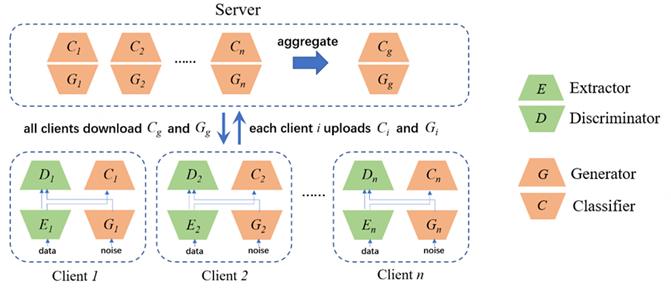
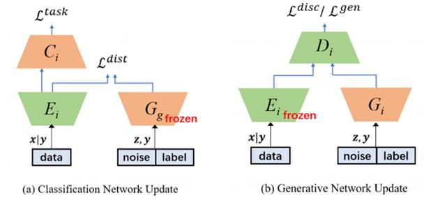
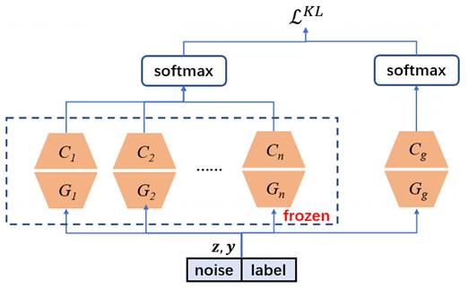
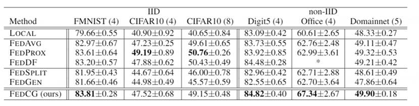
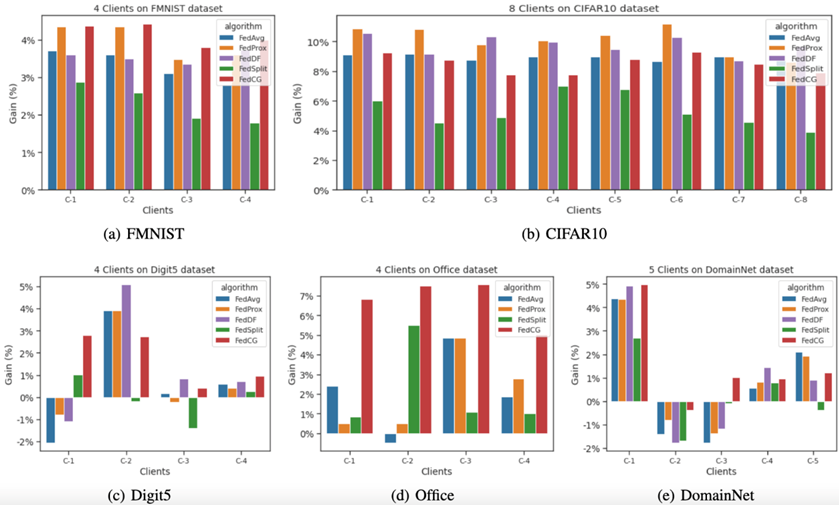
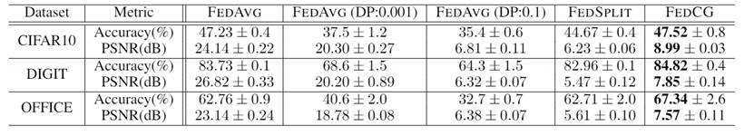

# FedCG: Leverage Conditional GAN for Protecting Privacy and Maintaining Competitive Performance in Federated Learning

## FedCG介绍

联邦学习（FL）旨在通过让客户端在不分享其私人数据、保护数据隐私的前提下协作建立机器学习模型。最近的一些研究证明了在联邦学习过程中交换的信息会受到基于梯度的隐私攻击，因此，各种隐私保护方法已被采用来阻止此类攻击，保护数据隐私。然而，这些防御性方法要么引入数量级更多的计算和通信开销（例如，同态加密），要么在预测准确性方面导致模型性能大幅下降（例如，使用差分隐私）。**FedCG**将条件生成对抗网络与分割学习相结合，实现对数据的有效隐私保护，同时保持有竞争力的模型性能。

更具体地说，FedCG将每个客户端的本地网络分解为私有特征提取器（extractor）和公共分类器（classifier），并将特征提取器保留在本地以保护隐私。每个客户端用一个生成器（generator）来拟合特征提取器的输出表征。FedCG的新颖之处在于它与服务器共享客户端的生成器而不是提取器，以聚合客户端的共享知识，提高模型性能 (如图1)。

<p align="center">
  
  <center>图1：FedCG 架构概览</center>
</p>


这种策略有两个直接的优势：首先，与服务器可以得到完整的客户端模型的联邦学习方法（例如，FedAvg 和 FedProx）相比，FedCG没有暴露直接与原始数据接触的模型 (也即，extractor)，因此客户端数据泄露的可能性显著降低。其次，服务器可以使用知识蒸馏（Hinton, Vinyals, and Dean 2015）聚合客户端的生成器和分类器，而无需访问任何公共数据。


### FedCG训练步骤

FedCG的训练步骤分为两阶段客户端更新（如图2）和服务器端聚合（如图3）。在两阶段客户端更新中，我们首先利用从服务器下发的全局生成器来优化分类网络（包括特征提取器和分类器），然后再训练一个本地生成器来拟合特征提取器的输出表征 $G(z,y) \approx F(x|y)$  我们用这个本地生成器来代替特征提取器, 在服务器端聚合所有客户端的知识同时保护数据隐私。

<p align="center">
  
  <center>图2：FedCG 客户端训练示意图。</center>
</p>


在服务器端聚合中，我们通过知识蒸馏的方式聚合一个公共分类器 $C_g$ 和一个公共生成器 $G_g$ 。然后，服务器下发公共分类器和公共生成器给每个客户端。

<p align="center">
  
  <center>图3：FedCG服务器端训练示意图。</center>
</p>


### FedCG实验结果

如表1所示，总体来说，FedCG 在4个数据集 (共6个数据集) 上取得最高准确率. 在IID 场景 : 在 FMNIST 上达到最高准确率。在Non-IID 场景: 在 3 个数据集上都达到最优，特别是在 Office 数据集上，FedCG比第二高准确率的 FedProx 高出 4.35% 。

 <p align="center">
  
  <center>表1：FedCG与基线在Top-1精度上的比较。粗体字表示最好的性能。*表示没有测量结果。括号内的数字表示客户端数量。</center>
</p>


IID 场景: 所有的FL方法在所有的客户端上都以较大的优势超过了本地模型。在FMNIST数据集上，FedCG在所有客户端的表现都是最好的（见图4（a））。FedCG的表现与那些共享所有本地模型的FL方法相差不大（见图4（b））。Non-IID 场景: 在所有3个Non-IID数据集中，没有一种FL方法能在每个客户上都击败本地模型（见图4（c），图4（d）和图4（e））。 FedCG在最多的客户端上取得了最好的效果。同时也是击败local最多的算法。
 <p align="center">
  
  <center>图4：在5个数据集上的实验中，在每个客户端上FEDAVG、FEDPROX、FEDDF、FEDSPLIT和FEDCG（红色）与LOCAL相比，都取得了精度提高。纵轴是准确性方面的性能差异（%）。正的（负的）收益意味着FL方法比LOCAL方法取得了 比LOCAL模型更好（更差）。</center>
</p>
 

如表2所示，隐私分析的实验结果表明，使用FedAvg，随着 DP 噪声添加得越多，能更好的保护隐私，但会导致较大的准确率损失；使用FedSplit，能保护隐私, 但有较大的准确率损失；使用FedCG，能在保护隐私的条件下，取得一个较高的准确率。

<p align="center">
  
  <center>表2： FedAVG，FedSPLIT和FedCG的模型性能与隐私保护效果对比</center>
</p>

### 总结和后续工作

我们提出了FedCG，目的是保护数据隐私，同时保持有竞争力的模型性能。FedCG将每个客户的本地网络分解为一个私有特征提取器和一个公共分类器，并将特征提取器保持在本地以保护隐私。它与服务器共享客户端的生成器，以聚合共享知识，从而提高客户端本地分类网络的性能。实验表明 FedCG具有高水平的隐私保护能力，并且可以实现有竞争力的模型性能。

本篇论文的不足之处在于FedCG的隐私保护理论分析仍待研究。此外，本篇论文使用 LeNet 作为本地网络，模型较小。作者将研究更深层次的神经网络，以进一步检验 FedCG 方法的有效性。


## Usage
- Train `FedAVG` `Lenet` on `FashionMNIST` dataset:
```bash
python main.py --algorithm="fedavg" --dataset="fmnist" --model="lenet5" --seed=1 --gpu=1
```
- Train `FedCG` `Lenet` on `Cifar` dataset:
```bash
python main.py --algorithm="fedcg" --dataset="cifar" --model="lenet5" --seed=1 --gpu=1
```


| Parameter                      | Description                                 |
| ----------------------------- | ---------------------------------------- |
| `algorithm` | The training algorithm. Options: `local`, `fedavg`, `fedsplit`, `fedprox`, `fedcg`. Default = `fedavg`. |
| `dataset`      | Dataset to use. Options: `fmnist`, `digit`, `office`, `cifar`. Default = `digit`. |
| `model` | The model architecture. Options: `lenet5`, `resnet18`. Default = `lenet5`. |
| `distance`  | The distance between extractor and generator. This parameter takes effect only when the algorithm is fedcg. Options: `none`, `mse`, `cos`. Default = `none`. |
| `lr` | learning rate for clients' extractor and classifier optimzer and server's generator and classifier optimizer, default = 2e-4. |
| `weight_decay` | weight decay for clients' extractor and classifier optimzer and server's generator and classifier optimizer, default = 1e-5. |
| `add_noise` | Whether adding noise to train data, default = False. |
| `batch_size` | Batch size, default = `8`. |
| `local_epoch` | Number of local training epochs, default = `20`. |
| `gan_epoch` | Number of local gan training epochs, default = `20`. |
| `global_epoch` | Number of server training epochs, default = `20`. |
| `global_iter_per_epoch` | Number of iteration per epoch for server training, default = `100`. |
| `mu` | The proximal term parameter for FedProx, default = `0.01`. |


## Citation

Please kindly cite our paper if you find this code useful for your research.

```
@inproceedings{ijcai2022-324,
  title     = {FedCG: Leverage Conditional GAN for Protecting Privacy and Maintaining Competitive Performance in Federated Learning},
  author    = {Wu, Yuezhou and Kang, Yan and Luo, Jiahuan and He, Yuanqin and Fan, Lixin and Pan, Rong and Yang, Qiang},
  booktitle = {Proceedings of the Thirty-First International Joint Conference on
               Artificial Intelligence, {IJCAI-22}},
  publisher = {International Joint Conferences on Artificial Intelligence Organization},
  editor    = {Lud De Raedt},
  pages     = {2334--2340},
  year      = {2022},
  month     = {7},
  note      = {Main Track}
  doi       = {10.24963/ijcai.2022/324},
  url       = {https://doi.org/10.24963/ijcai.2022/324},
}
```
