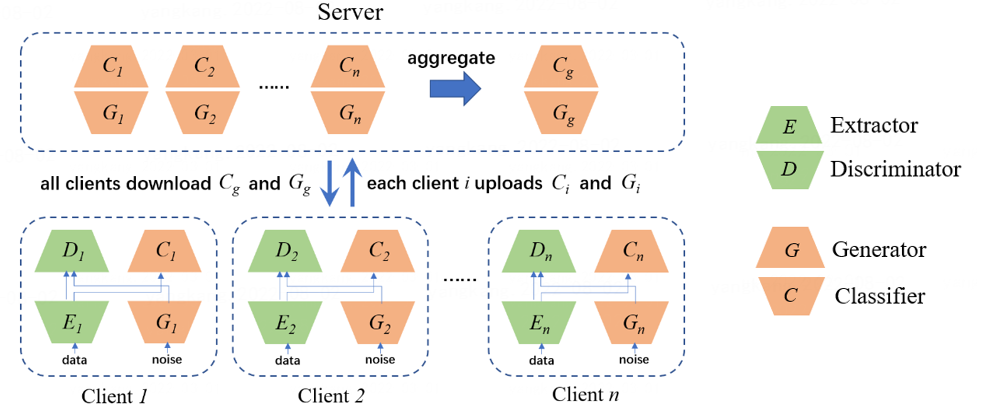

# FedCG: Leverage Conditional GAN for Protecting Privacy and Maintaining Competitive Performance in Federated Learning

<p align="center">
  
</p>

This is a PyTorch implementation of the paper [FedCG](https://www.ijcai.org/proceedings/2022/0324.pdf)

### Description
In this work, we propose FEDCG, a novel federated learning method
that leverages conditional generative adversarial networks to achieve high-level privacy protection while still
maintaining competitive model performance. FEDCG decomposes each client’s local network into a private extractor and a
public classifer and keeps the extractor local to protect privacy. Instead of exposing extractors, FEDCG shares clients’
generators with the server for aggregating clients’ shared knowledge aiming to enhance the performance of each client’s
local networks. Extensive experiments demonstrate that FEDCG can achieve competitive model performance compared with FL
baselines, and privacy analysis shows that FEDCG has a high-level privacy-preserving capability.

### Usage
- Train `FedAVG` `Lenet` on `FashionMNIST` dataset:
```bash
python main.py --algorithm="fedavg" --dataset="fmnist" --model="lenet5" --seed=1 --gpu=1
```
- Train `FedCG` `ResNet18` on `cifar` with `cos` distance:
```bash
python main.py --algorithm="fedcg" --dataset="cifar" --model="resnet18" --seed=1 --gpu=1
```


| Parameter                      | Description                                 |
| ----------------------------- | ---------------------------------------- |
| `algorithm` | The training algorithm. Options: `local`, `fedavg`, `fedsplit`, `fedprox`, `fedcg`. Default = `fedavg`. |
| `dataset`      | Dataset to use. Options: `fmnist`, `digit`, `office`, `cifar`. Default = `digit`. |
| `model` | The model architecture. Options: `lenet5`, `resnet18`. Default = `lenet5`. |
| `distance`  | The distance between extractor and generator. This parameter takes effect only when the algorithm is fedcg. Options: `none`, `mse`, `cos`. Default = `none`. |
| `lr` | learning rate for clients' extractor and classifier optimzer and server's generator and classifier optimizer, default = 2e-4. |
| `weight_decay` | weight decay for clients' extractor and classifier optimzer and server's generator and classifier optimizer, default = 1e-5. |
| `add_noise` | Whether adding noise to train data, default = False. |
| `batch_size` | Batch size, default = `8`. |
| `local_epoch` | Number of local training epochs, default = `20`. |
| `gan_epoch` | Number of local gan training epochs, default = `20`. |
| `global_epoch` | Number of server training epochs, default = `20`. |
| `global_iter_per_epoch` | Number of iteration per epoch for server training, default = `100`. |
| `mu` | The proximal term parameter for FedProx, default = `0.01`. |

### Citation

Please kindly cite our paper if you find this code useful for your research.

```
@inproceedings{ijcai2022-324,
  title     = {FedCG: Leverage Conditional GAN for Protecting Privacy and Maintaining Competitive Performance in Federated Learning},
  author    = {Wu, Yuezhou and Kang, Yan and Luo, Jiahuan and He, Yuanqin and Fan, Lixin and Pan, Rong and Yang, Qiang},
  booktitle = {Proceedings of the Thirty-First International Joint Conference on
               Artificial Intelligence, {IJCAI-22}},
  publisher = {International Joint Conferences on Artificial Intelligence Organization},
  editor    = {Lud De Raedt},
  pages     = {2334--2340},
  year      = {2022},
  month     = {7},
  note      = {Main Track}
  doi       = {10.24963/ijcai.2022/324},
  url       = {https://doi.org/10.24963/ijcai.2022/324},
}
```
