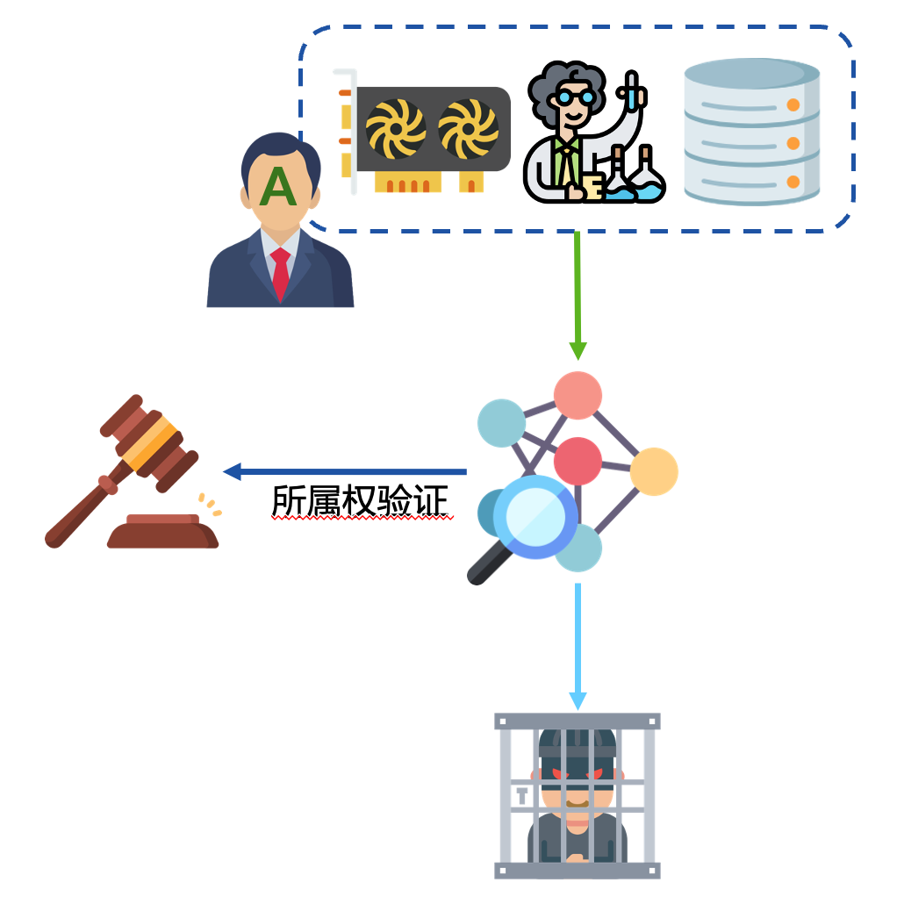
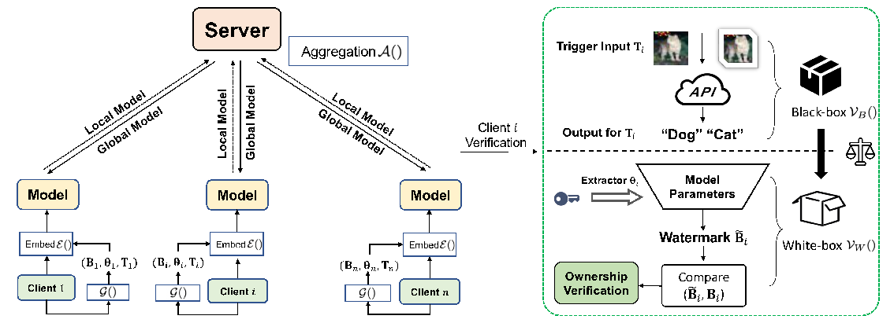
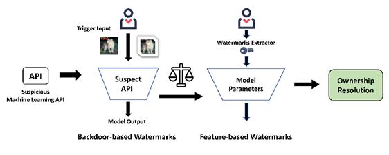
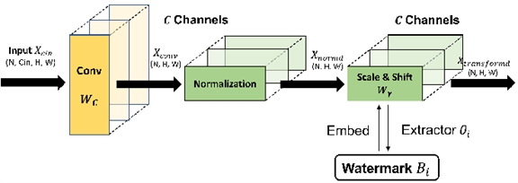
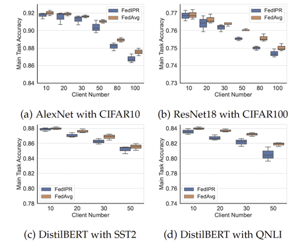
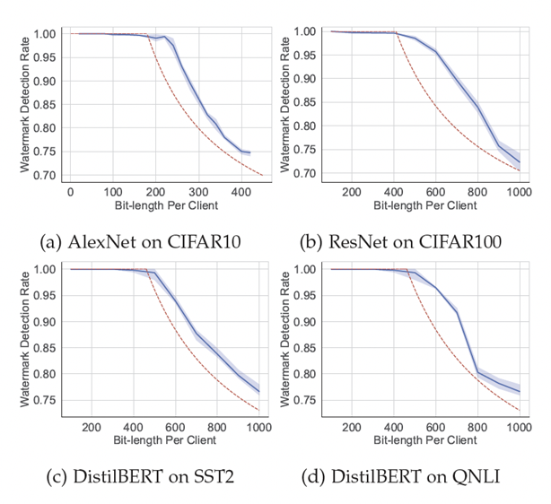

# FedIPR: Federated Learning Model Ownership Verification

Machine learning, especially deep neural network (DNN) technology, has achieved great success in many fields in recent years, and many technology companies are deploying neural network models in commercial products to improve efficiency. Training advanced neural network models requires large-scale datasets, enormous computing resources, and the ingenuity of designers. This is embodied in: (1) The scale of the training model applied by the deep learning model is huge. Taking GPT-3 as an example, the amount of data used for pre-training reaches 45TB, and the training cost exceeds 12 million US dollars, which has a very high economic cost. (2) In the process of training and deploying deep learning models to industrial application scenarios (such as smart finance, smart medical applications), it is necessary to introduce proprietary prior knowledge in fields such as finance and medical care, so the knowledge and experience of experts need to be introduced in the model design process to customize the model, which reflects the intellectual property of human brain power. (3) The training process of deep learning models requires massive data in specific fields as training resources, and there are data values and knowledge attributes. The above properties determine that the trained deep learning model has high commercial value and intellectual properties, which must be included in the intellectual property of the legal owner (ie the party that created it). Therefore, there is an urgent technical need to protect deep neural network (DNN) models from illegal copying, redistribution, or misuse.

  

For expensive artificial intelligence models, attackers can use technical means or non-technical means to steal; but to confirm the theft and declare model ownership , it is completely from the perspective of artificial intelligence theory and methods, and the model's ownership authentication technology needs to be Guaranteed to provide a reliable and robust method of intellectual property protection without sacrificing model usability.

Unlike model training in centralized scenarios, distributed training of federated learning involves multiple participants, and there is a greater risk of leaking artificial intelligence models. There are situations where participants are attacked by adversaries or the model free-riders. These situations constitute a violation of ownership of the federated learning model. In response to the copyright protection of the global model of federated learning, WeBank AI Lab and Shanghai Jiaotong University published an article on IEEE Transactions on Pattern Analysis and Machine Intelligence , a top academic journal of artificial intelligence([cite](https://ieeexplore.ieee.org/document/9847383/)) presented a paper titled " FedIPR : Ownership Verification for Federated Deep Neural Network Models " , and shared their thoughts on the protection of intellectual property rights of models from the perspectives of algorithms, protocols, security, etc. on the issue of intellectual property protection of federated learning models and work, a proposal named FedIPR The federated learning model copyright protection framework.
The existing intellectual property protection methods for deep learning models mainly focus on the algorithm practice and robustness challenges of deep neural network watermarking. At present, there is no research on the practice of model watermarking in the direction of trusted federated learning. The FedIPR framework proposed by Weizhong AI considers a federated learning system with incomplete trust. It is assumed that each participant in federated learning can perform model update and collaborative training according to the federation rules, but does not disclose private local data and private signatures to each other . In this setting, the proposed FedIPR elaborates a novel Federated Deep Neural Network ( FedDNN ) ownership verification scheme (Figure 2 ) that allows the embedding and verification of ownership signatures to claim the legitimate intellectual property rights of FedDNN models ( IPR) to prevent the model from being illegally copied, redistributed or misused .
 

  

WeBank AI Lab proposed a two-stage black-box and white-box framework for verifying the ownership of federated learning models (Figure 3): (1) In the black-box stage, there is no need to access model parameters and internal structures, just input specific samples into the model API, then determine the ownership of the model according to the output of the model, which provides a preliminary basis for the ownership of the model. (2) In the white box verification stage, the law enforcement agency opens the model parameters and structure according to the previous stage, and verifies whether the model parameters are embedded with a given "watermark" that can prove the ownership.
 

  

For the white-box model verification scenario, Webank AI  innovatively proposes a normalization The affine transformation parameters of the layer (Fig. 4) are used for watermark embedding, which has strong usability and robustness.
 

  

The paper illustrated the empirical study of the proposed FedIPR in terms of fidelity, significance and robustness of watermarks. Superior detection performances of both backdoor-based watermarks and feature-based watermarks demonstrated that FedIPR provides a reliable and robust scheme for FedDNN ownership verification.
 

  

Fidelity: main task accuracy of FedDNN model with FedIPR

  

Significance: Watermark detection rate of FedDNN model with FedIPR compared to theoretical bound.

Github  Code link: [https://github.com/purp1eHaze/FedIPR](https://github.com/purp1eHaze/FedIPR)

