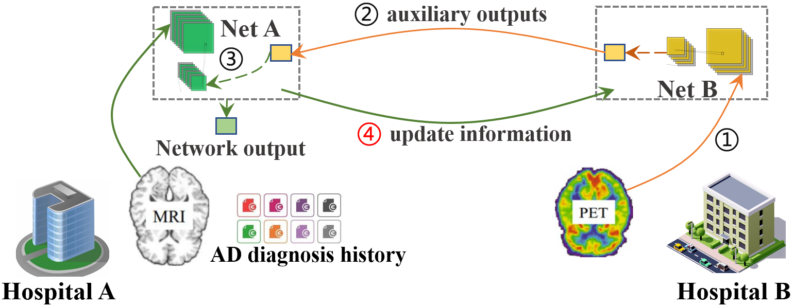

# Cross-silo Federated Neural Architecture Search for Heterogeneous and Cooperative Systems

<p align="center">
  
</p>

## Overview

In many cooperative systems (i.e. autonomous vehicles, robotics, hospital networks), data are privately and heterogeneously distributed among devices with various computational constraints, and no party has a global view of data or device distribution. Federated Neural Architecture Search (FedNAS) was previously proposed to adapt Neural Architecture Search (NAS) into Federated Learning (FL), in order to provide both privacy and automation to such uninspectable systems with resource and latency constraints. However, existing Federated NAS approaches learn an universal model across all parties therefore they do not address the data and device heterogeneity issue well. In this work, we present Self-supervised Vertical Fed- erated Neural Architecture Search (SS-VFNAS) for automating FL where participants hold heterogeneous data and devices, a common cross-silo scenario. SS-VFNAS simultaneously optimized all parties’ model architecture and parameters for the best global performance under a vertical FL (VFL) framework using only a small set of aligned and labeled data whereas preserving each party’s local optimal model architecture under a self-supervised NAS framework using unaligned and unlabeled local data. We demonstrate experimentally that our approach has superior per- formance, communication efficiency and privacy and is capable of generating high-performance and highly-transferable hetero- geneous architectures with only limited overlapping samples, providing practical solutions for designing collaborative systems with both limited data and resource constraints.

## Dataset
* modelnet40v1png: [maxwell.cs.umass.edu/mvcnn-data](http://maxwell.cs.umass.edu/mvcnn-data/)
* chexpert: [stanfordmlgroup.github.io](https://stanfordmlgroup.github.io/competitions/chexpert/)

## Getting Started
### Install dependencies
## Requirements

- python3
- pytorch
- graphviz
    - First install using `apt install` and then `pip install`.
- numpy
- tensorboardX

## Run example

Adjust the batch size if out of memory (OOM) occurs. It dependes on your gpu memory size and genotype.

- Search

```shell
python train_search_k_party.py --data data/modelnet40v1png --name test 
```

- Search with self-supervised
```shell
python train_search_k_party_moco.py --data data/modelnet40v1png --name test
```

- Augment

```shell
python train_darts_k_party.py --data data/modelnet40v1png --name test --genotypes_file path_to_genotypes
```

- Train manual network
```shell
python train_manual_k_party.py --data data/modelnet40v1png --name test --layers 18
```

### Citation 
Accepted for publication in edited book titled "Federated and Transfer Learning", Springer, Cham

Please kindly cite our paper if you find this code useful for your research.

```
@article{liang2021self,
  title={Self-supervised cross-silo federated neural architecture search},
  author={Liang, Xinle and Liu, Yang and Luo, Jiahuan and He, Yuanqin and Chen, Tianjian and Yang, Qiang},
  journal={arXiv preprint arXiv:2101.11896},
  year={2021}
}
```
